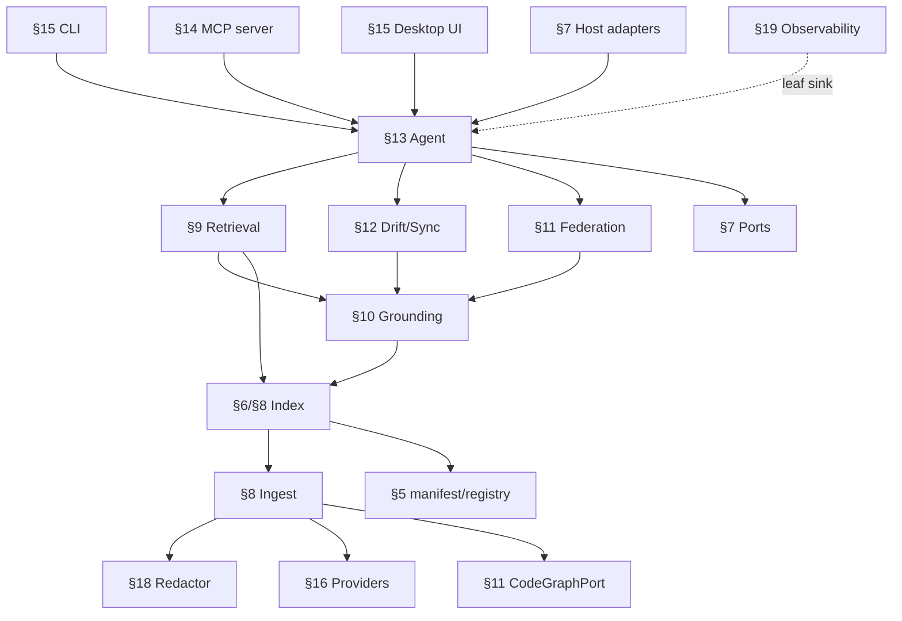

# ARCHITECTURE.md — Nexus Brain

> **Build contract:** This file is the **source of truth**. `IMPLEMENTATION_PLAN.md` phases cite its `§N` anchors as "spec anchors"; the area `CLAUDE.md` cross-doc-invariants table mirrors Appendix A; `/check-arch <topic>` reads one section. Anchors are **stable IDs — append-only, never reorder** (the draft's `§0–§21` are superseded; remap in `docs/gap-audits/anchor-remap.md`).
> **Build posture:** **production-grade** (no timebox; correctness/best-practice over speed). Auth, input validation, error paths, idempotency, observability, secrets handling, deploy/rollback, and the LanceDB maintenance contract are **in-scope baseline**, not deferrable. Load-bearing safety/security/correctness invariants are never cut. Finalized by `/arch-finalize` (Brain 2, Claude) from the `/arch-draft` artifacts + a 17-agent gap audit (`docs/gap-audits/`) + two dependency re-probes, with owner gate decisions 2026-06-16.
> **Companion (binding detail):** `docs/planning/DECISIONS.md` (D-1..D-27), `DATA_MODEL.md`, `DOMAIN_MODEL.md`, `REQUIREMENTS.md`, `THREAT_MODEL.md`, `EVALUATION_CRITERIA.md`, `RISKS.md`, `CONSTRAINTS.md`, `docs/integrations/MAIN_PLATFORM_INTERFACE.md` (NexusOps seam v0.2).

## Executive summary

Nexus Brain is a **local-first, multi-project memory · retrieval · reasoning · action-planning engine** for software portfolios. It ingests code + docs + git/PR history + (opt-in) Claude/Codex sessions per project into a **per-project, version-stamped LanceDB index** (embeddings + BM25 + anchors), fuses that at query time with an **external structural code graph** (CodeGraph, read behind a port) and answers through a frontier model where **every claim carries a continuously-revalidated `file:line` anchor** — its **north star is trust/citation correctness** (a confident-but-wrong or stale citation is the cardinal failure).

The system is a **two-process desktop app**: a Tauri shell (Rust host + WebView, reusing `NexusOps-ui-kit`) and a **bundled Python core sidecar** that is independently runnable headless (CLI + MCP). The core is **delivery- and host-agnostic** (ports-and-adapters): it touches the world only through typed **ports** (§7), so the **standalone** product (a signed `.dmg`/Homebrew Cask people install for their own repos) and the **later NexusOps-embedded** sidecar (propose-only, behind the Gateway) are the **same core with one swapped host adapter — never a fork** (one monorepo, a published `nexus-brain-core`).

Major subsystems and their one-way import direction (DAG in §2.5): **entrypoints** (CLI/MCP/app/host-adapters) → **agent** → {**retrieval**, **drift**, **federation**} → **grounding** → **index** → **ingest** → {**redactor**, **providers**, **ports**, **manifest/registry**}; **redactor** and **grounding** are fan-in hubs; **observability** is a leaf sink. The forced-serial spine (ports → schemas → ingest → index → retrieval → grounding → agent) is the first vertical slice; independent tracks (federation, sync, sessions, MCP, UI, providers) fork once their shared contracts (Appendix A) freeze.

Verified-best foundations (adversarial research, 2026-06-16): **LanceDB** (only embedded store covering in-process + git-SHA versioning + larger-than-memory; pinned, with a mandatory maintenance contract §6); embeddings **qwen3-embedding-4b** (local) / **voyage-code-3** (cloud) + rerankers **qwen3-reranker** / **voyage-rerank-2.5**, all pluggable per-project (§16); **CodeGraph 1.0.1** behind a `CodeGraphPort` + tree-sitter fallback (§11); orchestration **LlamaIndex Workflows**; observability **OTel + OpenInference → Collector → Langfuse + SigNoz** (§19), shipped instrumented-but-silent.

> *A local-first memory engine whose delivery-agnostic core answers portfolio-wide questions with continuously-revalidated `file:line` anchors — standalone first, NexusOps-embedded later, the only difference a swapped host adapter.*

## §1 — Goals & non-goals

**Goals (MVP, production-grade):** portfolio-wide evidence-backed `file:line`-anchored Q&A; the **trust/citation north star** (grounding gate + continuous anchor revalidation + provenance); local-first privacy (redaction-before-embed; keychain-only secrets; **user-choice local|cloud**); **federation from day one** (our router; cross-repo resolution is a spike with a marked fallback); two surfaces over one core (embedded agent + MCP server); drift/freshness ("never stale silently"); the LanceDB maintenance contract; deterministic test seams for the trust controls.

**Non-goals (MVP):** an IDE / terminal mux / git client / cloud SaaS; replacing Claude Code / Codex / CodeGraph / cc-crew; multi-user RBAC; agent egress isolation; the NexusOps integration *runtime* (seam designed §23, adapter `[P2]`); Windows; Codex session ingestion `[P1]`; drawer UX `[P2]`; ZDR/opt-out *enforcement* (un-enforceable account settings → disclosed, not gated, §18).

## §2 — System overview

```
macOS host (single OS user = trust boundary)
 ┌ Tauri desktop app (Rust host + WebView; NexusOps-ui-kit)  ── the standalone face
 │     ↕ loopback HTTP + per-launch token (§14)  OR in-process
 ┌ Python core sidecar (PyInstaller-bundled; runnable headless)
 │   agent(LlamaIndex Workflow) · retrieval · grounding · federation router · drift radar
 │   ingest · index(LanceDB) · sessions · redactor · provider registry · manifest/registry
 │   ports: HostPort · EventSource · Embedding/Reranker/Context/Model providers · CodeGraphPort
 │          · ObservabilitySink · SecretStore · Clock · Seed/IdGen
 │     ↕ stdio MCP (+opt loopback)          → external agents (Claude Code / Codex / CI)
 │     ↕ Ollama(local) · Claude/Voyage(cloud, user-chosen, redacted)
 │     ↕ read-only per project: LanceDB dataset · CodeGraph .codegraph/*.db · .project-brain/manifest
 └ (later, [P2]) HostPort=NexusOpsHost → NexusOps Gateway (propose-only) + redacted event outbox
```
End-to-end: `add` a repo → ingest (discover·classify·chunk·context-augment·**redact**·embed·LanceDB write·optimize·git-SHA-tag) → **ask** (route → hybrid retrieve → rerank → CodeGraph structural tools → whole-file hydrate → generate → **grounding gate** → answer + provenance) ⇄ kept fresh (watcher + git-hooks → drift radar → incremental re-index). Federation fans out read-only over N indexes + union-ranks.

## §2.5 — Subsystem dependency DAG & parallelization seams

**Import-direction rule:** dependencies point ONE way (`entrypoints → orchestration → query subsystems → grounding → index → ingest → leaf contracts`); **no upward or cross-sibling imports**. `ports` and `redactor` depend on nothing; `observability` is a leaf sink every node emits to; **`redactor` (index-time + MCP-egress + cloud-egress) and `grounding` (over retrieval+agent+drift+federation) are fan-in HUBS, not pipeline stages.**



**Forced-serial spine (Track-0, = §24 first vertical slice):** ports → {chunk + manifest/registry schema} → ingest (incl. redact) → index (embed/write/optimize/version) → retrieval → grounding → agent. **No track forks until this reaches a queryable + grounded one-repo index.**

**Independent tracks (fork after the spine + the frozen contracts):** **T-A** federation router + registry · **T-B** sync/freshness + drift radar · **T-C** sessions/episode-cards · **T-D** MCP server + trust boundary · **T-E** Tauri desktop UI (behind the frozen core public API) · **T-F** observability wiring (leaf, last) · **T-G** provider bake-offs (behind the provider ports, from day one) · dashed **T-P2** NexusOpsHost (behind frozen HostPort + published core API; never touches the spine). Build mode = **agent-team multi-track** (cc-crew team in git worktrees; D-26).

**Shared contracts to FREEZE before any post-spine track forks (Appendix A):** (1) LanceDB chunk schema · (2) `.project-brain/manifest.json` + global registry schema · (3) `HostPort` · (4) the 4 provider ports + `CodeGraphPort` · (5) `Anchor` · (6) `ProvenancePacket` + `EvidenceRef` · (7) store-level version stamp · (8) `Redactor` interface + fuzz corpus · (9) MCP tool contract. A change to any after fork = a cross-track Finding.

## §3 — Locked architecture decisions

Recorded once in `docs/planning/DECISIONS.md` (**D-1..D-27**, owner-confirmed incl. the 2026-06-16 gate). This contract references them by id and does not restate rationale. Spine: ports-and-adapters core (D-21) · LanceDB per-project + maintenance contract (D-11/D-25) · three-store fuse-at-query (D-12) · CodeGraph 1.0.1 behind `CodeGraphPort` + keep-our-router (D-27) · hybrid+rerank+hydrate RAG (D-13) · grounding gate (D-7) · pluggable providers + user-choice local|cloud (D-23) · LlamaIndex Workflows (D-8) · OTel-first observability (D-9/D-22) · Tauri desktop + Python sidecar (D-17) · redaction-on-catchable-set + keychain-primary (D-15/D-26).

## §4 — Domain model & invariants

Authoritative: `DOMAIN_MODEL.md`. Entities, ubiquitous language, the entity-relationship map. **Load-bearing invariants** (tested): (1) the index is a cache, not source-of-truth (reproducible from source + model-stamp); (2) no claim is served as cited unless its anchor is `live`; (3) side-effects flow only through the active `HostPort`; (4) redaction-before-embed has no holes on the catchable set; (5) single-writer-per-index, read-only federation; (6) one EmbeddingProvider per index generation; (7) CodeGraph store + `.scaffolding/manifest.json` are read-only to Nexus Brain.

## §5 — Data & state model

Authoritative: `DATA_MODEL.md`. **Three stores, fused at query time, never merged:** ① LanceDB per-project dataset, ② CodeGraph SQLite (external, read-only via `CodeGraphPort`), ③ `.project-brain/manifest.json` + `~/.project-brain/` registry.

**Source-of-truth law (resolves the freshness ambiguity, D-26/C-4):** the **LanceDB git-SHA version tag = canonical SHA**; the **store-level stamp = canonical `{schema, model, dim}`**; **manifest + registry = DERIVED PROJECTIONS** (rebuilt from the dataset on every commit, reconciled at startup, registry rebuildable by scanning manifests). The freshness banner = `delta(git HEAD, index.recorded_sha)` with a distinct "dirty working tree" state.

**State machines (all enumerated; Appendix A):** Index generation (`building → reembedding → validating → swapping → active(+retired→gc_eligible→purged)`; failure edges discard new, keep old; ENOSPC pre-flight) · Anchor (`live ⇄ stale|moved|unknown → orphaned/deleted`; recovery edges back to `live`) · Project (`added → indexing → ready ⇄ syncing → drift_detected → reindexing → (index_failed|archived|removed)`) · Worker (`cold → warm → idle_evicted`; `write_held(lease)`; crash→reattach) · EpisodeCard (`no_consent → consent_granted → reading → redacting → (quarantined_unsafe|redacted) → summarizing → embedded → linked`; terminals `consent_revoked`(purge), `superseded`) · Doc-refresh (ownership-gated, consent+conflict) · WorkflowInstance (12 frozen R-7 states; transition graph co-designed w/ NexusOps — LBD-12). **Manifest/registry schema is FROZEN (closes OQ-6)** with a forward-only `schemaVersion` migrator + backup-before-migrate + downgrade-refuse (D-26/C-12).

## §6 — LanceDB store & maintenance contract

LanceDB (pinned; high-level API pre-1.0 on stable Lance SDK 1.0/format 2.1). **One dataset per project** (isolation, idle-eviction, per-project blue-green). **Maintenance contract `[PH]` (mandatory, D-25):** `optimize()` after each upsert batch + monitor `index_stats().num_unindexed_rows ≈ 0` (post-write rows fall to flat scan; `fast_search` silently excludes them); scheduled `cleanup_old_versions()`; **git-SHA version tags (GC-exempt → double as §5's canonical SHA)**; **single-writer-per-dataset** (lease) + read-only federation; RAM-bounded batched index builds; pin `lancedb`; **`spawn` not `fork`**; verify arm64 wheels in CI; **ENOSPC pre-flight before blue-green** (abort new generation, retain prior, surface remediation). FTS caveat: no boolean AND/OR in the native query string → model boolean logic in the retrieval layer; `with_position` only for phrase queries.

## §7 — Ports & adapter contracts

The hexagonal spine. **Every port is an Appendix-A freeze-before-fork contract** (D-26/C-3). Ports (11): **`HostPort`** (`capabilities()`, `authorize(intent)`, `perform(action)`; StandaloneHost = a **closed typed allowlist** `{own_store_write | owned_doc_refresh | consented_host_config}`; NexusOpsHost serializes each to an `ActionPlan`/`ActionRequest`) · **`EventSource`** (`subscribe/poll`; git/watcher vs NexusOps outbox) · **`EmbeddingProvider`** (`embed`, `dimension`, `model_version`) · **`Reranker`** (`rerank`) · **`ContextStrategy`** (`augment`) · **`ModelProvider`** (`generate` w/ Citations) · **`CodeGraphPort`** (`query(kind, sym)` over CLI shell-out; 5-table reads; `schema_versions` assert; `CODEGRAPH_DIR`-aware; tree-sitter fallback) · **`ObservabilitySink`** (`emit`) · **`SecretStore`** (`get_ref/resolve`; keychain) · **`Clock`** + **`Seed/IdGen`** (deterministic test seams, C-15). **Test doubles** (named seams): `Fake{Embedding,Reranker,Model}Provider`, `FakeCodeGraph`, cassette record/replay for cloud + Citations API.

## §8 — Ingestion & indexing

Discover (source-agnostic; `.gitignore`+`.brainignore`) → classify (producer/`doc_type`/owned·foreign·supplemental) → chunk (docs heading-split + late-chunking; code AST via `CodeHierarchyNodeParser`, **pinned + tree-sitter fallback**) → **context-augment** (voyage-context-3 cloud / late-chunking local) → **redact** (§18) → embed (provider) → LanceDB write (chunk schema: text·vector·BM25·anchor·content_hash·`last_resolved_sha`·`embedding_model_version`·generation·tombstone·register) → `optimize()` → update manifest/registry projections. **`add` is idempotent** (re-add updates, never duplicates). **R-PARTIAL:** ingest whatever exists; never hard-require docs; partial-ingest writes a temp generation (no half-swap).

## §9 — Retrieval & answering

Route (per-project corpus < ~200K tokens → cached long-context; else agentic RAG; graph tools always-on) → **hybrid (dense+BM25)** → **rerank** (~30–50 → ~10; deterministic RRF tie-break `(rrf_score desc, project_id asc, chunk_id asc)`) → CodeGraph structural tools (callers/callees/impact/explore/search via `CodeGraphPort`) → **whole-file hydration** → `ModelProvider.generate`. **Whole-file hydration egress passes the redactor** (raw source read at query time, C-11/D11-6). Cost control: prompt-cache the stable prefix; a budget rule on the agentic loop; surface estimated cost (C-7/cost).

## §10 — Grounding, anchors & provenance (NORTH STAR)

**Grounding gate = answer-but-flag:** never present an ungrounded claim as cited; **post-validate every cited `file:line` span exists** in current source (a **deterministic** contract tested against fixed `(retrieval-result, recorded-Citations-payload)` fixtures — assert 100% flag of injected unsupported/stale citations); separate/mark "couldn't ground: X" at low confidence; opt-in **strict mode** refuses. **Anchors** continuously revalidated (`live|stale|moved|unknown`; gate keys on `live`); revalidation reads via `Clock` (deterministic). **Provenance Packet** (frozen, Appendix A) on every answer: project/source ids · `file:line[]` · commit SHAs · session ids · `recorded_sha` · index freshness · confidence + drift markers. Three-layer grounding stack: Contextual Retrieval (index) · Citations API (generate) · post-validation (this gate).

## §11 — Federation router & registry

**KEEP-OUR-ROUTER (HYBRID-lean, D-27).** Router reads N per-project LanceDB datasets **read-only** + queries N CodeGraph DBs via `CodeGraphPort`; **union + RRF rank-fusion**; gates each store on its **own** stamp (registry = routing index only, §5). **Result shape carries `{projects_requested, answered, excluded[]}`** (a silently-partial portfolio answer is the federation analogue of the trust failure). **Cross-repo symbol resolution** via `unresolved_refs` + namespaced `qualified_name` = `[SPIKE — O-FED]`; fallback = side-by-side-marked. **Hybrid-lean:** where repos already nest under one root, treat CodeGraph native co-indexing as one source; everywhere else the router fans out. Optional in-process backing: the DuckDB Lance core extension. On-demand workers + LRU idle eviction; only the router is always-on.

## §12 — Sync & freshness

Watchman/fswatch (freshness) + `post-commit/merge/checkout` git-hooks (correctness backstop) → debounce → content-hash delta → re-embed → tombstone+replace keyed on `source_path` → `optimize()`. **Drift radar** revalidates anchors, ranks by authority×recency×code-agreement, triggers ownership-gated owned-doc refresh (don't-clobber 3-way-merge; the only bounded user-file mutation, SR-4). Blue-green re-embed on model/dim change (§5 generation machine). *Watcher = freshness; hooks = convergence.*

## §13 — Embedded agent

A **LlamaIndex Workflow** driving the retrieval **tools** (the same internal core the MCP server exposes), calling `ModelProvider`. Multi-turn chat state in the standalone UI. Action modes (D-26/LBD-5): **Mode 1 read-only + Mode 2 draft in scope**; Mode 3 confirmed-single via the `HostPort` allowlist (standalone); **Mode 4/5 deferred `[P2]`** (integrated, via the Gateway).

## §14 — MCP server & trust boundary

FastMCP **3.x (pinned major; budget the 3.0 migration)**. Tools (frozen, Appendix A): `search`/`get_file`/`graph`/`list_projects`/`status` — each with params (retrieval-scope enum + `project_id` scoping + top-k), result (evidence chip + `file:line` + stable IDs + provenance), streaming, and **policy-denied → marker-not-error**. **The trust boundary:** **ingress validation** (canonicalize+contain `get_file` paths, authorize scope against registry+policy BEFORE fan-out, bound query/k/response sizes — Pydantic type + semantic validation) AND **egress redaction + policy-filter regardless of caller** (incl. hydration). Transport: **stdio** default (parent-process trust); **opt-in loopback** = `127.0.0.1` + per-launch token (entropy, at-rest-not-`ps`-readable, constant-time compare, Origin allowlist + DNS-rebinding defense, expiry on recycle). Local adversary scope = **same-uid trusted** (token defends different-uid + browser pages; same-uid exfil = stated non-goal, LBD-13). **INV-allowlist test:** no core module reaches an fs/git mutation except via `HostPort.perform`.

## §15 — CLI & desktop UI surfaces

**CLI** (`nexus`/`nb`: setup/add/sync/status/ask) — headless, the core's primary face. **Desktop UI** (Tauri; chat + evidence chips + freshness banner + project mgmt; supersedes the PRD "web/dev console", LBD-6) — a client of the frozen core public API. First-run/empty-portfolio + doc-completeness-nudge flows.

## §16 — Providers (pluggable, version-stamped)

Per-project `policy.yaml` (frozen schema, Appendix A) at `add`. **Privacy = explicit user choice `local | cloud`** per project (D-23/D-26), honestly disclosed (cloud = code sent to provider, ~30-day standard retention; **no ZDR/opt-out enforcement** — disclosed not gated). Embedding: local `qwen3-embedding-4b` default / cloud `voyage-code-3`. Reranker: local `qwen3-reranker` / cloud `voyage-rerank-2.5` (+ bake-off). Context: voyage-context-3 / late-chunking. Generation: latest capable Claude, ZDR-aware. **Redaction + keychain apply regardless of local/cloud.** Switching a provider = blue-green re-embed.

## §17 — Session memory & episode cards

Opt-in per project (consent stricter than docs/code). Claude sessions first (Codex `[P1]` after schema validation). Redact + exclude `thinking`; **raw transcripts never embedded**; → episode cards (EpisodeCard machine §5; Brain-owned) with commit-link confidence. `consent_revoked` purges embedded card + raw.

## §18 — Security & trust boundaries

Authoritative: `THREAT_MODEL.md`. **Redaction gate = "zero-leak on the CATCHABLE set"** (recall-floor on curated prefix/entropy/JSON-value classes; **enumerated accepted residuals** — ≈git-SHA hex, adversarial <20-char split, sub-20-char JSON; the literal-zero promise was undeliverable, D-26/C-11); **keychain-refs-only is the PRIMARY control**, redactor = defense-in-depth. The redactor runs at **all three** sinks (persist/chunk · MCP-egress · cloud-egress) — asserted by the fuzz harness (property generator + curated adversarial corpus; quantified recall floor + FP ceiling; resolves OQ#12). Other invariants: keychain-only secrets (incl. scrubbed from logs); bounded-allowlist single chokepoint + invariant test; **supply-chain pin-by-hash** (CodeGraph + models, fail-closed, provenance manifest); idempotent/reversible/consented host-config; structured **local-only scrubbed logs** (never phone-home). Integrated deltas: propose-only (INV-SEC-1), inputs pre-redacted, never set an ExecutionProfile.

## §19 — Observability & evals

Instrument once (OTel + OpenInference on LlamaIndex + Anthropic) → **OTel Collector hub** fans out: `gen_ai.*` → **Langfuse** (LLM traces + evals + datasets); all spans/metrics/logs → **SigNoz** (operational APM). Thin `ObservabilitySink` seam. **Ship instrumented-but-silent** (OTel off-by-default + local-only + opt-in diagnostics; backends + eval harness are dev/CI only; **never phone home**, D-22). **Eval harness** (CI-gated, golden sets in-repo, custom evaluators → Langfuse): citation precision/recall, **grounding-gate correctness**, anchor-revalidation, retrieval Recall@k, **redaction-recall fuzz (zero-leak-on-catchable hard gate)**, federation correctness; bake-offs (reranker, cloud-embedder) feed it. Golden-set construction = a fixture repo with scripted edits at known SHAs (anchor-state ground truth). Hard gates (absolute) vs comparative gates separated; thresholds against the §22 perf baseline. `EVALUATION_CRITERIA.md`.

## §20 — Packaging & distribution

Signed/notarized `.dmg`/`.app` (Tauri auto-updater) + **Homebrew Cask**; CLI via bundle/pipx/brew formula; **bundled PyInstaller sidecar**. `setup` provisions CodeGraph (`=1.0.1`) + Ollama + model (detect→install→**verify by hash, fail-closed**). **Notarization is a pre-build SPIKE** (not a precedent — NexusOps's is `[LOCKED-PENDING-SPIKE]`; hardened runtime, deep-sign, `spctl` CI gate). Signed update feed (key custody) + Cask sha256 auto-bump + yank/rollback. Linux later: AppImage/tarball + systemd `--user`. Shared-vs-separate Apple Developer ID with NexusOps = LBD-18 (default separate; revisit for the integrated bundle).

## §21 — Setup, provisioning & lifecycle

`setup` (machine bootstrap: deps, MCP + skills registration, central store, keychain, **local|cloud choice**) — every host mutation **idempotent + reversible + consented**, tracked in a **mutation ledger**. `uninstall` reverses every one (MCP/skills config, PATH symlink, launchd/systemd unit, per-repo git hooks, caches). **Auto-update-while-mid-write contract (C-13):** shell signals sidecar → stop ingest → drain/commit + `optimize()` OR atomically abandon to prior generation → checkpoint resume manifest → ack safe-to-replace → swap → relaunch → store-integrity check before serving (max-drain timeout + idempotent force-quit resume). **Shell↔sidecar↔store version handshake** (refuse skew). **On-disk schema migration** = forward-only `schemaVersion` runner + backup-before-migrate + downgrade-refuse (§5).

## §22 — Failure modes & recovery

Full mode·trigger·signal·recovery·status·test table (tasks-gen anchors here, not RISKS.md). Key contracts: **model 429/timeout ≠ "down"** — bounded backoff honoring Retry-After + per-request timeout budget; embed rate-limit → pause+resume from content-hash manifest (idempotent); only after retries exhaust → retrieval-only degraded (C-7). CodeGraph down → catch-up/CLI fallback → tree-sitter fallback. Worker crash → reattach (lease). Crash mid-reindex → prior generation serves (atomic swap) + delta resume. Corrupt store → rebuild from source. Runtime keychain-denied → degrade local-only, never plaintext. Disk-full → abort generation, retain prior, remediate. Federation partial → `excluded[]` marked. Schema/model mismatch → exclude + flag. Sidecar supervision: Tauri host (standalone) / NexusOps daemon (integrated) respawns; crash-loop backoff; token re-handshake.

## §23 — NexusOps integration seam (forward) `[P2]`

The `NexusOpsHost` adapter + `MAIN_PLATFORM_INTERFACE.md` v0.2: propose-only `ActionPlan` via the Gateway, redacted-outbox consumption (seq-order, dedup, unknown-tolerant), shared IDs, the drawer. NexusOps Phase 8 deferred/unbuilt → conform to frozen primitives (22 IDs, EventEnvelope, RiskLevel 0–4, ActionPlan shape, propose-only law, 11-value EvidenceType); **co-design** `BrainEventMapping`, the `brain.*` catalog, the WorkflowInstance transition graph, and the brain-state→ProjectBrain-status (10-token) mapping. Contract = the published `nexus-brain-core` API.

## §24 — Build order & sequencing

**Pre-build spikes:** O-FED (cross-repo), O-LANCE-BAKEOFF (maintenance-contract invisibility), the **redaction fuzz harness**, O-CG-COLDIFF (CodeGraph column diff), notarization. **Forced-serial spine** = §2.5 Track-0 (the first vertical slice: `add` one repo → grounded answer → eval green). **Then fork the independent tracks** (§2.5 T-A..T-G) once their Appendix-A contracts freeze. Agent-team multi-track (worktrees). `IMPLEMENTATION_PLAN.md` (`/tasks-gen`) derives the Track map from §2.5. Deferred `[P1]/[P2]`: Codex sessions, NexusOpsHost + drawer, policy-automation, advanced workflow-pack parsing.

## §25 — Cross-cutting concerns

Configuration (`policy.yaml` per-project + machine config); structured local-only logging (scrubbed); the `Clock`/`Seed` determinism seams threaded through anchor revalidation, drift ranking, manifest timestamps, idgen; cost/budget governance for cloud calls; a fail-closed rule for any undefined state transition (logged, never silently applied); data **export/backup/restore** (episode cards + provenance are NOT source-reproducible — prioritize them; machine-migration path); reference-hardware perf baseline (**Apple-Silicon M-series, 16–32 GB**) for every budget; accessibility + telemetry-consent UX baselines.

## §26 — Open questions & spikes

Authoritative: `OPEN_QUESTIONS.md` + `RISKS.md`. Spikes: O-FED · O-LANCE-BAKEOFF · redaction fuzz harness · O-CG-COLDIFF · reranker/cloud-embedder bake-offs · long-context-vs-RAG threshold · notarization. Co-design (NexusOps): WorkflowInstance transitions, BrainEventMapping, brain-status mapping. Deferred-with-acknowledged-GA-risk: nothing in the trust spine.

## §27 — Implementation-plan & workflow-pack awareness

Covers **FR-15 / FR-16** (PRD PB-6/PB-7). *(Appended at the `/tasks-gen` human gate, 2026-06-16, when the decomposition surfaced that these were only ingestion-level covered — the owner chose to contract them rather than defer; PRD roadmap targets P1, so this section is `[P1-scoped]` but binding when built.)*

**ImplementationPlan parser:** parse `IMPLEMENTATION_PLAN.md` (legacy `MVP_TASKS.md`; **tolerant of both**) into a structured `ImplementationPlan {phases, tracks, tasks[], anchors(→ ARCHITECTURE.md §N), acceptance, dependencies, architecture_refs}`; **degrades to whole-file ingestion** when unparseable (never blocks). **PlanTask** `{phase, track, title, source_anchor, architecture_anchor, acceptance, status, linked_*}` — linkable to Linear/GitHub issues, sessions, branches, worktrees, PRs, commits; **manual linking preserved before any auto-sync**. Plan-tasks surface as evidence chips + drive "what should I work on next."

**WorkflowPack vs WorkflowInstance detection:** classify a project's cc-crew/workflow state — template-available vs personalized-instance vs the **12 frozen R-7 states** (§5) — on the hard rule **template availability ≠ readiness**; index workflow commands/skills/subagents/hooks/manifests; expose readiness + drift to the surfaces. **cc-crew is the first, OPTIONAL pack** (never required; graceful degradation to code-only). Reads `.scaffolding/manifest.json` **read-only** (never mutates it — §4 invariant 7).

**Boundaries:** structured parse feeds §8 (memory sources) + §10 (evidence) + §13 (the agent's "next task" reasoning); it introduces no new mutation path (the only owned-doc mutation remains §12's refresh). Integrated, plan-task↔platform linking maps to the NexusOps shared IDs (§23).

---

## Spec Anchor Index

Requirement → contract. (`tasks-gen` derives REQ→task coverage from this + each phase's `Spec anchors:` line.)

| REQ | Implemented by § | Summary |
|---|---|---|
| FR-1..6 (ingest/index) | §8, §5, §6 | project registration, source-agnostic discovery, anchor-aware chunk, embed, manifest |
| FR-7..13 (retrieval/answer) | §9, §10, §14 | hybrid+rerank+hydrate, evidence-backed, grounding gate, anchor revalidation, federation, MCP tools, policy-at-boundary |
| FR-14, FR-17, FR-18 (sessions/drift/actions) | §17, §12, §13, §23 | episode cards, drift + owned-doc refresh, action plans |
| FR-15, FR-16 (plan/workflow-pack awareness) | §27, §8 | implementation-plan parser, workflow pack-vs-instance detection |
| FR-19..22 (install/lifecycle) | §20, §21 | CLI, dep provisioning, packaging, uninstall |
| NFR-1..5 | §12, §5, §9, §16 | freshness, reproducibility, latency routing, local-first, pluggability |
| PH-1 (LanceDB maintenance) | §6 | the maintenance contract |
| PH-2/PH-3 (redaction/privacy) | §18, §16 | redaction-on-catchable + keychain; user-choice local|cloud |
| PH-4/PH-5 (recovery/blue-green) | §22, §5 | crash-safety, generation machine |
| PH-6 (observability/evals) | §19 | instrumented-but-silent + CI eval harness |
| PH-7/PH-8/PH-9 (consent/FastMCP/degrade) | §21, §14, §22 | reversible host-config, MCP 3.0 migration, graceful degradation |

## Appendix A — Model / contract inventory

Cross-doc invariants (mirrored in area `CLAUDE.md`). **★ = freeze-before-fork (§2.5).** A field change requires editing the model's `§` + this row in the same commit round.

| Model | § | Fields (summary) | ★ |
|---|---|---|---|
| **Chunk** | §5/§8 | chunk_id·project_id·source_path·doc_or_code·producer·doc_type·ownership·register·text·vector·anchor·content_hash·last_resolved_sha·ingested_from_sha·embedding_model_version·context_blurb·generation·tombstone·created_at  **(19 — frozen @track/contract `269b68e`; FTS/BM25 = native LanceDB index on `text`, not a field)** | ★ |
| **Store version stamp** | §5/§6 | `{embedding_model, dimension, schema_version, index_built_at, source_root_hash}`; git-SHA = LanceDB version tag (canonical) | ★ |
| **Manifest + Registry** | §5 | manifest `{schemaVersion, project_id, source_repo, ingestedFromSha(derived), embedding_model, dimension, chunker_version, doc_format_spec_range, artifacts[], staleness_pointer, policy_path, lance_version_tag}` (12, frozen @track/contract `07c3cba`; on-disk camelCase keys = `schemaVersion`/`ingestedFromSha` only, rest snake; lenient-reader/strict-writer, on-disk key-shape rejection owned by the 1.2d loader); registry `{schema_version(file-format), entries: project_id → {db_path, schema_version(store), model_version, codegraph_db_path, last_indexed_sha, policy}}` (derived) | ★ |
| **Schema migration engine** | §5 | PURE forward-only `schemaVersion` runner `migrate(data, from_version, *, chain, current_version)`; downgrade-refuse + missing-migration; baselines = 1; NO file I/O (backup + read/write HOST-owned, Phase 2+); behavioral (no field snapshot) | ★ |
| **Anchor** | §10 | anchor_id·project_id·source_file·source_span·target_path·target_line_start/end·target_symbol·state(live\|stale\|moved\|unknown\|orphaned)·last_resolved_sha·confidence | ★ |
| **ProvenancePacket + EvidenceRef** | §10 | project/source ids·file:line[]·commit_shas·session_ids·recorded_sha·index_freshness·confidence·drift_markers; EvidenceRef `{type∈11-EvidenceType, label, resource_ref?, confidence?}` | ★ |
| **HostPort** | §7 | `capabilities()`·`authorize(intent)`·`perform(action)`; allowlist enum `{own_store_write\|owned_doc_refresh\|consented_host_config}`; NexusOpsHost→ActionPlan | ★ |
| **Provider ports** | §7/§16 | EmbeddingProvider`{embed,dimension,model_version}`·Reranker`{rerank}`·ContextStrategy`{augment}`·ModelProvider`{generate+citations}` | ★ |
| **CodeGraphPort** | §7/§11 | `query(kind,sym)` (CLI shell-out)·5-table reads·schema_versions assert·CODEGRAPH_DIR·tree-sitter fallback; pin `=1.0.1` | ★ |
| **Clock / Seed / IdGen** | §7 | determinism seams (C-15): `Clock{now()→tz-aware UTC, monotonic()}`·`IdGen{new_id(kind)→opaque unique str}`·`Seed{rng()→seeded Random}`; real adapter + contract-faithful `Fake*` double; behavioral protocols (no field-set → no schema-snapshot) | ★ |
| **MCP tool contract** | §14 | search/get_file/graph/list_projects/status: params(scope·project_id·top-k)·result(chip·file:line·ids·provenance)·streaming·policy-denied-marker·ingress validation | ★ |
| **policy.yaml** | §16 | providers·privacy(local\|cloud)·MCP-boundary filter·federation visibility·session consent·`.brainignore` | ★ |
| **Redactor** | §18 | `redact(payload, sink∈{persist,mcp_egress,cloud_egress})`; catchable-set recall floor + accepted residuals + fuzz corpus | ★ |
| **Index-generation / EpisodeCard / Anchor / Worker / Project state machines** | §5 | enumerated transitions + terminals (see §5) | ★ |
| **ImplementationPlan + PlanTask** | §27 | plan `{phases, tracks, tasks[], anchors, acceptance, dependencies, architecture_refs}`; task `{phase, track, title, source_anchor, architecture_anchor, acceptance, status, linked_*}` | (P1) |
| **ActionPlan (forward)** | §23 | NexusOps frozen shape `{plan_id, title, steps[], dependencies[], overall_risk 0-4, approval_mode}` | (P2) |
