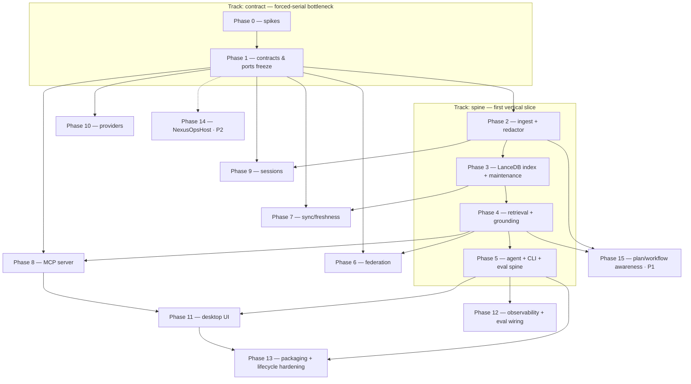

# IMPLEMENTATION_PLAN.md — Nexus Brain

> **Phase note.** Decomposition of the binding `ARCHITECTURE.md` (27 §-sections + Appendix A). **Build posture: production-grade · no timebox** (correctness/best-practice over speed; no demo phase). Build order = invariants → lifecycle correctness → tests → hardening. The **forced-serial bottleneck is Phase 1 (contracts & ports freeze)** — every track waits on it; the **first vertical slice** is the `spine` track (Phases 2–5: `add` one repo → grounded answer → eval green). Build mode = **agent-team multi-track** (worktrees per track). Locked decisions: `docs/planning/DECISIONS.md` D-1..D-27.
>
> **Reading discipline.** Read by section, not whole. The living sections (Currently-in-progress, Carry-forward, Log, Trims, Decisions) are bounded — pruned at `/orchestrate-end`.

> **Session protocol:**
> - **Start** — orchestrator `/orchestrate-start`; implementer `/session-start`. Confirm the session target with the user.
> - **End** (user-signalled) — implementer `/session-end` (TDD + cross-doc audit + Step-9 list + session doc + `/preflight`; never edits this doc); orchestrator `/orchestrate-end` (reconcile checkboxes, Log, Decisions, Carry-forward, round commit+push).

> **Reference deadlines:** none (no timebox — D-18). Sequence by the critical path, not dates.

> **Spec-anchor convention (architecture-as-contract).** Each phase header carries `**Spec anchors:**` (`ARCHITECTURE.md §N`). Re-read them at session start; a slice surfacing behavior the anchors don't cover is a cross-doc flag at `/tdd` Step 9 (missing anchor or drift). Each phase also carries `**Track:**` + `**Depends on (phases):**` (the source the Track map renders from). Mid-build tasks carry `(implements §X; origin: <slice>)` on the `### N.M` heading.

---

## Currently in progress

**Track `contract`, Phase 1 — at the fork-gate doorstep.** Phase-0 spikes 0.1 + 0.2 ✓ (0.3/0.4 not-yet-run, 0.5 HITL-deferred — before Phase-0 exit). **Phase 1.1 ✓ · 1.2 ✓ · 1.3 ✓ · 1.4 ✓ · 1.5 (boundary contracts: Redactor/policy/MCP) ✓ · 1.6 (before-fork hardening sweep) ✓ COMPLETE.** Last commit `de63ead` (track/contract; round-seal `b24df56`; suite **232/232** green, mypy --strict + ruff + format clean). **Cycled at end-of-1.6** (context WARN; fresh full-runway team takes the fork-gate stretch). LESSONS §1–§17 banked. **Handoff doc: `docs/sessions/contract-006-2026-06-20-phase1.5-1.6-orchestrator-handoff.md`** (read FIRST — round recap + decisions + deferred-to-phase + the D-A13/D-A14 fork obligations) + the decision log `docs/lead-decisions-while-away.md` (D-A1–A16) + the impl session doc `contract-005-*`.

**Next session target:** **Phase-0 spikes 0.3** (O-FED federation) + **0.4** (O-LANCE-BAKEOFF maintenance-contract invisibility) → **`/phase-exit 1`** (the fork gate; arch-drift audit [Appendix-A ↔ code — schema snapshots are the proof] + spec-coverage `scripts/spec-lint.sh tests 1` + dependency audit + the D-A13/D-A14 fork-obligation flags into the contract→spine handoff) → **merge `track/contract` → `main` = the fork gate** (spine + providers then spin up). (0.5 notarization HITL-deferred, D-A2.)

---

## Carry-forward to upcoming briefs

> _(Triaged at end-of-1.6 cycle. **The 1.5 boundary-contracts + the before-fork hardening sweep (1.6) bullets are DONE** — superseded; see `docs/sessions/contract-006-2026-06-20-*` for the round recap, the full deferred-to-phase list, and decisions D-A15/D-A16. The live set below: standing scaffolding/owner items + the D-A13/D-A14 fork-obligation handoff flags (carry into the `/phase-exit 1` contract→spine handoff). The D-A13/D-A14 bullets appear twice below — duplicate; dedupe at next prune.)_

- **1.5 `Redactor` + policy + MCP contract (NEXT brief)** *(spike 0.1; `docs/audits/redaction-envelope.md`)* — freeze `redact(payload, sink: Sink) -> str`, `Sink`={persist,mcp_egress,cloud_egress}; docstring enumerates the 3 accepted residuals (§18/C-11); envelope recall ≥95%/FP ≤5% (git-SHA 0% FP); invariants idempotent+never-raises+git-SHA-passthrough. **FLAG-4 + 95/5 threshold OWNER-deferred to 2.3/policy.yaml (D-A5/D-A6)** — signature accommodates both. **policy model = fail-CLOSED** (absent/empty/unrecognized → most-restrictive local-only). **MCP contract: ingress validation MUST use positive allow-lists (LESSON 10)** — `get_file` path canonicalize+contain, query/k/response bounds via Pydantic type + positive semantic check.
- **Before-fork HARDENING SWEEP — MUST-do-BEFORE-FORK** *(grew across 1.2c1/1.3/1.4; one focused slice before `/phase-exit 1`)* — (a) **whitespace-strip retrofit** of the 1.2 §5 identity fields (stamp/manifest/registry `min_length=1` admits `"   "`); 1.3/1.4 already bake `StringConstraints(strip_whitespace=True, min_length=1)` in. (b) **Consolidate ONE shared `IdentityStr` alias** (LESSON 7) — anchor/evidence/provenance/codegraph/secrets each redefine `_StrippedStr`/`IdentityStr`; hoist to a common module. (c) **`list[Child]`→`tuple[Child,...]` for frozen-contract collections** (LESSON 8 — `frozen=True` doesn't deep-freeze a list); retrofit `ProvenancePacket`'s collections + `GenerateResult.citations` (1.4c/1.4d already use tuple). (d) **control-char/NUL rejection + `max_length` cap** on the shared identity alias ([sec low], esp. `cited_text`/MCP-ingress). _Whitespace/mutable-container loose identity in a frozen cross-track contract post-fork = a Finding._
- **Standing scaffolding/owner items** — (a) spec-lint numeric-ID fix `392ed4f` → carry upstream at `/scaffold-upgrade`; (b) `requires-python "<3.13"` deliberate bump when moving to 3.13; (c) **D-A3 `.claude/commands/preflight.md` Step-4 `mypy core`→`mypy .`** (HITL-deferred, recommended-FIRST owner action; implementers override with `mypy .`).
- **★SAFETY contract→spine HANDOFF flag (D-A13; MUST appear in the `/phase-exit 1` handoff)** — Task **2.S** is the cardinal Key-safety-rule-#4 proof: the §14 INV-allowlist FULL runtime proof (every FS/git/session mutation routes via `HostPort.perform`) + the real `StandaloneHost`. 1.4a only seeds the static AST-scan tripwire; the runtime per-mutator proof crosses the fork — a Phase-2 must-do (with the first writer, 2.4/3.1).
- **★SAFETY contract→spine HANDOFF flag (D-A14; MUST appear in the `/phase-exit 1` handoff)** — Task **4.2** argv-hardening is the PRIMARY injection control for the CodeGraph shell-out's **query/symbol args** (un-allow-listable): `shell=False` + single fixed non-option argv + `--`. The 1.4c `resolve_codegraph_dir` allow-list covers `CODEGRAPH_DIR` only. Gated at Acceptance(4).
- **Deferred-to-phase (captured in handoff; not next-brief)** — (a) on-disk strict key-shape rejection → Phase-2/3 startup-reconcile loader *(1.2c1; models are lenient readers by design)*; (b) Phase-2.3 redactor engine FLAG-1/2/3 (encoding-aware oracle · JWT shape-matcher · binary corpus) + wire `ci/eval/redaction_fuzz/` as CI hard gate *(envelope doc §8)*; (c) Phase-2 SecretStore real-keychain-no-plaintext-on-self + log-scrub; (d) Phase-4 EvidenceType/IdKind canonical-membership pin (D-A11), Citations payload, ProvenancePacket `index_freshness` vocab + `file:line` token format.
- **★SAFETY contract→spine HANDOFF flag (D-A13; MUST appear in the `/phase-exit 1` handoff)** — Task **2.S** is the cardinal Key-safety-rule-#4 proof: the §14 INV-allowlist FULL runtime proof (every FS/git/session mutation routes via `HostPort.perform`) + the real `StandaloneHost`. 1.4a only seeds the static AST-scan tripwire; the runtime per-mutator proof crosses the fork and is a Phase-2 must-do — call it out explicitly in the contract→spine handoff so the spine team builds it with the first writer (2.4/3.1).
- **★SAFETY contract→spine HANDOFF flag (D-A14; MUST appear in the `/phase-exit 1` handoff)** — Task **4.2** argv-hardening is the PRIMARY command-injection control for the CodeGraph shell-out's **query/symbol args** (un-allow-listable code identifiers): `shell=False` + single fixed non-option argv + `--` terminator. The 1.4c `resolve_codegraph_dir` allow-list only covers `CODEGRAPH_DIR`; the query args are a separate untrusted shell-out input. Gated at Acceptance(4) — flag it so the spine team builds the CodeGraph adapter argv-hardened from the start.

---

## Deliverable map

<!-- ▼ EXAMPLE BLOCK [id=deliverable-map]: deliverable map — replace rows with the project's real required outputs (docs, deployed app, reports, etc.). ▼ -->

| Deliverable | Status | Delivered by |
|---|---|---|
| `nexus-brain-core` Python package (engine + ports) | ❌ | Phases 1–10 |
| Per-project LanceDB index + maintenance contract | ❌ | Phase 3 |
| Grounded-answer retrieval core (north star) | ❌ | Phase 4 |
| Embedded agent + `nexus`/`nb` CLI | ❌ | Phase 5 |
| Federation router (portfolio query) | ❌ | Phase 6 |
| Sync/freshness + drift radar | ❌ | Phase 7 |
| MCP server (trust boundary) | ❌ | Phase 8 |
| Opt-in session memory / episode cards | ❌ | Phase 9 |
| CI-gated eval harness + observability | ❌ | Phases 2–5, 12 |
| Tauri desktop app | ❌ | Phase 11 |
| Signed/notarized `.dmg` + Cask + `setup`/`uninstall` | ❌ | Phase 13 |
| (P1) Implementation-plan & workflow-pack awareness | ❌ | Phase 15 |
| (P2) NexusOpsHost adapter | ❌ | Phase 14 |

<!-- ▲ END EXAMPLE BLOCK [id=deliverable-map] ▲ -->
---

## Parallelization plan (Track map)

<!-- ▼ EXAMPLE BLOCK [id=parallelization-plan]: Parallelization plan / Track map — TEAM MODE ONLY. /tasks-gen authors this from ARCHITECTURE.md §2.5 refined by the per-task Depends on: graph. Authority for valid <track> names; /team-start <track> reads it. Delete this whole block for a single-track plan. ▼ -->

> **Team mode.** A *track* is a dependency-isolated region of the `ARCHITECTURE.md` §2.5 DAG. In this Python monorepo, track isolation is **by `core/` subpackage** (each track owns a subpackage + reads the frozen shared contracts read-only). Tracks fork only after the `contract` + `spine` tracks land.

**Phase/track DAG:**

> **Critical path:** Phase 0 → 1 → 2 → 3 → 4 → 5 → 13 (the serial floor — staff it first). **Forced-serial bottleneck:** **Phase 1** (the shared-contract freeze every track waits on).

**Track map** (`<track>-<area>-<role>` per root `CLAUDE.md` naming):

| Track | Phases | Code area(s) | Worktree (branch) | Agent-team names |
|---|---|---|---|---|
| contract | 0, 1 | `core/ports`, `core/model` | `../project-brain-contract` (`track/contract`) | `contract-core-orchestrator` / `-implementer` |
| spine | 2, 3, 4, 5 | `core/{ingest,index,retrieval,grounding,agent}`, `cli` | `../project-brain-spine` (`track/spine`) | `spine-core-orchestrator` / `-implementer` |
| federation | 6 | `core/federation` | `../project-brain-federation` (`track/federation`) | `federation-core-orchestrator` / `-implementer` |
| sync | 7 | `core/{sync,drift}` | `../project-brain-sync` (`track/sync`) | `sync-core-orchestrator` / `-implementer` |
| mcp | 8 | `core/mcp` | `../project-brain-mcp` (`track/mcp`) | `mcp-core-orchestrator` / `-implementer` |
| sessions | 9 | `core/sessions` | `../project-brain-sessions` (`track/sessions`) | `sessions-core-orchestrator` / `-implementer` |
| providers | 10 | `core/providers` | `../project-brain-providers` (`track/providers`) | `providers-core-orchestrator` / `-implementer` |
| plans `[P1]` | 15 | `core/plans` | `../project-brain-plans` (`track/plans`) | `plans-core-orchestrator` / `-implementer` |
| ui | 11 | `app/` (Tauri) | `../project-brain-ui` (`track/ui`) | `ui-app-orchestrator` / `-implementer` |
| observability | 12 | `core/obs`, `ci/` | `../project-brain-observability` (`track/observability`) | `observability-core-orchestrator` / `-implementer` |
| packaging | 13 | `app/`, `ci/`, `packaging/` | `../project-brain-packaging` (`track/packaging`) | `packaging-app-orchestrator` / `-implementer` |
| nexusops `[P2]` | 14 | `core/nexusops` | `../project-brain-nexusops` (`track/nexusops`) | `nexusops-core-orchestrator` / `-implementer` |

**Integration / merge order** (topological): 1) **contract** → integration branch first (freezes Appendix-A shared contracts); 2) **spine** (the vertical slice); 3) federation · sync · mcp · sessions · providers · **plans (P1)** (parallel, after spine); 4) ui · observability; 5) packaging; 6) (P2) nexusops.

**Shared contracts across tracks (freeze in Phase 1 before forks — Appendix A):** the LanceDB chunk schema · `.project-brain/manifest.json` + registry schema · `HostPort` · the 4 provider ports + `CodeGraphPort` · `Anchor` · `ProvenancePacket`+`EvidenceRef` · the store version stamp · the `Redactor` interface + fuzz corpus · the MCP tool contract · `policy.yaml`. A change to any after fork = a cross-track Finding.

<!-- ▲ END EXAMPLE BLOCK [id=parallelization-plan] ▲ -->
---

## Phase exit checklist (template — applies to every phase)

Executed row-by-row by `/phase-exit <phase>`:

- [ ] All phase task checkboxes ticked (partial work stays unchecked + Log note).
- [ ] Acceptance criterion met (`/preflight` clean + manual smoke where there's runtime behavior).
- [ ] `/preflight` clean (incl. architecture-invariant tests).
- [ ] Cross-doc invariants verified (no model field change without an `ARCHITECTURE.md` edit same round).
- [ ] Reachability audit clean per touched area.
- [ ] Arch-drift audit clean over the phase's Spec anchors.
- [ ] Spec coverage: every phase anchor has a tagged test or waiver (`scripts/spec-lint.sh tests <phase>`).
- [ ] **Dependency audit: no NEW findings vs baseline** — `pip-audit` (core) + `cargo audit` (app) once; new finding → accepted-risk in Decisions or a Finding. _(production-grade)_
- [ ] **Whole-system security review clean (qualifying phases)** — phases with security/invariant/trust-boundary tasks; policy `invariant` → built-in `/security-review` over the track diff; critical → Finding. _(production-grade)_
- [ ] **Perf budgets met or regression flagged** — run the phase's benchmark task(s) vs `ARCHITECTURE.md` budgets; no-budget phases tick `n/a`. _(production-grade)_
- [ ] Session doc(s) exist + list files created/modified.
- [ ] Commits pushed to origin.

---

## Final-submission acceptance criteria (project-level)

- [ ] `add` one repo → `ask` → a **grounded, `file:line`-anchored answer** with a provenance packet, on a real repo (no mocks on the load-bearing path).
- [ ] Portfolio/federated query returns a coherent answer, partial results **marked** (never silently wrong).
- [ ] **Eval harness green:** grounding-gate correctness, zero stale-anchor false-confidence, redaction-recall = zero-leak-on-catchable, retrieval Recall@k on the golden set.
- [ ] LanceDB **maintenance contract invisible** on the reference Mac (O-LANCE-BAKEOFF) under a multi-repo portfolio.
- [ ] Signed/notarized `.dmg` installs; `setup` provisions deps; `uninstall` reverses every host mutation.
- [ ] **No phone-home** (CI no-egress check); secrets keychain-only; redactor runs at all three sinks.

---

## Phase 0 — Pre-build spikes

**Goal:** retire the load-bearing unknowns before they distort the build; produce reusable rigs (fuzz harness, bake-off harness) the later phases assert against.

**Spec anchors:** `ARCHITECTURE.md §24`, §26, §11, §6, §18.

**Track:** contract · **Depends on (phases):** none.

### 0.1 — Redaction property/fuzz harness (rig)
- [x] A property generator + curated adversarial seed corpus for secret-shaped inputs (prefix/entropy/JSON-value classes); leak = a secret surviving into chunk text/vector OR a (simulated) MCP-egress OR cloud-egress payload.
- [x] Quantified **recall-floor (catchable set) + FP-ceiling** — proposed **recall ≥95% / FP ≤5%** (git-SHA 0% FP, hard sub-invariant); the 3 §18-anchored accepted-residual classes (git-SHA hex · adversarial <20-char split · sub-20-char JSON) recorded, zero deviation.
- [x] Files: `ci/eval/redaction_fuzz/` (NEW), `docs/audits/redaction-envelope.md` (NEW). _(landed @track/contract `f2b5f6c`; 34/34 harness tests.)_
- [x] Cross-doc invariant: none (test rig). Depends on: none.

### 0.2 — CodeGraph 1.0.1 column-diff + CodeGraphPort smoke (O-CG-COLDIFF)
- [x] Diff the live `.codegraph` 0.9.7 column set vs `@colbymchenry/codegraph@1.0.1` `schema.sql`; confirm the 5 tables + `schema_versions` — **CORRECTION: live `MAX(version)=5`, NOT `=1`; assert `>=5`**. CLI smoke ✓ — but `search` kind → CLI `codegraph query` (NOT `codegraph search`); system codegraph is v0.9.7 (lacks `explore`/`node`).
- [x] Pin `=1.0.1` exact (verdict: SAFE); record the `trace`/`context` → `explore` migration + `CODEGRAPH_DIR` handling.
- [x] Files: `ci/probes/codegraph_coldiff.md` (NEW). _(landed @track/contract `f2b5f6c`.)_ Cross-doc invariant: none. Depends on: none.

### 0.3 — Federation cross-repo resolution spike (O-FED)
- [ ] Prototype `unresolved_refs.reference_name` + namespaced `qualified_name` resolution across 2 fixture repos; measure precision; confirm the side-by-side-marked fallback path.
- [ ] Files: `ci/probes/federation_spike.md` (NEW). Cross-doc invariant: none. Depends on: 0.2.

### 0.4 — LanceDB maintenance-contract bake-off rig (O-LANCE-BAKEOFF)
- [ ] Harness to measure `optimize()` latency, index-build RAM, steady-state disk (versions+transactions) on a representative multi-repo corpus on the reference Mac (Apple-Silicon, 16–32 GB).
- [ ] Files: `ci/bench/lancedb_maintenance/` (NEW). Cross-doc invariant: none. Depends on: none.

### 0.5 — Notarization spike
- [ ] Prove a PyInstaller sidecar + Tauri `.app` notarizes under hardened runtime (deep-sign order; `spctl`/`codesign --deep` gate). Document the signing recipe.
- [ ] Files: `packaging/notarization-spike.md` (NEW). Cross-doc invariant: none. Depends on: none.

### Acceptance criteria (0)
- [ ] All 0.X ticked; each spike has a recorded verdict; the fuzz + bake-off rigs are reusable by later phases.

---

## Phase 1 — Shared contracts & ports freeze (the bottleneck)

**Goal:** define + freeze every cross-track contract (Appendix A) and the 11 ports as typed interfaces with named test doubles. **Nothing forks until this lands.**

**Spec anchors:** `ARCHITECTURE.md §7`, §5, §4, §10, §14, §16, §18, Appendix A, §2.5.

**Track:** contract · **Depends on (phases):** 0.

### 1.1 — Determinism seams: `Clock` + `Seed`/`IdGen` ports
- [x] `Clock` and `Seed`/`IdGen` port interfaces + real + fake implementations; injectable everywhere (anchor revalidation, drift ranking, manifest timestamps, id minting). _(landed @track/contract `61853b3`; +`monotonic()`, +`Seed.rng()`; fakes in `core/testing/fakes.py`; 16 tests `spec(§7)`.)_
- [x] Files: `core/ports/clock.py`, `core/ports/idgen.py` (NEW). Cross-doc invariant: NEW (`Clock`, `Seed/IdGen` — §7). Depends on: none.

### 1.2 — The data contracts: chunk schema · version stamp · manifest + registry
- [x] Frozen `Chunk`, store-level **version stamp**, `.project-brain/manifest.json` + global **registry** schemas (the §5 source-of-truth law: SHA-tag canonical, stamp canonical for schema/model/dim, manifest+registry derived); `schemaVersion` with a forward-only migrator + backup-before-migrate + downgrade-refuse. _(landed @track/contract: chunk `269b68e`, stamp `4fab4ab`, manifest `07c3cba`, registry `665dd8b`, migration engine `bb000b1`. Stamp omits the SHA (version tag canonical). backup+I/O are HOST-owned, Phase 2+. 82 tests.)_
- [x] Files: `core/model/{chunk,stamp,manifest,registry}.py`, `core/model/migrations.py` (NEW). Cross-doc invariant: NEW (Chunk, version stamp, Manifest+Registry — §5; schema-snapshot tests `spec(§5)`-tagged, +by-alias on-disk-key snapshot for the serialized files). Appendix-A reconciled (Chunk 16→19, manifest 9→12, registry 5→6). Depends on: 1.1.

### 1.3 — Trust contracts: `Anchor` · `ProvenancePacket` + `EvidenceRef`
- [x] Frozen `Anchor` (5-value `AnchorState`; `deleted`=record-lifecycle not a state), `EvidenceRef` (EvidenceType membership DEFERRED — **D-A11**), `ProvenancePacket` (10 fields incl. `evidence: tuple[EvidenceRef]` — additive **D-A12**). _(landed @track/contract as 3 atomic ★ sub-slices: Anchor `5b50b5f`, EvidenceRef `518da07`, ProvenancePacket `77276e3`; spec(§10) snapshots; 36 trust-contract tests.)_
- [x] Files: `core/model/{anchor,provenance,evidence}.py` (NEW). Cross-doc invariant: NEW (Anchor, ProvenancePacket, EvidenceRef — §10; spec(§10) snapshots). Appendix-A:216/217 reconciled (evidence[] +D-A12, EvidenceType deferral +D-A11, `deleted` §5 clarification). Depends on: 1.1.

### 1.4 — The ports: Host · providers · CodeGraph · Event · Secret · Observability
- [x] All 11 ports frozen as interfaces + Fake doubles (4 atomic sub-slices). `HostPort` (`8aa6935` — fail-closed authorize + perform capability-recheck + §14 tripwire; **SAFETY**), 4 provider ports (`e9d1e51` — behavioral Protocols + result types), `CodeGraphPort` (`b1dafcc` — spike-0.2 corrections + CODEGRAPH_DIR allow-list), `EventSource`/`SecretStore`/`ObservabilitySink` (`05c3551` — SecretRef-no-secret #3 pin). _(suite 174/174; cassette record/replay **re-sequenced** to providers/eval — not a freeze contract.)_
- [x] Acceptance: HostCapability is a closed typed StrEnum `{own_store_write|owned_doc_refresh|consented_host_config}` (membership-snapshot pinned); CodeGraphPort schema-gate asserts `MAX≥5` + `CODEGRAPH_DIR` allow-list resolver. _(Real StandaloneHost + CodeGraph CLI adapter deferred to Phase-2/4.2 — see Task 2.S/D-A13 + Phase-4.2/D-A14.)_
- [x] Files: `core/ports/{host,providers,codegraph,events,secrets,observability}.py`, `core/testing/fakes.py` (NEW). Cross-doc invariant: NEW (the ports — §7; spec(§7) snapshots for data types; behavioral Protocols carry no field-snapshot). **3 additive Appendix-A rows** (EventSource/SecretStore/ObservabilitySink — D-A12-class). Depends on: 1.1.

### 1.5 — Boundary contracts: MCP tool contract · `policy.yaml` · `Redactor` interface
- [x] Frozen MCP tool signatures (params incl. scope enum + project-id + top-k; result = chip+file:line+ids+provenance; streaming; policy-denied marker; **ingress validation** rules) · `policy.yaml` schema (providers/privacy `local|cloud`/boundary-filter/consent) · `Redactor` interface (`redact(payload, sink∈{persist,mcp_egress,cloud_egress})`). _(landed @track/contract as 4 atomic sub-slices: Redactor iface `343b6fb` [§18, LESSON 12], policy.yaml fail-CLOSED `a9df580` [§16, LESSON 13], MCP ingress `e65b9e3` [§14, LESSON 14], MCP results `959d5d9` [§14/§10, LESSON 15]; spec(§14)/spec(§16)/spec(§18) snapshots; PolicyDenied marker; composes ProvenancePacket/EvidenceRef.)_
- [x] Files: `core/model/{mcp_contract,policy,redactor_iface}.py` (NEW). Cross-doc invariant: NEW (MCP contract, policy.yaml, Redactor — §14/§16/§18; **§2.5-seam → schema-snapshot test `spec(§14)`/`spec(§18)`**). Appendix-A reconciled (policy.yaml +`schema_version`; MCP tool contract += result envelope + PolicyDenied marker + ASCII ingress allow-list + bound constants — additive, D-A7). Depends on: 1.1.

### 1.6 — Before-fork hardening sweep (LESSON 7/8/16/17 + StrictBool; implements §4/§5/§7; origin: 1.2c1/1.3/1.4/1.5 carry-forward)
- [x] **(1.6a) Shared hardened identity alias** — 11 dup `_StrippedStr`/`IdentityStr` defs → ONE cross-cutting `core/_types.py` `IdentityStr` (strip + min_length + reject Unicode control/format/bidi/zero-width Cc/Cf/Zl/Zp + max_length) + `TextStr` (content); closed the `chunk.py` bare-str zero-validation gap + the §5 stamp/manifest/registry strip gap. _(landed `0520304`; LESSON 16; owner-approved unicode char-policy D-A16.)_
- [x] **(1.6b) `list`→`tuple` for frozen-contract collections** — ProvenancePacket ×7 + GenerateResult.citations + manifest.artifacts → tuple; closed the composed-`McpResult.provenance.evidence` mutability gap. _(landed `ec71d48`; LESSON 8. chunk.vector list→tuple deferred to Phase 3.1 — LanceDB binding.)_
- [x] **(1.6c) `StrictBool` for safety/security/lifecycle/output bools** — policy ×3 opt-ins + HostAction.authorized + HostResult.ok + chunk.tombstone + McpResult.truncated → StrictBool; PolicyDenied.denied stays Literal[True]. _(landed `de63ead`; LESSON 17; owner-approved D-A15.)_
- [x] Files: `core/_types.py` (NEW) + retrofits across `core/model/*` + `core/ports/*`. Cross-doc invariant: constraint-tightening on frozen contracts (additive — no field-name/shape change; all schema-snapshots stayed green = the regression guard). Suite 174→232. Depends on: 1.2/1.3/1.4/1.5.

### Acceptance criteria (1)
- [ ] All Appendix-A freeze-before-fork models exist + have schema-snapshot tests; all 11 ports have interfaces + Fake doubles; `/preflight` clean. **This is the fork gate.**

---

## Phase 2 — Ingestion + Redactor (spine)

**Goal:** discover→classify→chunk→context-augment→**redact**→ready-to-embed, with the redaction zero-leak-on-catchable gate wired from the start.

**Spec anchors:** `ARCHITECTURE.md §8`, §18, §16, §5.

**Track:** spine · **Depends on (phases):** 1.

### 2.1 — Discovery + classification
- [ ] Source-agnostic discovery (md/code/schemas/`.github`) honoring `.gitignore`+`.brainignore`; classify producer/`doc_type`/owned·foreign·supplemental.
- [ ] Files: `core/ingest/{discover,classify}.py` (NEW). Cross-doc invariant: none. Depends on: 1.2.

### 2.2 — Anchor-aware chunking
- [ ] Docs heading-split + late-chunking; code AST via `CodeHierarchyNodeParser` (pinned) + **tree-sitter fallback**; emit `Chunk` + `Anchor`.
- [ ] Files: `core/ingest/chunk.py` (NEW). Cross-doc invariant: extended (Chunk/Anchor). Depends on: 1.2, 1.3.

### 2.3 — Redactor (catchable-set engine) + the fuzz gate
- [ ] Prefix/PEM/JWT + Shannon-entropy on KV/JSON-value, allowlist git-SHA/ULID/UUID; quarantine high-confidence-unsafe; runs at the persist sink (and is the same engine reused at MCP/cloud egress).
- [ ] Acceptance: **redaction-recall fuzz (Phase 0.1 rig) = zero-leak on the catchable set**; raw transcripts/`thinking` never reach a chunk.
- [ ] Files: `core/ingest/redactor.py` (NEW, implements 1.5 iface). Cross-doc invariant: extended (Redactor). Depends on: 1.5, 0.1.

### 2.4 — `add` ingest orchestration (idempotent)
- [ ] `add <repo>` runs the pipeline → context-augment → writes the manifest (derived projection); **re-add updates, never duplicates**; R-PARTIAL (ingest whatever exists, temp generation, no half-swap).
- [ ] Files: `core/ingest/pipeline.py`, `core/model/manifest.py` (extended) (NEW/extended). Cross-doc invariant: extended (Manifest). Depends on: 2.1, 2.2, 2.3.

### 2.S — ★SAFETY: §14 INV-allowlist FULL runtime proof — every mutator routes via `HostPort.perform` (implements §14/§4 #3; origin: 1.4a; **D-A13**)
- [ ] **Cardinal Key-safety-rule-#4 proof (crosses the fork — MUST land with the first mutation-capable module).** The `add`/manifest writer (2.4) is the first `core/` module that performs an FS mutation; it MUST route every FS/git/external/session mutation through `HostPort.perform` (StandaloneHost adapter), never a raw primitive. Add the **full runtime architecture-invariant test**: no mutation reaches the filesystem/git except through the authorized `perform` chokepoint (extends as 3.1 LanceDB writer + later writers land). Phase 1.4a seeded the **static AST-scan tripwire** (`test_inv_allowlist_no_mutation_outside_hostport` — no FS/git mutation primitive outside the host-adapter path); this task upgrades it to the runtime per-mutator proof + builds the real `StandaloneHost` (deferred from 1.4a) + **(a)** extends the static scan to session-state (`os.environ`/`putenv`) writes + **(b)** HARDENS the tripwire against the 1.4a residual — module-aliasing (`import os as _os`) + `getattr`/dynamic-dispatch resolution (1.4a security-reviewer residual, on the record) + **(c)** tests the REAL `StandaloneHost.perform` capability-recheck (1.4a only pins it on `FakeHost`). security-reviewer mandatory.
- [ ] Files: `core/ports/host.py` (StandaloneHost adapter — NEW real impl), the INV-allowlist runtime test. Cross-doc invariant: HostPort (§7) — StandaloneHost lands. Depends on: 1.4a, 2.4.

### Acceptance criteria (2)
- [ ] A repo ingests to redacted, chunked, anchored, context-augmented records; fuzz gate zero-leak; `add` idempotent.
- [ ] **★SAFETY (D-A13): the §14 INV-allowlist runtime proof is green — every FS/git/session mutation routes through `HostPort.perform`; no raw mutation primitive escapes the chokepoint. Phase 2 does NOT close without this (the cardinal Rule #4 proof; tripwire seeded in 1.4a).**

---

## Phase 3 — LanceDB index + maintenance contract (spine)

**Goal:** embed + write to a per-project LanceDB dataset with the full maintenance contract + the blue-green generation machine.

**Spec anchors:** `ARCHITECTURE.md §6`, §5, §16.

**Track:** spine · **Depends on (phases):** 2.

### 3.1 — LanceDB writer + hybrid table + version stamp
- [ ] Write chunks (vector+BM25+metadata+anchor) to a per-project dataset; stamp `{model,dim,schema,sha}`; **git-SHA version tag**; single-writer lease.
- [ ] Files: `core/index/lance_store.py` (NEW). Cross-doc invariant: extended (version stamp). Depends on: 1.2, 1.4.

### 3.2 — Maintenance contract
- [ ] `optimize()` after each upsert batch + `num_unindexed_rows≈0` monitor; scheduled `cleanup_old_versions()`; RAM-bounded batched builds; `spawn` not `fork`; arm64 wheels CI-verified.
- [ ] Acceptance: benchmark task vs the §6/§25 budgets (reference Mac) — **ONE discrete benchmark, not per-slice timing**.
- [ ] Files: `core/index/maintenance.py`, `ci/bench/lancedb_maintenance/` (extended). Cross-doc invariant: none. Depends on: 3.1, 0.4.

### 3.3 — Blue-green generation machine + ENOSPC
- [ ] Index-generation state machine (`building→reembedding→validating→swapping→active(+retired→gc→purged)`; failure discards new, keeps old); **ENOSPC pre-flight** (abort, retain prior, remediate); tombstone+replace keyed on `source_path`.
- [ ] Files: `core/index/generation.py` (NEW). Cross-doc invariant: NEW (Index-generation machine — §5; schema-snapshot `spec(§5)`). Depends on: 3.1.

### Acceptance criteria (3)
- [ ] A project indexes + serves queries; re-embed is blue-green with rollback; maintenance contract benchmark within budget on the reference Mac.

---

## Phase 4 — Retrieval + grounding (spine · NORTH STAR)

**Goal:** hybrid→rerank→hydrate→generate→**grounding gate**→provenance; the trust control with a deterministic test seam.

**Spec anchors:** `ARCHITECTURE.md §9`, §10, §11 (CodeGraphPort reads), §18.

**Track:** spine · **Depends on (phases):** 3.

### 4.1 — Hybrid retrieve + rerank + route
- [ ] Hybrid (dense+BM25) → rerank (~30–50→~10; deterministic RRF tie-break `(rrf_score desc, project_id asc, chunk_id asc)`); long-context-vs-RAG routing (<~200K → cached LC).
- [ ] Files: `core/retrieval/{hybrid,rerank,route}.py` (NEW). Cross-doc invariant: none. Depends on: 3.1, 1.4.

### 4.2 — CodeGraphPort + whole-file hydration (redacted)
- [ ] Structural tools (callers/callees/impact/explore/search) via `CodeGraphPort` CLI shell-out + tree-sitter fallback; whole-file hydration; **hydration egress passes the Redactor**.
- [ ] **★SAFETY (D-A14): argv-hardened shell-out — the PRIMARY injection defense for the query/symbol args.** The CLI adapter shells out **untrusted query terms + symbol names** (from retrieval) which CANNOT be charset-allow-listed (arbitrary code identifiers, e.g. `MyClass::method<T>`). Their ONLY control is execution containment: **`shell=False` + each arg a SINGLE fixed non-option argv element + the `--` options-terminator before positional args + absolute-resolve of the dir** (the 1.4c `resolve_codegraph_dir` allow-list covers `CODEGRAPH_DIR` only, NOT the query args). A shell-out of unvalidated query args reintroduces the exact command-injection the 1.4c dir-fix closed. security-reviewer mandatory; gated at Acceptance(4). _(origin: 1.4c; the 1.4c finding's Phase-3 residual, upgraded from defense-in-depth to primary control)._
- [ ] Files: `core/retrieval/{codegraph,hydrate}.py`, `core/ports/codegraph.py` (impl) (NEW/extended). Cross-doc invariant: extended (CodeGraphPort). Depends on: 1.4, 0.2, 2.3.

### 4.3 — Grounding gate + anchor revalidation + provenance
- [ ] Generate (ModelProvider + Citations) → **grounding gate: post-validate every cited span exists** (answer-but-flag; opt-in strict); continuous anchor revalidation (`live|stale|...` via `Clock`); attach `ProvenancePacket`.
- [ ] Acceptance: **deterministic test** against fixed `(retrieval-result, recorded-Citations-payload)` fixtures asserts 100% flag of injected unsupported/stale citations; **zero stale-anchor false-confidence**.
- [ ] Files: `core/grounding/{gate,revalidate,provenance}.py` (NEW). Cross-doc invariant: extended (Anchor, ProvenancePacket). Depends on: 1.3, 4.1, 4.2.

### Acceptance criteria (4)
- [ ] A query returns a grounded answer; the gate flags every unsupported/stale citation deterministically; provenance packet complete.
- [ ] **★SAFETY (D-A14): the CodeGraph CLI shell-out is argv-hardened** — `shell=False`, every query/symbol arg a single fixed non-option argv element, `--` options-terminator, absolute-resolved dir; a security-reviewer-verified injection test (untrusted query args cannot inject a flag or command). Phase 4 does NOT close without this (the query-arg injection control; origin 1.4c).

---

## Phase 5 — Embedded agent + CLI + eval spine (first vertical slice)

**Goal:** complete the vertical slice — `add` → `ask` (embedded agent or CLI) → grounded answer → eval green.

**Spec anchors:** `ARCHITECTURE.md §13`, §15, §19, §9.

**Track:** spine · **Depends on (phases):** 4.

### 5.1 — Embedded agent (LlamaIndex Workflow)
- [ ] A LlamaIndex Workflow driving the retrieval tools (Mode 1 read-only + Mode 2 draft); multi-turn state; budget rule + prompt-cache the stable prefix (cost control).
- [ ] Files: `core/agent/workflow.py` (NEW). Cross-doc invariant: none. Depends on: 4.3, 1.4.

### 5.2 — `nexus`/`nb` CLI
- [ ] `setup`/`add`/`sync`/`status`/`ask` headless commands over the core public API.
- [ ] Files: `cli/main.py` (NEW). Cross-doc invariant: none. Depends on: 5.1, 2.4.

### 5.3 — Eval harness spine + golden set
- [ ] CI-gated harness (custom evaluators → Langfuse local): grounding-gate correctness, anchor-revalidation, retrieval Recall@k; golden set = a fixture repo with scripted edits at known SHAs; hard gates separated from comparative.
- [ ] Files: `ci/eval/harness/` (NEW), `ci/eval/golden/` (NEW). Cross-doc invariant: none. Depends on: 4.3, 5.2.

### Acceptance criteria (5)
- [ ] `add` one repo → `ask` → grounded answer end-to-end on a real repo; **eval harness green** (the first-vertical-slice gate; tracks may now fork).

---

## Phase 6 — Federation router & registry

**Goal:** portfolio query — read-only fan-out over N indexes + union-rank; cross-repo resolution spike result; partial results marked.

**Spec anchors:** `ARCHITECTURE.md §11`, §5.

**Track:** federation · **Depends on (phases):** 1, 4.

### 6.1 — Registry + on-demand workers
- [ ] `~/.project-brain/` registry (derived; rebuildable by scanning manifests); on-demand worker activation + LRU idle eviction; only the router always-on.
- [ ] Files: `core/federation/{registry,workers}.py` (NEW). Cross-doc invariant: extended (Registry). Depends on: 1.2.

### 6.2 — Router fan-out + RRF + result-shape
- [ ] Read N LanceDB datasets read-only + N CodeGraph DBs; **union + RRF rank-fusion**; gate each on its **own** stamp; result carries `{projects_requested, answered, excluded[]}`; HYBRID-lean native co-indexing for same-root nests.
- [ ] Acceptance: a silently-partial portfolio answer is impossible (excluded[] always populated); optional DuckDB-Lance backing behind the same interface.
- [ ] Files: `core/federation/router.py` (NEW). Cross-doc invariant: none. Depends on: 6.1, 4.1, 0.3.

### Acceptance criteria (6)
- [ ] Cross-portfolio query returns a fused, ranked answer with excluded[] marked; cross-repo edges resolved-or-marked per the spike.

---

## Phase 7 — Sync & freshness + drift radar

**Goal:** keep indexes fresh (watcher + git-hooks) and surface staleness (never stale silently).

**Spec anchors:** `ARCHITECTURE.md §12`, §5, §10.

**Track:** sync · **Depends on (phases):** 1, 3.

### 7.1 — Watcher + git-hooks + incremental re-index
- [ ] Watchman/fswatch (debounced) + `post-commit/merge/checkout` hooks; content-hash delta → re-embed → tombstone+replace → `optimize()`; idempotent resume.
- [ ] Files: `core/sync/{watcher,hooks,incremental}.py` (NEW). Cross-doc invariant: none. Depends on: 3.1, 3.3.

### 7.2 — Drift radar + owned-doc refresh
- [ ] Revalidate anchors, rank by authority×recency×code-agreement; ownership-gated owned-doc refresh (don't-clobber 3-way-merge; the only bounded user-file mutation, via HostPort allowlist).
- [ ] Files: `core/drift/{radar,refresh}.py` (NEW). Cross-doc invariant: extended (Anchor, Doc-refresh machine). Depends on: 7.1, 4.3, 1.4.

### Acceptance criteria (7)
- [ ] Edits converge the index (watcher + hook backstop); drift surfaced + marked; owned-doc refresh never clobbers human edits.

---

## Phase 8 — MCP server & trust boundary

**Goal:** expose retrieval to external agents with ingress validation + egress redaction/policy — the trust boundary.

**Spec anchors:** `ARCHITECTURE.md §14`, §18, §9.

**Track:** mcp · **Depends on (phases):** 1, 4.

### 8.1 — FastMCP 3.x server + tools
- [ ] `search`/`get_file`/`graph`/`list_projects`/`status` per the frozen contract; streaming; policy-denied → marker-not-error; pin FastMCP major (3.0 migration budgeted).
- [ ] Files: `core/mcp/server.py`, `core/mcp/tools.py` (NEW). Cross-doc invariant: extended (MCP contract). Depends on: 1.5, 4.3.

### 8.2 — Trust boundary: ingress validation + egress redaction + transport auth
- [ ] Ingress: canonicalize+contain `get_file` paths, authorize scope vs registry+policy before fan-out, bound query/k/response sizes (Pydantic type + semantic). Egress: redactor + policy-filter regardless of caller (incl. hydration). Transport: stdio (parent-trust) + opt-in loopback (`127.0.0.1` + per-launch token, constant-time compare, Origin allowlist, DNS-rebinding defense).
- [ ] Acceptance: **INV-allowlist test** (no core module reaches fs/git mutation except via `HostPort.perform`); MCP-boundary contract test (redaction + policy-deny-marker + token auth + no-egress).
- [ ] Files: `core/mcp/boundary.py` (NEW). Cross-doc invariant: none. Depends on: 8.1, 2.3.

### Acceptance criteria (8)
- [ ] External agent queries are ingress-validated + egress-redacted/policy-filtered; loopback token auth hardened; security review clean.

---

## Phase 9 — Session memory & episode cards (opt-in)

**Goal:** opt-in, consent-gated, redacted session ingestion → episode cards (Claude first).

**Spec anchors:** `ARCHITECTURE.md §17`, §5, §18.

**Track:** sessions · **Depends on (phases):** 1, 2.

### 9.1 — EpisodeCard machine + consent gate
- [ ] State machine (`no_consent→...→embedded→linked`; terminals `consent_revoked`(purge), `superseded`); per-project consent stricter than docs; raw transcripts/`thinking` never embedded.
- [ ] Files: `core/sessions/episode.py` (NEW). Cross-doc invariant: NEW (EpisodeCard machine — §5; schema-snapshot `spec(§5)`). Depends on: 1.3, 2.3.

### 9.2 — Claude transcript ingest + commit linking
- [ ] Read Claude transcripts → redact → summarize → episode card; commit-link with confidence; Codex deferred `[P1]`.
- [ ] Files: `core/sessions/ingest.py` (NEW). Cross-doc invariant: extended (EpisodeCard). Depends on: 9.1.

### Acceptance criteria (9)
- [ ] Opt-in session ingest produces redacted episode cards; consent-revoke purges; no raw/thinking embedded.

---

## Phase 10 — Providers (pluggable) + bake-offs

**Goal:** the provider menu behind the frozen ports — user-choice local|cloud, version-stamped, blue-green on swap.

**Spec anchors:** `ARCHITECTURE.md §16`, §7.

**Track:** providers · **Depends on (phases):** 1.

### 10.1 — Local + cloud provider adapters
- [ ] Embedding (qwen3-embedding-4b local / voyage-code-3 cloud), reranker (qwen3-reranker / voyage-rerank-2.5), context (voyage-context-3 / late-chunking), generation (latest Claude); per-project `policy.yaml` selection; **honest local|cloud disclosure**; redaction+keychain regardless.
- [ ] Files: `core/providers/{embedding,rerank,context,model}.py` (NEW, implement 1.4 ifaces). Cross-doc invariant: extended (provider ports). Depends on: 1.4, 1.5.

### 10.2 — Bake-off harness (reranker + cloud embedder)
- [ ] In-domain golden-set bake-off (voyage-rerank-2.5 vs zerank-2 vs cohere; voyage-code-3 vs gemini-embedding-2) feeding the eval harness; records the chosen defaults.
- [ ] Files: `ci/eval/bakeoff/` (NEW). Cross-doc invariant: none. Depends on: 10.1, 5.3.

### Acceptance criteria (10)
- [ ] Provider swap works (blue-green re-embed); local|cloud user choice honored + disclosed; bake-off recorded.

---

## Phase 11 — Tauri desktop UI

**Goal:** the native desktop app — chat + evidence chips + freshness banner + project management, over the frozen core API.

**Spec anchors:** `ARCHITECTURE.md §15`, §2, §14.

**Track:** ui · **Depends on (phases):** 5, 8.

### 11.1 — Tauri shell + sidecar lifecycle
- [ ] Tauri host bundles the Python core sidecar (PyInstaller); loopback HTTP + per-launch token; sidecar supervise/respawn + token re-handshake.
- [ ] Files: `app/src-tauri/` (NEW). Cross-doc invariant: none. Depends on: 5.2, 8.2.

### 11.2 — Chat UI (NexusOps-ui-kit)
- [ ] Chat + evidence chips + freshness/staleness banner + provenance; project add/list/status; first-run/empty-portfolio flow.
- [ ] Files: `app/src/` (NEW). Cross-doc invariant: none. Depends on: 11.1.

### Acceptance criteria (11)
- [ ] Desktop app drives an end-to-end grounded ask with evidence chips + freshness; sidecar lifecycle robust.

---

## Phase 12 — Observability + eval wiring

**Goal:** OTel + OpenInference → Collector → Langfuse + SigNoz; ship instrumented-but-silent; eval harness fully wired as a release gate.

**Spec anchors:** `ARCHITECTURE.md §19`, §22, §25.

**Track:** observability · **Depends on (phases):** 5.

### 12.1 — OTel/OpenInference instrumentation (off-by-default, local-only)
- [ ] Instrument LlamaIndex + Anthropic + the system spans via `ObservabilitySink`; off-by-default + opt-in local diagnostics; **CI no-egress check** (never phone home).
- [ ] Files: `core/obs/otel.py` (NEW, impl 1.4 iface). Cross-doc invariant: none. Depends on: 1.4.

### 12.2 — Collector fan-out + dev/CI backends
- [ ] OTel Collector config (gen_ai→Langfuse; all→SigNoz) as dev/CI infra (compose profile, NOT shipped); wire the eval harness as a release gate.
- [ ] Files: `ci/observability/` (NEW). Cross-doc invariant: none. Depends on: 12.1, 5.3.

### Acceptance criteria (12)
- [ ] Instrumented-but-silent verified (no-egress); eval gate enforced in CI; backends are dev/CI-only.

---

## Phase 13 — Packaging + setup/lifecycle hardening

**Goal:** signed/notarized distribution + idempotent/reversible setup + auto-update quiesce + migration/backup — the production deploy/rollback path.

**Spec anchors:** `ARCHITECTURE.md §20`, §21, §22.

**Track:** packaging · **Depends on (phases):** 5, 11.

### 13.1 — `setup`/`uninstall` (idempotent · reversible · consented)
- [ ] `setup` provisions CodeGraph(`=1.0.1`)+Ollama+model (detect→install→**verify-by-hash, fail-closed**), MCP+skills registration, keychain, local|cloud choice — all via a mutation ledger; `uninstall` reverses every entry.
- [ ] Files: `core/setup/{provision,register,uninstall}.py` (NEW). Cross-doc invariant: none. Depends on: 5.2, 10.1.

### 13.2 — Packaging: `.dmg`/Cask + notarization + signed update feed
- [ ] Tauri-bundled signed/notarized `.dmg`/`.app` (per the 0.5 spike) + Homebrew Cask + auto-updater with a signed feed + Cask sha256 bump + yank/rollback.
- [ ] Files: `packaging/`, `ci/release/` (NEW). Cross-doc invariant: none. Depends on: 11.1, 0.5.

### 13.3 — Lifecycle hardening: auto-update quiesce + migration + failure-mode table
- [ ] Auto-update-while-mid-write quiesce/drain/resume handshake + store-integrity check; on-disk schema migration runner + backup + downgrade-refuse; shell↔sidecar↔store version handshake; the §22 failure-mode contracts (429/backoff, keychain-denied degrade, disk-full, crash-resume).
- [ ] Files: `core/lifecycle/{update,migrate,recovery}.py` (NEW). Cross-doc invariant: extended (manifest/registry migration). Depends on: 13.1, 3.3.

### Acceptance criteria (13)
- [ ] `.dmg` installs + notarizes; `setup`/`uninstall` fully reversible; auto-update is mid-write-safe; migration/backup/rollback proven; failure-mode tests green.

---

## Phase 14 — NexusOpsHost adapter & seam `[P2]`

**Goal:** the additive embedded adapter — propose-only via the NexusOps Gateway. **Deferred; never touches the spine.**

**Spec anchors:** `ARCHITECTURE.md §23`, §7, `docs/integrations/MAIN_PLATFORM_INTERFACE.md` v0.2.

**Track:** nexusops `[P2]` · **Depends on (phases):** 1.

### 14.1 — NexusOpsHost (propose-only)
- [ ] Implement `HostPort` as NexusOpsHost: every mutation → typed `ActionPlan`/`ActionRequest` to the Gateway; consume the redacted outbox (seq/dedup/unknown-tolerant); shared IDs; conform to frozen primitives.
- [ ] Files: `core/nexusops/host.py` (NEW). Cross-doc invariant: extended (HostPort; ActionPlan forward-shape). Depends on: 1.4.

### Acceptance criteria (14)
- [ ] Embedded mode proposes (never executes) via the Gateway; the core is unchanged (same engine, swapped adapter).

---

## Phase 15 — Implementation-plan & workflow-pack awareness `[P1]`

**Goal:** parse implementation plans into structured tasks + detect workflow pack-vs-instance state, surfaced as evidence + "what should I work on next" (FR-15/FR-16). PRD-roadmap P1; contracted at §27 (added at the tasks-gen gate per owner choice to architect-not-defer).

**Spec anchors:** `ARCHITECTURE.md §27`, §8, §5, §10.

**Track:** plans · **Depends on (phases):** 2, 4.

### 15.1 — ImplementationPlan + PlanTask parser
- [ ] Parse `IMPLEMENTATION_PLAN.md` (legacy `MVP_TASKS.md`; both names) → structured `{phases, tracks, tasks, anchors, acceptance, deps, architecture_refs}`; **degrade to whole-file ingest when unparseable** (never blocks); PlanTask manual-linking model (preserve manual links before any auto-sync).
- [ ] Files: `core/plans/parser.py` (NEW). Cross-doc invariant: NEW (ImplementationPlan, PlanTask — §27; **§2.5-seam → schema-snapshot test `spec(§27)`**). Depends on: 2.4, 1.2.

### 15.2 — Workflow pack/instance detector
- [ ] Classify cc-crew/workflow state (template-available vs personalized-instance vs the 12 R-7 states); enforce **template availability ≠ readiness**; index commands/skills/subagents/hooks/manifests; read `.scaffolding/manifest.json` **read-only**; expose readiness + drift.
- [ ] Files: `core/plans/workflow_detect.py` (NEW). Cross-doc invariant: extended (WorkflowInstance machine — §5). Depends on: 15.1, 2.1.

### 15.3 — Surface plan-tasks as evidence + "next task"
- [ ] Plan-tasks → evidence chips + the agent's "what should I work on next" reasoning; integrated, link to NexusOps shared IDs; graceful degradation on non-cc-crew repos.
- [ ] Files: `core/plans/surface.py` (NEW). Cross-doc invariant: none. Depends on: 15.1, 4.3.

### Acceptance criteria (15)
- [ ] A cc-crew project's plan parses into structured tasks; workflow state classified (template ≠ ready); plan-tasks surface as evidence; code-only repos degrade gracefully.

---

## Trims / Nice-to-Haves Catalog

_(Empty at project start; populated as scope cuts surface. Seeded nice-to-haves from the gap audit §6: first-run/empty-portfolio polish, P3 flows — since-you-left / cross-project impact, telemetry-consent UX, desktop a11y baseline, data export/backup/machine-migration, i18n scope note.)_

---

## Decisions tabled

- **Full schema-snapshot coverage (all Appendix-A models, not just §2.5-seam-crossed):** revisit off accumulated `/phase-exit` verdicts. _(Deliberate, user-approved exception to start-empty — the per-plan §2.5-seam snapshot seed.)_

---

## Log

### 2026-06-20 — contract track: Phase 1.5 (boundary contracts) + 1.6 (before-fork hardening sweep) COMPLETE (end-of-1.6 cycle)

- **Completed:** **Phase 1.5** — boundary contracts frozen as 4 atomic sub-slices (Redactor iface `343b6fb` §18 · policy.yaml fail-CLOSED `a9df580` §16 · MCP ingress `e65b9e3` + results `959d5d9` §14/§10; PolicyDenied marker; composes ProvenancePacket/EvidenceRef). **Phase 1.6** — before-fork hardening sweep (new task `### 1.6`): identity consolidation → `core/_types.py` + unicode-hardened `IdentityStr` `0520304` · frozen-collection list→tuple `ec71d48` · StrictBool ×7 `de63ead`. Suite 174→**232**. LESSONS §12–§17 banked. Briefs contract-014…020. Round-seal `b24df56` (track/contract).
- **Decisions made (owner-approved, present/driving):** **D-A15** StrictBool uniform for frozen safety/security/lifecycle/output bools (exempt: deny-strengthening `Literal[True]`). **D-A16** IdentityStr Unicode char-policy (reject Cc/Cf/Zl/Zp on identities; allow unicode letters; Trojan-Source CONTENT sanitization → Phase-2 redactor, LESSON 14). Additive Appendix-A reconciliations (policy.yaml +`schema_version`; MCP result envelope + PolicyDenied + ASCII allow-list).
- **Safety findings handled:** 1.6a medium before-fork finding (ASCII-only control-rejection on frozen identity fields still admitted Unicode bidi/zero-width/C1 → owner-approved Cc/Cf/Zl/Zp extension, D-A16). Every security-relevant slice (1.5a/1.5c1/1.6a/1.6c) security-reviewed CLEAN.
- **Scope shifts:** before-fork sweep formalized as task `### 1.6` (a/b/c). Deferred-to-phase: chunk.vector→tuple (3.1, LanceDB binding); Trojan-Source content sanitization (2); §14-ingress hardening (`_GetFilePath` max_length + query control-char) + `get_file` runtime realpath-containment (8.2). Full list in contract-006.
- **New blockers / open questions:** none. Fork obligations D-A13 (Task 2.S) + D-A14 (Task 4.2) carry to the spine via `/phase-exit 1`.
- **Next session target:** Phase-0 spikes 0.3 (O-FED) + 0.4 (O-LANCE-BAKEOFF) → `/phase-exit 1` (fork gate) → merge `track/contract` → `main`. Fresh full-runway team (cycled end-of-1.6, context WARN).
- **Reference:** orchestrator handoff `contract-006-2026-06-20-phase1.5-1.6-orchestrator-handoff.md`; impl session doc `contract-005-2026-06-20-*`.

### 2026-06-18 — contract track: Phase 1.3 (trust contracts) + 1.4 (11-port freeze) COMPLETE (end-of-1.4 cycle)

- **Completed:** **Phase 1.3** — the 3 §10 trust contracts frozen as atomic sub-slices (Anchor `5b50b5f` · EvidenceRef `518da07` · ProvenancePacket `77276e3`). **Phase 1.4** — all 11 ports frozen (HostPort `8aa6935` · 4 providers `e9d1e51` · CodeGraphPort `b1dafcc` · Event/Secret/Observability `05c3551`). Suite **174/174** green. LESSONS §6–§11 banked. 7 briefs (contract-007…013).
- **Decisions made (lead-adjudicated, owner-away):** **D-A11** EvidenceType/IdKind membership DEFERRED to Phase-4 (external NexusOps authority; constrained-str now, narrow additively). **D-A12** ProvenancePacket reconciled +`evidence: tuple[EvidenceRef]` (additive, ER-map-mandated). **D-A13** §14 INV-allowlist FULL runtime proof = Task 2.S (Phase-2, gated; 1.4a seeds the static tripwire). **D-A14** CodeGraph shell-out argv-hardening = Phase-4.2 ★SAFETY (primary query-arg injection control; gated Acceptance(4)). HostPort fail-closed authorize + perform capability-recheck (defense-in-depth). CodeGraph spike-0.2 corrections baked (schema ≥5, search→query, CODEGRAPH_DIR allow-list). model_version on EmbeddingProvider only (principled asymmetry). SecretRef carries no secret (#3). cassette record/replay re-sequenced to providers/eval.
- **Safety findings handled:** 1.4c HIGH (CodeGraph dir-validator deny-list → positive allow-list + 18-value bypass corpus; LESSON 10). All HIGH/critical relayed to lead per recalibration. HostPort chokepoint proof accepted (D-A13). No unresolved security residuals (the 2 gated Phase-2/4 tasks backstop the deferred runtime proofs).
- **Cross-doc:** 9 `core/CLAUDE.md` rows + LESSONS §6–§11; ARCHITECTURE.md Appendix-A:216–220 reconciled + 3 additive port rows (Event/Secret/Obs) + §5 line-90 `deleted` clarification.
- **Scope shifts:** 1.3/1.4 ran as 7 atomic sub-slices (each ★ freeze with its own snapshot). cassette → providers/eval. Real StandaloneHost → Phase-2; real CodeGraph CLI adapter → Phase-4.2.
- **Next session target:** Phase 1.5 (MCP contract · policy.yaml · Redactor iface) → before-fork hardening sweep → Phase-0 0.3/0.4 → `/phase-exit 1` (fork gate) → merge. Fresh full-runway team (cycled at end-of-1.4).
- **Reference:** orchestrator handoff `docs/sessions/contract-004-2026-06-18-phase1-trust-and-ports-handoff.md`; impl session doc `contract-003-*`; decision log D-A1–A14. Round commits — impl on `track/contract` (`5b50b5f`…`05c3551`), integration on `main` (this).

### 2026-06-17 — contract track: Phase-0 spikes + Phase 1.1/1.2 contract freeze (end-of-1.2 cycle)

- **Completed:** Phase-0 spikes 0.1 (redaction envelope) + 0.2 (CodeGraph coldiff); Phase 1.1 (Clock/Seed/IdGen determinism seams + `core/` package bootstrap); **Phase 1.2 COMPLETE** — the §5 contract group frozen (Chunk · StoreVersionStamp · ProjectManifest+ManifestArtifact · Registry+RegistryEntry · pure migration engine). Suite 82 green. LESSONS §1–§5 banked.
- **Decisions:** stamp omits the SHA (version tag = sole canonical SHA home; DATA_MODEL draft superseded; D-A8-equiv); Appendix-A field-set reconciles (Chunk 16→19, manifest 9→12, registry 5→6; D-A7); serialized-file models pin two snapshots + `validate_by_name/by_alias` (LESSON §4); migration engine PURE (host owns I/O+backup, §4/§7); `RegistryEntry.policy` min_length=1 (fail-open closed). Owner-deferred (lead-adjudicated): FLAG-4 cloud-egress strictness + the 95/5 redaction threshold → Phase 2.3 (D-A5/D-A6); 0.5 notarization → HITL (D-A2); D-A3 preflight.md edit → recommended-FIRST owner action, HITL-deferred.
- **Findings handled:** register-shadow HIGH bug (code-only, LESSON §3); spec-lint numeric-ID gate fixed (`392ed4f`); gate-output-suppression shipped 3 E501s (lint-only, fixed `1ffdcc4`, LESSON §5, root enabler = D-A3 / D-A9).
- **Scope shifts:** Task 1.2 ran as 5 atomic per-model sub-slices (1.2a–1.2d) rather than one bundle (each a ★ freeze-before-fork with its own snapshot). Before-fork hardening sweep (whitespace-strip) carried forward.
- **Next session target:** Phase 1.3 (trust contracts: Anchor/ProvenancePacket/EvidenceRef) → 1.4 (ports) → 1.5 (boundary contracts). Run Phase-0 0.3/0.4(/0.5) + the before-fork sweeps before `/phase-exit 1` (the fork gate).
- **Reference:** orchestrator handoff doc `docs/sessions/contract-001-2026-06-17-phase1-contracts.md`. Round commits — impl on `track/contract` (`61853b3`…`bb000b1`), integration on `main` (`aa1f32d`/`4b6e742`/`c02e32b` + this).

_(Populated at every `/orchestrate-end`.)_
