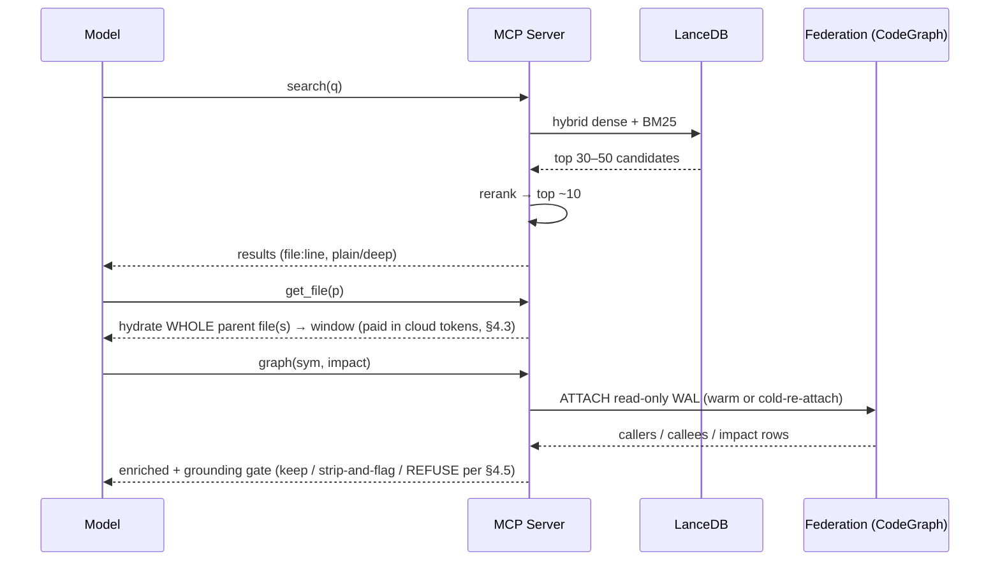

# project-brain — Product Requirements Document (Rough Draft)

> ⚠️ **SUPERSEDED — preserved as the historical rough draft (2026-06-03).** The current PRD is [`PRD.md`](./PRD.md) (v2). This file predates the standalone-first / NexusOps framing and the platform contract freeze (NexusOps `CONTRACT_VERSION 0.34.0`); kept for provenance only — **do not build from it.** Naming note: "Anchorlight" (Appendix D) is no longer the lead candidate; the working name is `project-brain`, with a possible future rename to **Nexus** / **Nexus Brain**.
> **Status:** ROUGH DRAFT · **Date:** 2026-06-03 · **Working name:** `project-brain` (naming candidates in [Appendix D](#appendix-d--naming-candidates))
> **Owner:** dreddheddz@gmail.com · **Companion docs:** [`RESEARCH_DOSSIER.md`](../research/RESEARCH_DOSSIER.md) (research dossier), [`../../README.md`](../../README.md)
> **Honesty note:** This draft marks assumptions with **[ASSUMPTION]**, unverified capabilities with **[UNVERIFIED]**, and undecided questions with **[OPEN]**. The CodeGraph federation design in particular leans on a single live probe (Python-only sample) whose limits are documented in §1.5, §13, and the dossier — read those before committing engineering to v1.1+. Where this doc makes a capability claim, it tries to say plainly what was *verified on the probe* vs what is an *orchestration-layer bet we still have to build and prove*.

---

## 1. TL;DR

`project-brain` is a **local-first, multi-project knowledge platform** that fuses a *curated docs pipeline* (the layer-docs / LESSONS / planning artifacts that cc-crew already emits) with **an orchestration-layer federation over N independently-live, per-repo code graphs** (CodeGraph-style AST/call-graph intelligence, one live index *per* repo, fanned-out and union-read — **not** a single native cross-repo graph; cross-repo *edge resolution* is a v1.1+ read-side bet, see §1.5 and §13), and serves both to a **frontier model** (Opus / GPT-5.5-class, 200K–1M context) through a local MCP harness — so you can ask one question across your entire portfolio and get an answer where **every claim carries a clickable `file:line`** and is dated and honest about staleness. The keystone is the `file:line` **anchor**, treated not as text but as a typed, continuously re-validated edge between docs and code.

**The honest one-liner:** *N live per-repo graphs, fanned-out and union-read, fused on the `file:line` anchor to a curated docs pipeline, on a local-first frontier harness.* No competitor occupies that intersection: *local-first AND portfolio-scale AND frontier-harness AND docs-fused-to-per-repo-live-code-graphs.* Cross-repo symbol resolution — the thing that would turn "N graphs side by side" into "one graph" — is the v2 moat and is **explicitly unproven** (§1.5, §13).

---

## 1.5. Assumptions & open decisions (read this first)

> Every open bet, its gate, and a default, in one screen. Markers: **[VERIFIED]** (live probe / cited source), **[UNVERIFIED]** (plausible but unconfirmed — do not build as if true), **[ASSUMPTION]** (working premise), **[OPEN]** (undecided product question). Full detail in §13 and the dossier.

| # | Open item | Marker | Blocks / gates | Default if unresolved |
|---|---|---|---|---|
| A1 | **Cross-repo symbol resolution** read-side (ATTACH-union + namespaced `qualified_name` + `unresolved_refs`) actually resolves at acceptable precision | [UNVERIFIED] | W1 / W3 / W6 (v2 moat); a go/no-go spike gates them (§13) | Degrade to per-repo + manual linking; MVP/v1 value stands without it |
| A2 | **Multi-language federation** — cross-language `qualified_name` namespacing/collision (probe was Python-only) | [UNVERIFIED] | Same v2 moat as A1; widens or narrows the portfolio it serves | Assume **single-language portfolio** for v1.1; multi-language is a v1.1+ spike |
| A3 | **Idle-project staleness** — CodeGraph daemon idle-exits at 300 s; no `watch`/`daemon` subcommand | [VERIFIED] limit | Goal 4 freshness claim; cold re-attach SLA (§12) | "Live while active, cold-but-fast-catch-up when idle" — *not* always-live |
| A4 | **Keep-warm strategy** must use `serve` (no standalone watcher) | [VERIFIED] / [UNVERIFIED] cost | FR-2.7; steady-state liveness of idle projects | Lean on cheap cold re-attach (catch-up sync) rather than holding daemons hot |
| A5 | **Embedding reproducibility** — cloud voyage-code-3 not guaranteed bit-reproducible across calls/point-releases | [ASSUMPTION] | "rebuildable cache" claim (§5); audit/replay metric | Claim *equivalent retrieval quality*, not bit-identical re-embedding |
| A6 | **Prompt-cache TTL** regression (1h→5m) | [ASSUMPTION] | Harness cost (§12, FR-4.6) | Verify/pin TTL each session; budget for 5-min default |
| A7 | **Non-cc-crew / code-only repos** — is the "thin brain" (no plain/deep, no drift) compelling? **Now softened:** source-agnostic discovery (FR-11) makes ANY repo a first-class citizen (its docs are ingested as FOREIGN; layer-docs is SUPPLEMENTAL gap-fill); cc-crew is one privileged producer, not a precondition | [OPEN] → **softened** | Audience-expansion decision; spec'd as feature W13 (§8) + FR-11 discovery; §13 | **Repo-agnostic by default** (discover+ingest whatever exists); cc-crew docs are the richest tier, not the gate |
| A12 | **CodeGraph distribution channel** — `brain setup` must install CodeGraph, but it is **likely NOT an npm package** (the probe is a Node CLI `@colbymchenry/codegraph`, but the toolchain may ship via brew/cargo/pipx/download) | [UNVERIFIED] | FR-10.2(a) setup (CodeGraph-present step); install self-containment | Setup **detects → installs via the real channel → verifies**, never assumes an npm `dependencies` entry; if no auto-channel found, print exact manual install steps and continue degraded |
| A13 | **Skills-bundling for a self-contained install** — for a fresh machine with ONLY project-brain, where do `layer-docs`/`learn-site`/the doc-update skill come from: (a) a shared installable unit both repos consume, (b) vendor a copy/fork, (c) hard-depend on a cc-crew checkout | [OPEN] | FR-10.2(c) (skills-register step); §10 boundary; install self-containment | **Lean (a) or (b) — self-contained.** Default to vendoring a pinned copy (b) for v1 so install never needs a cc-crew checkout; extract a shared unit (a) when both repos diverge |
| A8 | **Team-mode trust model** — key distribution / revocation for signed `.brain` bundles | [OPEN] | W2 / W7 (team sync); not shippable without it | De-scope team sync until a key-management requirement exists |
| A9 | **Naming / trademark clearance** — none of the [Appendix D](#appendix-d--naming-candidates) candidates are cleared | [OPEN] | v1 naming gate | Keep working name `project-brain` until cleared |
| A10 | **Grounding-gate action on an unanchorable-but-true sentence** | [OPEN] | §12 grounding metrics; FR-4.5 behavior | Strip-and-flag (annotate as unverifiable), not silent drop — decide at v1 |
| A11 | **Storage budget / eviction at scale** — disk ceiling + vacuum cadence across 6–15 → N≈50 projects | [OPEN] | FR-8.1; behavior at N≈50 | Name a per-project + total ceiling and vacuum SLA by v1.1; LRU-evict cold derived caches |
| A14 | **Codex `session_meta` carries the cwd** for project association — Claude Code records carry `cwd` on EVERY record **[VERIFIED]**; Codex's `session_meta` record **LIKELY** holds cwd+model but is **unconfirmed** | [UNVERIFIED] | FR-13 Codex session association; Session Memory cross-tool half (M9/W14) | Confirm by reading a real `session_meta` record at build time; if cwd is absent, fall back to thread-name / first-`cd` heuristic and mark those associations low-confidence |
| A15 | **Transcript-privacy gate** — session transcripts are free-form chat and **routinely contain pasted secrets/keys/PII**; ingesting them is strictly riskier than code/docs | [VERIFIED risk] / [OPEN] policy | FR-13 session ingestion; M9/W14 cross-tool version | **Session ingestion is OPT-IN per project, defaults to LOCAL embeddings, runs a redaction pass, honors per-project ZDR, and NEVER sends raw transcript chunks to a cloud model without explicit consent.** `thinking` blocks are excluded from embeds entirely |
| A16 | **Transcript schemas are undocumented + version-pinned** — Claude Code records carry a `version` (e.g. `2.1.154`); Codex's `session_meta`/`event_msg`/`response_item` schema is reverse-engineered, not specced | [UNVERIFIED stability] | FR-13 normalizer; M9/W14 robustness | Build **version-tolerant adapters** (ingest the fields understood, flag the rest, never hard-fail on an unknown record type); pin the observed schema version in provenance |
| A17 | **Commit-linking is heuristic** — matching a `tool_use` edit on path P at time T to a git commit touching P near T is best-effort; uncommitted, squashed, rebased, or amended work weakens it | [ASSUMPTION] | FR-13 commit-linking; the Session Memory signature payoff | Cite the linked `<sha>` **with a confidence/looseness marker**; degrade to "session touched P (uncommitted/unlinked)" rather than asserting a false commit link |

---

## 2. Problem & motivation

**The pain today.** A developer with a portfolio of projects (the cc-crew user is exactly this) has, per project, a rich set of artifacts: layered architecture docs anchored to code, a LESSONS log of hard-won fixes, planning/decision records, an `ARCHITECTURE.md` contract, and the live code itself. But:

- **AI coding tools start fresh every request.** They have no persistent dependency graph and "can't see that service A's token validation depends on service B's types" — the single most-cited 2026 limitation. Reasoning is per-repo or per-session.
- **Docs rot silently.** A `file:line` anchor in a layer doc points at a symbol that moved three commits ago; an exec-summary describes code that changed. Nothing tells you the docs are lying until you trust one and get burned. Swimm built an entire company on *single-repo* auto-sync; nobody does it portfolio-wide.
- **Institutional memory evaporates.** You solved this exact race condition in project C four months ago and wrote a LESSON about it. When you hit it again in project F, nothing surfaces it. The corpus exists, structured, anchored — and is never recalled.
- **The market is siloed.** Tools are *cloud multi-repo* (Cody, Unblocked, Glean) **OR** *local single-repo* (Continue, Aider, Cursor's @codebase, Pieces) **OR** *docs-only* (Swimm, Mintlify, DeepWiki) **OR** *PR-review-scoped* (Greptile, Ellipsis). None is local-first, portfolio-wide, docs+code-fused, and frontier-harnessed at once.

**Why a multi-project, docs+code, live brain.** Two assets the cc-crew pipeline already produces — a *curated, code-anchored docs corpus* (plain⇄deep, drift-flaggable, with a stable-ID LESSONS log) and *per-repo live code graphs* (CodeGraph) — are individually valuable but, fused on the `file:line` anchor and **federated (union-read) across the portfolio**, become something no competitor has: a brain that reasons across *all* your projects, *jointly* over docs and code, *grounded* in citations, and *honest* about how fresh it is. (Federation here is orchestration-layer union-read over N per-repo graphs; cross-repo *edge resolution* is the v2 bet — §1.5.) The cost to build it is low precisely because cc-crew already authored the hard part (the structured docs); the brain only has to *consume, index, federate, and serve*.

---

## 3. Goals & non-goals

### Goals
1. **Portfolio-wide Q&A.** One `/ask` that reasons across *all* registered projects, fusing dense + BM25 (MVP) and per-repo live call-graph edges (from v1.1), with every claim carrying a resolvable `file:line` (or being refused). "Across all projects" means **fan-out + union-read over N per-repo indexes** — cross-repo *symbol* resolution is the separate v2 bet (§1.5).
2. **Living docs↔code join.** Parse every `file:line` anchor as a typed edge and continuously re-resolve it — green if it still points at its symbol, red if stale. (Re-resolution is staged: against HEAD in the MVP, upgraded to the live per-repo code graph in v1.1 — §8, §14.) This is the keystone everything else trusts.
3. **Local-first & private.** Index, embeddings, and code graph stay on-machine. Only the text the harness deliberately returns reaches a cloud model, and only under a per-project policy (**ZDR** = zero-data-retention, redaction). A secret-heavy repo can be fully air-gapped (local embeddings + local generation).
4. **Live-while-active freshness (cold-but-fast-catch-up when idle).** For the brain's *own* docs/code index: watcher + git hooks + content-hash diffing keep an *active* project current with sub-second-to-seconds lag. For the *federated code graph*: each per-repo CodeGraph daemon is live only while queried and **[VERIFIED] idle-exits at 300 s** — so an idle project's graph is cold and re-syncs (fast catch-up) on next attach. The honest steady state is therefore *live while active, cold-but-fast-catch-up when idle* — **not** continuously always-live. Every answer is dated, says when the docs drifted from HEAD, and (for graph-derived claims) whether the underlying daemon was warm or cold-re-attached. See the *idle-project staleness window* metric in §12.
5. **Compounding memory.** Federated, semantic+BM25 recall over every project's LESSONS corpus — "you cracked this exact problem in project C; here's the rule and the fix."
6. **Honest staleness.** Every answer stamped with `ingestedFromSha`, embedding-model, and cited chunk IDs; replayable months later for audit.
7. **Clean boundary with cc-crew — but repo-agnostic.** The brain *consumes* cc-crew's docs through a small versioned contract and never authors docs (except clearly-namespaced SUPPLEMENTAL gap-fill) or mutates cc-crew's provenance manifest. **cc-crew is one privileged producer, not a precondition:** the brain discovers and ingests *whatever docs exist*, however produced (gstack, Compound Engineering, Mintlify/Docusaurus, ADRs, hand-written notes), and degrades gracefully (§7 FR-11).
8. **Install-and-go.** The product installs as a global CLI (`npx` / `npm -g`); a one-time `brain setup` makes it ready out of the box (ensures CodeGraph is present, registers the MCP server into host configs, registers the doc skills, creates the central store) and `brain add <repo>` bootstraps a workspace, all **idempotent, reversible, and consented** (§7 FR-10).

### Non-goals (explicitly out of scope)
- **Not a doc author (it *orchestrates* authors).** The brain never hand-writes a producer's content from scratch — cc-crew/gstack/humans own authorship. What it *may* do: (a) **orchestrate** a re-runnable skill it owns (e.g. trigger `layer-docs --update`) to refresh OWNED docs on drift, and (b) add clearly-namespaced **SUPPLEMENTAL** gap-fill where docs are absent (§7 FR-12, §8 V10 self-updating brain). It never overwrites FOREIGN (human/other-tool) docs. Its core remains: discover, ingest, index, federate, serve.
- **Not a cloud vendor.** We never become a hosted SaaS. "Team mode" is a local router (`Brain Hub`) + a serverless `.brain` bundle — not a multi-tenant cloud.
- **Not a CodeGraph replacement.** We *consume and federate* CodeGraph (or any code-intelligence MCP); we do not re-implement AST parsing or call-graph extraction.
- **Not a generic enterprise RAG over Slack/Jira/Confluence.** Our corpus is the *curated developer docs + code* portfolio. (A Linear/Jira *injector* is a moonshot, not the core.)
- **Not an IDE extension product.** v1 ships a CLI + MCP server + optional thin web UI. A maintained from-scratch IDE extension is explicitly de-scoped to "a thin MCP client an editor *can* call."
- **[ASSUMPTION] Not real-time multi-writer collaboration.** Team mode is read-share + per-machine indexes, not a shared live-edited store.

---

## 4. Target users & personas

**Primary user:** the **solo / small-team developer who runs cc-crew across a portfolio of projects** — they already produce the curated docs the brain feeds on, and they feel the "AI starts fresh every request" pain acutely across many repos.

### Persona A — "Dia, the portfolio solo-dev" (primary)
Runs 6–15 active projects locally, all scaffolded and documented via cc-crew. Privacy-conscious (secret-heavy client repos), works on a laptop, lives in Claude Code / Codex. **Pain:** can't ask one question across all projects; re-solves problems she already solved elsewhere; doesn't trust that a layer doc still matches the code. **Wants:** `/ask` over everything, grounded and dated; déjà-vu LESSONS recall; drift warnings. **Success:** "It found the JWT-refresh LESSON from a project I forgot I'd written it in, with the exact `file:line`."

### Persona B — "Marco, the new teammate onboarding" (v1/v2)
Joins a team using the brain; needs to understand a 40-layer system fast without reading every file. **Pain:** generic AI explanations hallucinate; per-repo wikis don't connect; he doesn't know the safe order to learn things. **Wants:** plain→deep explanations he can dial, role-scoped onboarding quests sequenced by the layer graph, a live `trace` that opens the real `file:line` as it narrates. **Success:** "I got a guided, *cited* tour that opened the actual code as it explained the flow."

### Persona C — "Priya, the tech lead / reviewer" (v1/v2)
Owns architectural coherence across the portfolio; reviews PRs and worries about cross-project blast radius. **Pain:** "what breaks across my whole portfolio if I change this symbol?" is unanswerable today; docs drift goes unnoticed until incidents. **Wants:** Drift Radar (where the docs lie, portfolio-wide), PR-aware answers (`/ask --pr 1234` names invalidated docs/LESSONS), Cross-Project Impact Lens, a decision ledger ("why did we choose X?"). **Success:** "A CI gate failed a PR because code moved out from under a documented claim, before it shipped."

---

## 5. Core concept / product vision

> **The `file:line` anchor is the unlock.** It is the join key that fuses a *curated docs pipeline* (plain/deep, drift-flagged, LESSONS) to **N per-repo live code graphs federated at the orchestration layer** on a *frontier harness* — producing the local-first, portfolio-wide, docs+code, grounded-and-dated brain that no competitor occupies. (Federation here means *union-read over N independently-live per-repo graphs*; turning that into true cross-repo edge resolution is the v2 bet — §1.5, §13.)

Concretely, the vision is a single always-available surface where:

- You **add a project** once; thereafter the brain's docs/code index stays current automatically *while the project is active* (watcher + git hooks + content-hash deltas), and its per-repo code graph is live while queried / cold-but-fast-catch-up when idle.
- You **ask one question** and the brain fans retrieval across the whole portfolio — hybrid (dense + BM25) to *locate*, then **hydrate whole files** into the frontier model's huge window to *read*, then enrich with **per-repo call-graph** edges to *reason structurally*.
- **Every claim is anchored.** A grounding gate enforces the §4.5 contract: every sentence must carry a resolvable `file:line` from tool outputs, and cited spans are post-validated against the (re-attached) graph; an unsupported claim is refused or stripped-and-flagged.
- **Every answer is dated and honest.** "Grounded at `abc123`; docs drifted 4 commits; 2 anchors may be stale; graph cold-re-attached."
- **The docs and the code are reasoned jointly**, at the asker's altitude (plain for onboarding, deep for architecture) — because, *for cc-crew docs*, the source authored *both* registers. (Code-only / non-cc-crew repos have only the `deep`/code view — the plain⇄deep dial is a projection of authored registers, not a free LLM rewrite; §13, FR-4.7.)

The brain is a **rebuildable derived cache** — but "rebuildable" means *reproduces equivalent retrieval quality*, not bit-identical re-embedding. The full set of inputs needed to reproduce it is: **source files + the project registry + per-project `policy.yaml` + the embedding-model-version/endpoint behavior** (a cloud embedder such as voyage-code-3 is **not** guaranteed bit-reproducible across calls or model point-releases). Any *derived* store (vectors, FTS, graph reads) can be dropped and rebuilt without coordination; the non-reproducible inputs are source + registry + policies + accreted brain state (e.g. LESSONS-recall history), not source files alone.

---

## 6. Key user stories / use-cases

- **As Dia,** I `npm i -g project-brain && brain setup` once on a fresh laptop and everything I need is ready — CodeGraph installed, the brain registered as an MCP server in Claude Code / Codex, the doc skills available — without hand-editing a single config, and I can undo it all with `brain setup --uninstall`.
- **As Dia,** I run `brain add ~/dev/payments` once and it stays current as I code, so I never manually re-index — and it doesn't refuse a half-finished project: it ingests whatever docs+code exist now and nudges me to run layer-docs when `docs/layers/` is thin, without blocking.
- **As Dia,** I point the brain at a repo that has **no cc-crew docs** — just a README, some ADRs, and gstack-generated docs — and it still builds a useful brain over them, citing each source's producer.
- **As Dia,** when I refactor and the layer docs fall out of date, the brain notices (the anchors stopped resolving), runs `layer-docs --update` for me on the OWNED docs, and re-embeds only what changed — so the brain keeps itself honest without my babysitting it.
- **As Dia,** I ask *"why does the billing service depend on the identity service?"* and get a cited answer drawing on the owning layer doc + the real code at its anchors + a live call-graph context call.
- **As Dia,** I ask *"have I solved JWT refresh anywhere?"* and get each project's owning-layer summary + `file:line`, ranked, with a one-line diff of how they differ.
- **As Marco,** I open the brain and get a role-scoped onboarding path sequenced by the layer graph; each step opens the real `file:line` via a live `trace`.
- **As Marco,** I hover a project term and see a plain definition plus the canonical `file:line` where it's *defined*, resolved live.
- **As Priya,** I run `brain drift` and get a portfolio-wide ranked board of dead anchors, stale exec-summaries, and `depends_on` edges the live graph contradicts.
- **As Priya,** I run `brain ask --pr 1234` and the brain diffs the PR, runs `impact`/`callers` on every touched symbol across the federation, and names which layer-doc sections and LESSONS it invalidates.
- **As Priya,** a CI gate fails a PR because an anchor no longer resolves — drift caught before merge.
- **As Priya (v2),** I ask *"what breaks across my whole portfolio if I change this symbol?"* and get cross-repo impact enriched with each hit's layer doc + drift state.
- **As Priya,** I ask *"when did we implement the eval gate, and why did we choose strip-and-flag over a hard refuse?"* and get a cited answer that names **the session** (tool `claude`/`codex`, model, date, gitBranch), summarizes the decision from that session's episode card, and links the **resulting commit `<sha>`** — turning my own past agent sessions into a searchable decision ledger (the commit link is **best-effort/heuristic** — A17 — and labeled as such).
- **As Dia,** I ask *"what was I doing when `billing/charge.py` last changed?"* and the brain finds the session whose `tool_use` edits touched that file, names the session + branch + model + date, summarizes the intent and outcome, and points at the commit it produced — recovering the *why/when* that the code and docs alone never recorded.
- **As any user,** I get every answer dated, replayable, and honest about how stale the underlying index is.

---

## 7. Functional requirements (by capability)

> Convention: **MUST** / **SHOULD** / **MAY** per RFC-2119 sense. Capability IDs map to the architecture (§9) and roadmap (§14).

### (1) Add-a-project / ingest
- **FR-1.1** The system MUST provide `brain add <repo>` that discovers a project via its read-only `.scaffolding/manifest.json` (identity: `scaffoldingRepo`, `placeholders.PROJECT_NAME`, `codeAreas[]`, `generatedFromSha`) and registers it.
- **FR-1.2** Ingest MUST consume cc-crew artifacts: `docs/layers/`, `docs/planning/`, `ARCHITECTURE.md`, `MVP_TASKS.md`, `<area>/LESSONS.md`.
- **FR-1.3** Ingest SHOULD take a **fast path** by consuming `docs/learn-site/content.json` directly (already a structured plain/deep model) and a **faithful path** by re-deriving from `docs/layers/`.
- **FR-1.4** The chunker MUST be **anchor-aware**: every `file:line` is parsed per the cc-crew anchor grammar into a typed `anchor` row, not opaque text.
- **FR-1.5** Doc chunking MUST split markdown by heading hierarchy (H1→H2→H3), keep the heading path as metadata, store **plain** and **deep** registers per chunk, and MAY use late chunking for long docs.
- **FR-1.6** Code chunking MUST use AST/tree-sitter structural chunking (`CodeHierarchyNodeParser`, parent/child scope refs) and SHOULD prepend a **graph-derived** context blurb (deterministic from CodeGraph, not an LLM guess).
- **FR-1.7** The system MUST **degrade gracefully** on absent artifacts: no manifest → repo-name identity + code-only; no `docs/layers/` → no plain/deep split, no drift validation; older spec → ingest the subset it understands and flag the rest. The brain MUST NOT require cc-crew.
- **FR-1.8** The system MUST write its own sibling ledger `.scaffolding/brain.json` (or `.project-brain/manifest.json`) and MUST NOT mutate `manifest.json`.

### (2) Sync & freshness (live-while-active; cold-but-fast-catch-up when idle)
- **FR-2.1** Each project MUST run a **debounced filesystem watcher** (Watchman default; fswatch fallback) on the low-latency path.
- **FR-2.2** The system MUST install **git hooks** (`post-commit`, `post-merge`, `post-checkout`) as a deterministic correctness backstop for branch switches and merges.
- **FR-2.3** The system MUST maintain a **Merkle file-hash manifest** to find dirty files and a **chunk-hash embedding cache** so unchanged/duplicate chunks (even cross-repo) are never re-embedded.
- **FR-2.4** Deletes MUST **tombstone** (soft-delete + periodic vacuum) so the structural graph and vector store stay consistent without full rebuilds.
- **FR-2.5** Re-index MUST write to a temp generation and **atomically swap**, so a crash mid-build leaves the prior generation live and the next run resumes only missing deltas (idempotent by construction).
- **FR-2.6** New rows MUST be folded into the FTS/ANN index (LanceDB `table.optimize()`); the system MUST NOT leave new rows on a permanent flat-scan path.
- **FR-2.7 [UNVERIFIED dependency]** Because **[VERIFIED]** the CodeGraph daemon idle-exits at 300 s and there is **no `watch`/`daemon` subcommand** (the watcher lives only inside `serve`), the system SHOULD either keep the per-repo daemon warm per *active* workspace via `serve` keep-warm pings, **or** accept cold re-attach and rely on the cheap fast catch-up sync. Whichever is chosen, the system MUST surface, per graph-derived answer, whether the daemon was warm or cold-re-attached, and MUST track the *idle-project staleness window* (§12).
- **FR-2.8 (own-write concurrency)** The brain MUST serialize its **own** writes to a project's store. Two near-simultaneous triggers (watcher + git hook), or two concurrent `brain` CLI invocations against the same project, MUST NOT corrupt the index or double-embed: re-index runs under a per-project writer lock (advisory lockfile / SQLite write transaction), with the loser coalescing into the winner's pending-delta set rather than starting a competing build. (Read-side WAL federation concurrency is covered by FR-5.2; this requirement is about the brain's *own* LanceDB/SQLite writer.)

### (2a) Sync & onboarding FAILURE MODES (trust is the moat — these MUST be specified)

> Happy-path sync is FR-2.1–2.8. Because a *reasoning* brain's only moat is trust, every break in the sync/onboarding path needs a defined contract: **failure → detection → user-visible state → recovery.** Below is the required contract table; each row is a MUST.

| # | Failure | Detection | User-visible state | Recovery |
|---|---|---|---|---|
| **FM-1** | **Watcher misses an event** (Watchman not installed *and* fswatch absent, or a missed/coalesced event) | git-hook backstop on next commit/merge/checkout; periodic Merkle re-scan reconciles file-hashes vs index | Answer banner: "index may lag HEAD by N commits / last reconciled `<sha>`" — never silent rot | Next git hook or scheduled Merkle reconcile re-ingests dirty files; manual `brain sync <repo>` forces it |
| **FM-2** | **Git hook not installed / overridden** (clone into existing repo; `core.hooksPath`, husky, lefthook own the hooks dir) | On `brain add` and on each query, verify the hook is reachable; if `core.hooksPath` is set, detect and chain rather than overwrite | Warning at add-time + per-answer "hook backstop inactive — relying on watcher + periodic reconcile" | Install via the configured `core.hooksPath` (append, don't clobber); fall back to a periodic Merkle reconcile timer as the backstop-for-the-backstop |
| **FM-3** | **Embedding API (voyage-code-3) down / rate-limited mid-ingest** | HTTP error / 429 from the embedder during a batch | Ingest reports "partial: M/N chunks embedded; index serving prior generation" — the temp generation is NOT swapped in | Idempotent resume from the chunk-hash cache (FR-2.3, FR-2.5): only un-embedded deltas retry with backoff; no half-finished swap; optional automatic fallback to the local embedder if policy allows |
| **FM-4** | **First ingest of a large repo** (e.g. 500+ files) takes long / is interrupted | Progress + ETA emitted; checkpoint after each embedded generation | "Ingesting: X/Y files, est. T remaining" — queryable on the partial as it builds | **Resumable by construction** (content-hash manifest + atomic temp-generation): a kill mid-ingest resumes only missing deltas. The §12 "time-to-first-grounded-answer < 5 min" target is **[ASSUMPTION] for a small/median repo only** — large first ingests may be minutes-to-tens-of-minutes and MUST show progress, not hang |
| **FM-5** | **CodeGraph not installed / `.codegraph/` absent** on a registered repo | Registry/router probes for `codegraph.db` at attach time | Graph tools return "no code graph for `<project>` — answering from docs + hybrid search only"; answer is flagged as graph-degraded | Brain still serves docs RAG + hybrid search + anchor re-resolution against HEAD text (not the call-graph); user prompted to run CodeGraph indexing to light up `callers/callees/impact/trace` |

- **FR-2.9** Every degraded state above MUST be **reflected in the answer's provenance stamp** (e.g. `graph: unavailable`, `index: lagging 3 commits`, `embed: partial`), never hidden. A degraded answer is allowed; a *silently* degraded answer is not.

### (3) Multi-project model
- **FR-3.1** The system MUST maintain a **project registry** (`~/.brain/registry.json`) mapping `project_id → {repo_root, brain_db_path, codegraph_db_path, schema_version, model_version, policy_path, ingestedFromSha}`.
- **FR-3.2** Each project MUST have its own per-project store (LanceDB + sibling SQLite), partitioned at query time by a `project` column/filter — never one giant shared index.
- **FR-3.3** The registry MUST be the single source of truth that the federation router and MCP server route through.
- **FR-3.4** Projects MUST be independently rebuildable; dropping one project's store MUST NOT affect others.

### (4) Query / ask (the frontier harness)
- **FR-4.1** The system MUST expose a **local MCP server** (FastMCP, stdio) as the only component that touches raw code — the trust/DLP boundary.
- **FR-4.2** Tools (model-invoked) MUST include: `search(query, project?, k, mode=hybrid)`, `get_file/get_chunk` (retrieve-then-read), `graph(symbol, kind=callers|callees|impact|trace)`, `explain(target)`, `drift()`, `list_projects/status`.
- **FR-4.3** Retrieval MUST be **hybrid (dense + BM25) → rerank top ~30–50 to top ~10 → hydrate whole parent file(s)** into the model's window. Whole-file hydration is **the single biggest code-QA quality lever**, but it is *not* free: it is paid in **frontier-model input tokens + latency** — the expensive, *non-local* resource. (Local storage is cheap; the model context window is not.) It MUST therefore be governed by the §4.4 long-context-vs-RAG rule, not applied unconditionally.
- **FR-4.4** The system MUST apply the long-context-vs-RAG decision rule: per-project scope < ~200K tokens → cached long-context (skip retrieval); scope > window or multi-project → agentic RAG; **graph tools always-on regardless**. **[VERIFIED caveat]** even when a corpus *fits* the window, a 1M-token request is slower than fetching ~5 chunks — so when latency-sensitive, **prefer retrieval even if the whole project would fit**. "Fits the window" is a sufficient condition to *allow* hydration, not a reason to *always* hydrate.
- **FR-4.5 (grounding gate — explicit action)** Every result MUST return stable IDs + `file:line` anchors. The **grounding gate** MUST classify each answer sentence and take a *defined* action:
  - **anchored + span post-validates** → keep;
  - **claims a doc fact but the anchor is dead/stale** → strip the sentence and flag the answer ("1 claim dropped: anchor no longer resolves");
  - **true-but-structurally-unanchorable** (e.g. "this service has no tests" — an absence, which has no `file:line`) → **MUST NOT be silently dropped**; annotate it as `[unverifiable-by-anchor]` (default: strip-and-flag, decided at v1 — A10) rather than mutilating fluency or asserting false confidence.
  - If *no* sentence in a candidate answer can be anchored, the gate MUST refuse the whole answer rather than emit ungrounded prose. The §12 "100% / 0" targets are the *aspiration* under this gate, reported against a measured floor (see §12).
- **FR-4.6** The harness SHOULD use prompt caching for the stable prefix (system prompt + tool schemas + pinned manifest), default 5-min TTL for interactive sessions, and **[ASSUMPTION]** SHOULD verify the cache TTL on each session (a known regression silently dropped 1h→5m, inflating cost).
- **FR-4.7** Answers SHOULD be depth-adaptive (plain⇄deep toggle). **This is a pure projection at zero extra LLM cost ONLY when the answer is synthesized from cc-crew's pre-authored dual register** (plain = exec-summary, deep = depth). For **code-only / non-cc-crew** sources, only the `deep`/code view exists, so the dial MUST either (a) present deep-only and say "no authored plain register for this source," or (b) — if a plain rendering is explicitly requested — perform an *extra* LLM summarization pass and label it as a generated (not authored) summary. The "zero-cost" claim is scoped to dual-register doc chunks; it MUST NOT be advertised for code-only answers.

### (5) Code-graph federation (orchestration-layer union-read over N per-repo graphs)
- **FR-5.1** The federation router MUST open each registered `.codegraph/codegraph.db` **read-only over WAL** and run `callers/callees/trace/impact` directly against the stable property-graph schema — **no repo checkout required**.
- **FR-5.2** The router MUST honor WAL constraints: same host only, `-shm`/`-wal` readable (or `immutable` query param), and MUST gate on `schema_versions` (v4 observed) to refuse/upgrade mismatched stores.
- **FR-5.3** The router MAY fall back to a **proxy per-project CodeGraph MCP / one-shot CLI** (`codegraph query/context/callers/callees/impact`, headless against any `.codegraph`) when a schema-read can't serve a query faithfully.
- **FR-5.4** The system MUST **fan out per workspace** (one addressable graph per repo); it MUST NOT assume a single multiplexing daemon (none exists).
- **FR-5.5 [UNVERIFIED — v2 moat; gated, NOT a v1 MUST]** Cross-repo resolution is the v2 moat and is **explicitly unproven**. The proposed mechanism is **read-side**: namespace `qualified_name` by `project_id` for globally-unique monikers, ATTACH-union the N DBs, and resolve `unresolved_refs.reference_name → qualified_name` across them. This MUST NOT assume CodeGraph's `serve` resolves cross-repo (the probe could not confirm it does). Because the probe lists `unresolved_refs` only as *"the seam where links would live"* — i.e. it is untested whether `reference_name` carries enough to resolve at acceptable precision — the normative requirement is:
  - **v1.1 SHALL prototype** the read-side resolution and **gate** it behind an explicit **go/no-go spike** with a stated **precision threshold** (e.g. ≥ X% of cross-repo references correctly resolved on a representative sample) *before* W1 / W3 / W6 are committed.
  - **[UNVERIFIED] Multi-language assumption:** the probe sample was **Python-only**; cross-language `qualified_name` namespacing/collision is untested. The spike MUST assume a **single-language portfolio** unless/until multi-language resolution is separately validated (A2).
  - If the spike fails the threshold, W1/W3/W6 degrade to **per-repo impact + manual cross-repo linking**, and the headline moat is re-scoped — not silently shipped as if resolved.

### (6) Privacy / security

> First-use expansions: **ZDR** = zero-data-retention (the model provider retains no prompt/response data). **DLP** = data-loss-prevention (a gate that inspects/redacts outbound text for secrets, keys, and PII before it leaves the trust boundary).

- **FR-6.1** Index, embeddings, and code graph MUST stay on-machine. Only text the MCP tool layer **chooses to return** may reach a cloud model.
- **FR-6.2** Each project MUST carry a `policy.yaml` (allowed transport, ZDR-required flag, redaction rules, roles) enforced at the MCP boundary; `list_projects()` MUST honor it so a sensitive repo can never route to a cloud model.
- **FR-6.3** The system MUST **redact secrets/PII before embedding** (embedding-inversion can reconstruct near-source text from vectors).
- **FR-6.4** A **local-only mode** (local embedder + local rerank + on-device generation) MUST be available for air-gapped repos; cloud paths MUST require ZDR + DLP.

### (7) Optional UI / learn-site integration
- **FR-7.1** learn-site MUST remain the static, human-browsable teach view; the brain UI is the *queryable* sink, consuming the same MCP server.
- **FR-7.2** The brain UI's plain⇄deep toggle MUST be a pure projection of the dual register `content.json` already serializes (no extra LLM cost).
- **FR-7.3** The UI MAY surface the drift board, déjà-vu LESSONS recall, and onboarding quests as first-class views.

### (8) Storage budget & lifecycle
- **FR-8.1 (size budget & eviction)** Across a Persona-A portfolio (6–15 projects, scaling toward N≈50) the brain MUST have a defined **disk budget and eviction policy** for its *own* stores (vectors + FTS + whole-file-hydration corpora + tombstones-before-vacuum). The system MUST expose per-project and total store size, MUST set a **vacuum cadence** for tombstoned rows (so soft-deletes don't accumulate unbounded), and SHOULD support LRU eviction of cold *derived* caches (rebuildable on next query). "Larger-than-memory via LanceDB" is the storage substrate, **[OPEN]** but a named ceiling / behavior at N≈50 is a v1.1 decision, not unbounded by default.

### (9) Telemetry (so the §12 metrics are actually measurable)
- **FR-9.1** The harness MUST **emit the events** the §12 success metrics derive from — at minimum: per-`/ask` {projects-spanned, whether a federated cross-project LESSON was surfaced and clicked (déjà-vu), grounding-gate outcomes per sentence (kept/stripped/refused), graph warm-vs-cold-re-attach, tokens consumed, agentic-vs-classic path}; per-ingest {chunk-hash cache hit-rate = re-embed avoidance, time-to-first-grounded-answer, partial/resumed flags}; per-sync {index lag at query time, idle-project staleness window}. Without this telemetry the §12 targets cannot be baselined or measured — so this FR is a prerequisite for §12, not an optional add-on. Telemetry MUST be **local by default** and honor the same privacy posture as §6.

### (10) Installation, setup & onboarding (`brain setup` / `brain add`)

> The product is a global CLI (`npx project-brain` / `npm i -g project-brain`). Setup is the trust-critical seam: it touches host configs and installs a separate toolchain, so every action MUST be **idempotent, reversible, and consented** — never a silent mutation of a developer's machine.

- **FR-10.1 (global install)** The system MUST be installable as a global package / CLI. `brain` MUST run with no project context for the setup/uninstall/status verbs.
- **FR-10.2 (`brain setup` — one-time, machine-level)** A single `brain setup` MUST make the brain ready out of the box by ensuring all of:
  - **(a) CodeGraph present.** Setup MUST **detect** whether CodeGraph is installed and on PATH; if absent, **install it via its real distribution channel** and then **verify** it answers. **[UNVERIFIED] (A12):** CodeGraph is **likely not an npm dependency** — the probe is a Node CLI but the toolchain may ship via brew / cargo / pipx / direct download. Setup MUST therefore detect-the-channel rather than `npm install` it; if no automatable channel is found, it MUST print exact manual install steps and continue in a CodeGraph-degraded mode (FM-5), never hard-fail the whole setup.
  - **(b) MCP server registered.** Setup MUST register the project-brain MCP server into host configs — Claude Code (`~/.claude.json`), Claude Desktop, and Codex (`~/.codex/config.toml`) — **idempotently** (re-running is a no-op, never a duplicate entry), **reversibly**, and **only with explicit consent**. This is what makes the brain queryable from any frontier-model session.
  - **(c) Doc skills registered.** Setup MUST make the doc skills it depends on (`layer-docs`, `learn-site`, and the doc-update mode `layer-docs --update` — FR-12) available globally (`~/.claude/skills`, `~/.codex/skills`). **[OPEN] (A13):** whether these are sourced from a shared installable unit, a vendored copy, or a cc-crew checkout is undecided; the install MUST be **self-contained** (lean (a)/(b) — default vendor a pinned copy), so a fresh machine with ONLY project-brain works.
  - **(d) Central store + registry created.** Setup MUST create `~/.project-brain/` (the central store) and an empty project registry (`~/.brain/registry.json`, FR-3.1).
- **FR-10.3 (idempotent · reversible · consented)** Every host-config / global / install action above MUST be: **idempotent** (re-running `brain setup` converges, never duplicates or corrupts a config); **reversible** via `brain setup --uninstall` (de-registers the MCP server, removes the brain's skills/store/registry, and — for anything setup installed — offers to remove it, but MUST NOT remove a CodeGraph the user already had); and **consented** (each mutating step prompts, or is gated by an explicit flag, e.g. `--register-mcp`, `--yes`). When chaining into a host config the brain MUST **append, never clobber** (mirror the `core.hooksPath`-chaining discipline of FM-2).
- **FR-10.4 (`brain add <repo>` — workspace bootstrap)** Running `brain add <repo>` MUST bootstrap a workspace by doing all of, in order:
  - **(a) Init CodeGraph for the repo** — initialize/index the repo's `.codegraph/` per the probe (CodeGraph indexes via `serve`/index; there is **no standalone `watch`/`daemon` subcommand** — A4) so structural queries work immediately. If CodeGraph is absent, continue graph-degraded (FM-5) and surface it.
  - **(b) Write the `.project-brain` manifest** (sibling to any `.scaffolding/manifest.json`, never a mutation of it — FR-1.8) recording project id, discovery globs, embedding model, schema/chunker versions, and `ingestedFromSha`.
  - **(c) Ensure the doc skills are available** for this repo — they are global (FR-10.2c), but `add` MAY also drop a project-local `.claude/` pointer to the brain MCP + skills so in-repo sessions resolve them.
  - **(d) First ingest** of whatever docs + code exist *now* (FR-1.*, FR-10.* discovery), so the project has immediate value even if incomplete.
  - **(e) Enroll sync** — install the git hook(s) (FR-2.2, FM-2) and adopt the keep-warm-or-cold-re-attach approach the PRD already chose (FR-2.7), so the workspace stays current.
- **FR-10.5 (partial-project handling — NEVER block)** `brain add` MUST NOT hard-require complete docs. It MUST ingest whatever exists now (README, ARCHITECTURE, planning, code). If `docs/layers/` is absent or thin, the system MUST **suggest** running layer-docs (or **offer** a non-interactive best-effort pass) but MUST NOT block. Re-running `brain add` / `brain sync` after docs improve MUST upgrade the index. The system SHOULD surface a per-project **doc-completeness signal** and nudge accordingly.
- **FR-10.6 (setup status & repair)** The system MUST expose `brain setup --status` (and have `brain status` reflect it) reporting each moving part — CodeGraph present/version, MCP registration per host, skills registered, store/registry present — so a partially-completed or drifted setup is visible and `brain setup` can repair it idempotently.

### (11) Source-agnostic doc discovery & producer classification

> The brain is **repo-agnostic**: it discovers ALL relevant docs however produced, not just cc-crew artifacts. cc-crew is one privileged, best-structured producer; the brain degrades gracefully to "whatever docs exist." This resolves/softens A7.

- **FR-11.1 (broad discovery)** Beyond the cc-crew artifacts of FR-1.2, ingest MUST discover documentation broadly via globs: `**/*.{md,mdx,rst,adoc}`, `README*`, `ARCHITECTURE*`, `CONTRIBUTING*`, `CHANGELOG*`, `docs/**`, `**/adr/**` and RFC dirs, `.github/**`, OpenAPI / GraphQL / JSON schemas, notebooks, Mermaid/diagram files, and code-embedded docs (docstrings / JSDoc / module headers). It MUST honor `.gitignore` and a repo-level **`.brainignore`**, and skip vendored / build / secret paths.
- **FR-11.2 (producer recognizer — extensible)** The system MUST tag each discovered doc with a `producer` — `cc-crew-layer-docs | gstack | compound-engineering | mintlify | docusaurus | human | other-generated` — via frontmatter, signature markers, or path conventions, through an **extensible producer-recognizer registry** (new producers added without a schema change). cc-crew artifacts are recognized via the existing manifest/anchor conventions; the recognizer MUST default unknown docs to `human`/`other-generated` rather than misattributing them.
- **FR-11.3 (doc-type classification)** Each doc MUST also be tagged with a `doc_type` — `architecture | layer | planning | lesson | api | guide | readme | changelog | adr | design` — for retrieval filtering and organization.
- **FR-11.4 (graceful, no-cc-crew default)** With no cc-crew manifest or `docs/layers/`, discovery MUST still produce a useful brain from whatever exists (READMEs, ADRs, gstack output, hand-written notes). The plain⇄deep dial and drift-validation are **richest** for cc-crew dual-register docs and degrade for others (FR-4.7, FR-1.7) — but the repo is still a first-class brain citizen, not a second-class fallback.
- **FR-11.5 (provenance & trust ranking at retrieval)** When docs conflict (doc-vs-doc) or a doc disagrees with code (doc-vs-code), retrieval SHOULD rank by **source authority × recency × code-agreement** (do the doc's `file:line` anchors still resolve against current code?). Every answer MUST cite each source's `producer` + freshness, so the asker sees *why* one source outranked another.

### (12) Doc lifecycle — OWNED / FOREIGN / SUPPLEMENTAL + the drift→refresh→re-embed loop

> Classify every discovered doc by *who can re-run it*, which decides update-vs-replace-vs-supplement. The **replace-in-the-vector-DB step is uniform** (content-hash tombstone + upsert keyed on `source_path`, FR-2.3/2.4); only *regeneration* differs by class.

- **FR-12.1 (classification)** Every discovered doc MUST be classified into exactly one of:
  - **OWNED** — produced by a skill the brain can re-run (e.g. `layer-docs`). The brain MAY **regenerate + replace** (then re-embed). It MUST honor a **don't-clobber-human-edits** discipline: detect hand-edits to an owned doc and do a **section-level update + flag conflicts** rather than overwrite (the same 3-way-merge philosophy as `/scaffold-upgrade`).
  - **FOREIGN** — produced by gstack / Compound Engineering / humans / other tools. The brain MUST **ingest and re-ingest on change** (content-hash) and MUST **never overwrite** it. It MAY **annotate** staleness (vs code) and offer a SUPPLEMENTAL "what changed" note, never an edit-in-place.
  - **SUPPLEMENTAL** — gap-fill the brain itself adds where docs are absent (via layer-docs run as a brain-owned producer). MUST be clearly **namespaced** and marked brain-generated, and MUST NOT clobber human or foreign docs.
- **FR-12.2 (uniform replace-in-DB)** Regardless of class, when a doc's content hash changes the sync engine MUST **tombstone the old chunks and upsert the new**, keyed on `source_path` (FR-2.3/2.4/2.6). "New docs replace old in the vector DB" is therefore a property of the existing sync engine, not a per-class special case; **only the regeneration trigger differs** (OWNED can be re-run; FOREIGN is re-read when its author/tool updates it; SUPPLEMENTAL is brain-authored).
- **FR-12.3 (drift detection — the trigger)** The system MUST detect when **code changed but its docs did not**, using the same `file:line` anchors it already validates (M1 Anchor-Live): an OWNED/FOREIGN doc whose referenced files/symbols moved since the doc's last edit is **stale**. Drift MUST be a first-class signal for **all** docs (not only OWNED) — surfaced on the Drift Radar (V1).
- **FR-12.4 (self-updating loop — OWNED only)** For **OWNED** docs the brain MUST be able to **orchestrate the refresh loop**: *detect stale → run `layer-docs --check` (read-only drift signal) → run `layer-docs --update` (incremental, in-place regeneration of only the affected layers, honoring the don't-clobber guard) → re-embed only the changed chunks* (FR-2.3 chunk-hash cache ⇒ unchanged chunks are never re-embedded). For **FOREIGN** docs the brain MUST NOT auto-regenerate; it flags staleness and MAY offer a SUPPLEMENTAL "what changed since this doc" note. This loop MUST honor the §6 privacy posture and run under the per-project writer lock (FR-2.8).
- **FR-12.5 (conflict & gap analysis)** The system SHOULD surface **doc-vs-doc and doc-vs-code conflicts** (two sources disagree; a doc's anchors contradict the live graph) and **doc-gap analysis** (code areas with no covering doc → suggest layer-docs as SUPPLEMENTAL). Both feed the Drift Radar (V1) and the self-updating loop (FR-12.4).
- **FR-12.6 (orchestration boundary)** The brain orchestrates `layer-docs` for **OWNED** docs only; it MUST NOT invoke a producer it doesn't own (it never re-runs gstack `/document-generate` or rewrites human docs). The brain consumes `layer-docs --check` (read-only) as the drift signal and `layer-docs --update` as the OWNED-refresh mechanism (§10, FR-11/12); cc-crew's own running of layer-docs (during a build) and the brain's orchestrated running (on detected drift) MUST be reconcilable through the same stamped layer-docs state file, so they never fight.

### (13) Session-history ingestion & provenance (Session Memory)

> The corpus so far is *docs + code* — the **what-is**. It does not capture the **why/when/how-it-came-to-be**: the agent sessions in which the work was actually decided and done. Session Memory ingests the LOCAL Claude Code **and** Codex agent-session transcripts, associates each to its project, summarizes it into a privacy-redacted **episode card**, and links edits to commits — so the user can ask **temporal / provenance** questions across the portfolio and get a *cited* answer (session + tool + model + date + branch + the linked `<sha>`). This serves Persona C's decision-ledger wish (W9) and pulls the "Since-You-Left" moonshot (X2) forward. **Session data is strictly more sensitive than code/docs — the privacy requirements below (FR-13.7) are HARD, not best-effort.**

- **FR-13.1 (sources + paths)** The session-history ingestor MUST read the on-disk transcripts of both supported tools:
  - **Claude Code [VERIFIED].** JSONL at `~/.claude/projects/<cwd-with-/-as-->/<session-uuid>.jsonl`. **Every** record carries `cwd` (the exact project association — no guessing), `gitBranch`, an ISO-8601 `timestamp`, `sessionId`, and a `version` (e.g. `2.1.154`); assistant records additionally carry `model` (e.g. `claude-opus-4-8`) and typed content blocks (`text` / `thinking` / `tool_use`). `tool_use` blocks of kind `Edit`/`Write` reveal **which files changed when**. (33 project dirs already exist on disk.)
  - **Codex [VERIFIED layout, UNVERIFIED association — A14].** Rollout JSONL at `~/.codex/sessions/YYYY/MM/DD/rollout-<ts>-<uuid>.jsonl` with record types `session_meta` (1 per file — **LIKELY** carries `cwd`+`model`, **[UNVERIFIED] MUST confirm `session_meta` holds the cwd**, A14), `event_msg`, and `response_item`. A lightweight `~/.codex/session_index.jsonl` (`{id, thread_name, updated_at}`) is the session list / incremental signal, **not** a cwd source. The `~/.codex/sqlite/` DB is Codex's automation/inbox, **NOT** the transcript store and MUST NOT be read as one.
- **FR-13.2 (normalizer — version-tolerant adapters)** Because the two tools' schemas differ and **both are undocumented + version-pinned (A16)**, the ingestor MUST normalize them into one common **session-event** model via per-tool **adapters** (a Claude adapter and a Codex adapter). The adapters MUST be **version-tolerant**: ingest the fields they understand, **flag** unknown record types rather than hard-failing, and stamp the observed schema `version` into provenance. Codex's adapter is the heavier one (its schema is reverse-engineered); Codex's existing import of Claude transcripts (`claude-cowork-transcript-imports/`, `external_agent_session_imports.json`) is useful precedent, not a dependency.
- **FR-13.3 (episode extraction — do NOT embed raw transcripts)** The ingestor MUST NOT embed raw transcripts (one observed Claude session was **21 MB**, mostly `tool_use` spam and `thinking`). Instead it MUST summarize each session — **preferring a LOCAL model** (§6) — into an **episode card**: `{project, tool(claude|codex), session_id, start_ts, end_ts, gitBranch, model(s), user_intents/asks, files_touched (from tool_use), key_decisions, errors_fixed, outcome_summary}`. It MAY additionally embed **salient turn-level chunks** (notable user asks / decisions). It MUST **exclude `thinking` blocks from all embeds** (internal, noisy, sometimes sensitive).
- **FR-13.4 (project association)** Each episode MUST be associated to a registered project. For **Claude** this is direct — `cwd` is on every record. For **Codex** it derives from `session_meta.cwd` (**[UNVERIFIED] — A14**; if absent, fall back to a thread-name / first-`cd` heuristic and mark the association **low-confidence**). The association MUST map **worktree / Conductor / sub-directory paths back to the canonical project**, reusing the existing project-identity logic (the registry, FR-3) rather than a new path scheme.
- **FR-13.5 (commit-linking — the signature payoff, heuristic — A17)** The ingestor SHOULD link edit events to commits: for a `tool_use` edit on path `P` at time `T`, match the nearest git commit touching `P` near `T` to cite **the session AND the resulting `<sha>`**. This MUST be treated as **best-effort/heuristic**: uncommitted, squashed, rebased, or amended work weakens it, so every linked commit MUST carry a **confidence/looseness marker** and degrade to "session touched `P` (uncommitted/unlinked)" rather than asserting a false link.
- **FR-13.6 (temporal / provenance query)** The brain MUST expose session-aware retrieval: **semantic match over episode cards** plus **filters on `timestamp` / `gitBranch` / touched-file / `tool` / `model`**, returning a **cited** answer that names the session (tool, model, date, branch) and — when available — the linked commit. This answers "when did we implement X?", "why did we choose Y?", "what was I doing when file Z last changed?", and "show the session where we fixed the eval failures." Session citations flow through the same grounding/provenance stamp as everything else (§4.5, M5).
- **FR-13.7 (privacy gate — HARD, stricter than code/docs ingestion)** Session transcripts are free-form chat that **routinely contain pasted secrets/keys/PII (A15)**. Therefore session ingestion:
  - **MUST be OPT-IN per project** (off by default; no project's sessions are ingested without explicit consent — distinct from, and stricter than, code/doc ingestion).
  - **MUST default to LOCAL embeddings** for session data (bge-m3 / on-device), regardless of a project's code/doc transport tier.
  - **MUST run a REDACTION pass** before embedding (secret/key/token patterns + entropy detection + PII), reusing and **tightening** the §6 DLP redactor.
  - **MUST honor the per-project ZDR policy** and **MUST NOT** send raw transcript chunks to a cloud model without **explicit, per-action consent**.
  - **MUST exclude `thinking` blocks** from embeds entirely (FR-13.3).
- **FR-13.8 (incremental)** Both transcript stores are **append-only JSONL**, so the ingestor MUST track per-file `mtime`/`size`/byte-`offset` plus newly-appeared date-dir files (Codex) and ingest only cheap deltas — never re-reading whole transcripts. This reuses the brain's existing content-hash/delta discipline (FR-2.3).

---

## 8. Feature catalog by tier

> Scoring carried from the catalog synthesis: **V**alue / **F**easibility / **D**ifferentiation, 1–5 (5 best). Feasibility is honest engineering effort. **★ = signature feature** (defines the product's identity). Full catalog incl. cuts in §15 / the dossier.

### MVP — the substrate everything else trusts

> **Resolving the M1 keystone dependency (was an internal inconsistency).** M1 Anchor-Live is the keystone, but full re-resolution against the *live call-graph* requires the federation router, which §14 delivers in **v1.1**. So M1 ships in **two stages**: the **MVP stage re-resolves anchors cheaply against HEAD** (does the `file:line` still point at its symbol, via text/AST grep on the current checkout + the brain's own `nodes`/anchor index) — no full graph federation needed; the **v1.1 stage upgrades** re-resolution to use the live per-repo CodeGraph for symbol-accurate (moved-vs-deleted) state. The keystone therefore does **not** float above its roadmap: its MVP form depends only on MVP infra.

| # | Feature | V/F/D | Ships in | Note |
|---|---|---|---|---|
| ★ **M1** | **Anchor-Live** — every `file:line` parsed as a typed edge, continuously re-resolved; green if live, red if stale. | 5/4/5 | MVP (HEAD-grep re-resolution) → v1.1 (graph-accurate) | **The keystone primitive.** Everything else's trust flows from this. MVP form uses HEAD text/AST + own index; v1.1 upgrades to the live call-graph. |
| ★ **M2** | **Ask-the-Portfolio** — one `/ask` fusing BM25 + dense (+ call-graph from v1.1) across all projects, every claim with a clickable `file:line`. | 5/4/5 | MVP (docs+hybrid) → v1.1 (+graph edges) | The daily driver. Call-graph fusion lands with federation (v1.1); MVP fuses BM25 + dense + anchors. |
| **M3** | **Whole-File Hydration** — after rerank, hydrate full parent file(s) into the 1M window, not lone snippets. | 5/5/4 | MVP | The biggest code-QA quality lever — **paid in cloud tokens + latency** (§4.3), gated by the §4.4 rule; *not* free. |
| ★ **M4** | **Depth-Dial** — every answer ships a plain⇄deep toggle; a projection of the dual register. | 4/5/4 | MVP | Zero extra LLM cost **for dual-register doc chunks**; code-only sources are deep-only or pay a generated-summary pass (FR-4.7). |
| ★ **M5** | **Provenance / Freshness Contract** — every answer stamped `ingestedFromSha` + model + cited chunk IDs; says when docs drifted + graph warm/cold; replayable. | 5/5/4 | MVP | Trust is the moat for a *reasoning* brain. |
| ★ **M6** | **Federated LESSONS / Déjà Vu** — semantic+BM25 over every project's anchored LESSONS. | 5/5/5 | MVP | Compounding memory no competitor possesses. |
| **M7** | **Install-and-Go** — global CLI; one-time `brain setup` (ensures CodeGraph, registers the MCP server + doc skills, creates the store) and `brain add <repo>` workspace bootstrap (init CodeGraph, write manifest, first ingest, enroll sync). All idempotent · reversible · consented. | 4/4/3 | v1 | The on-ramp. Without it the brain isn't a product, just a library. CodeGraph install channel is **[UNVERIFIED] (A12)**; skills-bundling **[OPEN] (A13)** — lean self-contained. (FR-10.) |
| **M8** | **Source-Agnostic Discovery** — discover + classify ALL docs (cc-crew, gstack, CE, Mintlify/Docusaurus, ADRs, READMEs, hand-written) via broad globs + `.brainignore`; tag `producer` + `doc_type`. | 4/4/4 | v1 | Makes the brain a general product, not a cc-crew appendage. Softens A7. (FR-11.) |
| ★ **M9** | **Session Memory (Claude-only, early form)** — ingest LOCAL **Claude Code** transcripts (every record carries `cwd`+branch+ts+model — association is trivial) into redacted **episode cards**; ask temporal/provenance questions ("when did we implement X?", "why did we choose Y?") over your own past sessions, cited by session + model + date + branch. | 4/4/5 | v1 | The Claude read is **[VERIFIED] trivial**, so the single-tool form lands early. **OPT-IN, local-embeddings, redacted (FR-13.7).** The full cross-tool + commit-linking + Codex version is **W14** (v2 — privacy machinery + the [UNVERIFIED] Codex association A14 gate it). (FR-13.) |

### v1 — the differentiating core ("nobody else can do this")
| # | Feature | V/F/D | Note |
|---|---|---|---|
| ★ **V1** | **Drift Radar** — portfolio-wide ranked board of "where the docs lie," for ALL docs (owned + foreign), not just cc-crew. | 5/3/5 | Swimm sells single-repo drift as a whole company. (FR-12.3/12.5.) |
| **V2** | **Explain-This** (file/symbol/PR/layer) — plain→deep, never-hallucinated, every sentence cited. | 5/4/4 | |
| **V3** | **Eval-Gated / Citations Contract** — refuse any claim lacking a resolvable `file:line`; post-validate spans. | 5/4/5 | The grounding gate. |
| **V4** | **Contextual-Anchor Embeddings** — graph-derived chunk context (structurally true, token-free). | 4/3/5 | |
| **V5** | **PR-Aware Answers** — `/ask --pr 1234` runs impact across the federation, names invalidated docs/LESSONS. | 5/3/5 | |
| **V6** | **Onboarding Quests + Trace-It Stepper** — role-scoped path by layer topo order; live `trace` opens real `file:line`. | 4/4/4 | |
| **V7** | **Gotcha Guard** — on open/edit, surface that layer's Gotchas + matching LESSONS. | 4/4/4 | Post-mortem knowledge → pre-mistake warning. |
| **V8** | **Drift Sentinel (CI gate)** — CI check re-validates every anchor; fails/comments the PR on drift. | 4/4/4 | |
| **V9** | **CI Knowledge Publish** — merge-to-main runs layer-docs → `/ingest`; brain always grounded at latest green. | 4/4/3 | The brain as a build output. |
| ★ **V10** | **Self-Updating Project Brain** — the brain orchestrates the doc pipeline: detect drift (code moved, docs didn't) → `layer-docs --check` → `layer-docs --update` (in-place, don't-clobber) → re-embed only changed chunks, for OWNED docs; flag-and-annotate FOREIGN docs. | 5/3/5 | **Signature capability.** No competitor closes the loop — the brain isn't a passive index, it *keeps its own docs honest.* Ships staged: drift detection + foreign-flagging in v1, full OWNED auto-refresh orchestration in v1.1→v2 (depends on `layer-docs --update`). (FR-12.) |

### v2 — the portfolio / federation heavies + governance (deep moat, hard)
| # | Feature | V/F/D | Note |
|---|---|---|---|
| ★ **W1** | **Cross-Project Impact Lens** — "what breaks across my whole portfolio if I change this?" | 5/**2**/5 | **The headline v2 differentiator — and the least feasible.** F=2 because it is **gated on UNVERIFIED cross-repo resolution** (FR-5.5, A1); committed only after the v1.1 go/no-go spike clears its precision threshold. We still bet on it because it is the one capability *no rival has* and the entire portfolio framing pays off here. |
| **W2** | **Brain Hub** — always-on router ATTACHes every project's read-only WAL SQLite behind one endpoint. | 5/3/4 | Team mode without becoming a cloud vendor. **Team-sync trust model (key dist/revocation) is [OPEN] (A8)** — not shippable until specified. |
| **W3** | **Pattern Atlas / Pattern Diff** — cluster analogous layers/call-shapes ("3 services validate tokens 3 ways"). | 4/**2**/5 | **Gated on cross-repo resolution (A1).** Same spike as W1. |
| **W4** | **Semantic Code-Diff / Time-Lapse** — AST/symbol-level diff of two generations, narrated vs docs. | 4/3/4 | |
| **W5** | **Constellation** — zoomable cross-project dependency map. | 4/3/4 | Judged on navigation, not particle effects. |
| **W6** | **Cross-Project "How Did We Do X Elsewhere"** — owning-layer summary + anchor per project, ranked + diffed. | 5/3/5 | Doc-side ranking works without cross-repo *symbol* resolution; the *symbol-level* diff variant is gated on A1. |
| **W13** | **Code-Only Brain** — the experience for a repo with **no cc-crew docs**: hybrid search + per-repo graph + anchor re-resolution, but **no plain/deep, no drift validation**. | 3/4/2 | **[OPEN] (A7).** Defines what the "thin brain" actually *is* so the audience-expansion call (§13) has something concrete to decide against — not just a deferred question. |
| **W7** | **Brain Bundles + Team Sync** — signed, content-hashed `.brain` pack; offline clone; `post-merge` delta refresh. | 4/**3 (conditional)**/5 | Server-less team sharing. **Not shippable until the [OPEN] key distribution/revocation model is specified (A8)** — signing without a revocation/distribution story is not real team-sync; treat the 4/3/5 as conditional on that requirement landing. |
| **W8** | **ACL-by-Project Policy Routing** — per-project `policy.yaml` enforced at the MCP boundary. | 4/3/4 | Governance while staying local-first. |
| **W9** | **Decision Ledger** — index tagged decisions (`locked`/`proposed`/`open`/`deferred`) + ARCHITECTURE `§` anchors. | 4/4/4 | "Why did we choose X?" |
| **W10** | **Ownership & Bus-Factor Map** — blame/`CODEOWNERS` × layers × PageRank centrality → hotspots. | 3/3/4 | |
| **W11** | **Glossary Hover Brain** — hover any term → plain def + canonical `file:line`, resolved live, federation-wide. | 3/3/3 | |
| **W12** | **Slack `/brain`** — slash-command answers, plain + collapsible deep + `file:line` permalinks. | 3/3/3 | |
| ★ **W14** | **Session Memory — full cross-tool + commit-linked** — extends M9 to **Codex** (version-tolerant normalizer + [UNVERIFIED] `session_meta` association, A14) and adds **commit-linking** (match `tool_use` edits to the resulting `<sha>`, heuristic — A17), behind the **HARD privacy gate** (opt-in · local-embeddings · redaction · ZDR-honoring). Answers "show the session where we fixed the eval failures" with session + model + date + branch + linked commit. | 5/**3**/5 | **The provenance moat — the why/when/how-it-came-to-be record code+docs never capture.** Serves Persona C's decision ledger (W9) and pulls X2 Since-You-Left forward. F=3: the Codex association is [UNVERIFIED] (A14), commit-linking is heuristic (A17), and the redaction/opt-in privacy machinery (FR-13.7) gates it — which is *why* the full form is v2, not v1. (FR-13.) |

### moonshot — high-wow / high-uncertainty
| # | Feature | V/F/D | Note |
|---|---|---|---|
| **X1** | **Drift-Adapter Index Upgrades** — learned linear old→new embedding map to defer full re-embeds; blue-green on drop. | 3/2/4 | Schedule only when a real model swap looms. |
| **X2** | **Since-You-Left briefing** — plain digest of everything that moved across all projects since your last visit. | 4/3/4 | First moonshot to pull forward. |
| **X3** | **Boot the Brain (voice/ambient)** — ask aloud, get a spoken cited briefing with a clickable deep trail. | 2/3/3 | Thin shell over M2; never prioritized. |
| **X4** | **Linear/Jira Context Injector** — on ticket creation, auto-attach layer-doc sections + owning files + LESSONS. | 3/3/3 | The brain as a *push* system. |

**Signature set (the identity in one breath):** M1 Anchor-Live (the keystone), M2+V3 Ask-the-Portfolio with grounded citations, V1 Drift Radar, **V10 Self-Updating Brain** (closes the docs↔code loop), **M9/W14 Session Memory** (closes the *why/when/how-it-came-to-be* loop — provenance across your own agent sessions, commit-linked), W1 Cross-Project Impact Lens (the v2 payoff), M6 Déjà-Vu LESSONS, M4 Depth-Dial, M5 Provenance. Ship the identity early (M1/M2/M4/M5/M6 are MVP; **M9 Claude-only Session Memory lands in v1 — the Claude read is trivial**), make it general and self-installing (M7/M8 in v1), then close the self-updating loop (V10) and deepen the moats (W1 cross-repo resolution + **W14 cross-tool, commit-linked Session Memory** are the v2 bets).

### Tier × phase × top-risk matrix (the real story: the differentiators are the least feasible)

> The pattern to see at a glance: **MVP/v1 features are F=4–5 and ship the identity; the W-tier differentiators are F=2–3 and are gated on the unverified cross-repo seam.** Every **F≤2** feature is annotated with its gating spike.

| Tier | Phase | Feasibility band | Headline features | Gating risk / spike |
|---|---|---|---|---|
| **MVP** | v0–v1 | **F 4–5** (highest) | M1 (staged), M2, M3, M4, M5, M6, **M7 Install-and-Go, M8 Source-Agnostic Discovery, M9 Session Memory (Claude-only)** | None infra-blocking; M1 MVP form uses HEAD-grep, not federation; M7's CodeGraph-install channel is [UNVERIFIED] (A12) but degrades gracefully; M9's Claude read is [VERIFIED] trivial but its privacy gate (FR-13.7) is a HARD requirement |
| **v1** | v1–v1.1 | **F 3–4** | V1 Drift Radar, V2 Explain, V3 grounding gate, V5 PR-aware, V6–V9, **V10 Self-Updating Brain (staged)** | Drift/PR features need v1.1 federation router; V10's OWNED auto-refresh depends on `layer-docs --update`; no unverified seam |
| **v2 (W)** | v2 | **F 2–3** (lowest) | **W1 (F2)**, W3 (F2), W6, W2, W7, W13, **W14 Session Memory (cross-tool + commit-linked, F3)** | **W1 + W3 gated on A1 cross-repo resolution spike** (FR-5.5); W7/W2 gated on A8 team-trust model; multi-language gated on A2; **W14 gated on the [UNVERIFIED] Codex `session_meta` association (A14), heuristic commit-linking (A17), and the transcript-privacy machinery (A15, FR-13.7)** |
| **moonshot (X)** | post-v2 | F 2–3 | X1 (F2), X2, X3, X4 | X1 gated on a real model-swap event (blue-green fallback) |

**The bet stated plainly:** our most *differentiated* features (W1/W3 — cross-portfolio reasoning) are our *least feasible* (F2, gated on an unverified capability). The roadmap is sequenced so the **feasible identity (MVP/v1) ships and earns trust before the unfeasible-but-unique moat (v2) is attempted**, and the moat is gated on a spike rather than assumed.

---

## 9. System architecture

> Honest framing: this is a **doc/code consumer**. cc-crew authors; the brain ingests, indexes, federates, serves. The federation layer is the load-bearing risk — see §13 for what was *verified* on a live CodeGraph probe vs *assumed*.

### 9.1 Components (one machine)

> Rendered as a mermaid graph (renderer-safe) plus a labeled component list, replacing the prior ASCII box-art (which mis-aligned in most renderers). Everything below runs on **one machine**.

```mermaid
graph TD
  SETUP["SETUP / INSTALLER (brain setup) — one-time, machine-level<br/>ensure CodeGraph (detect→install via real channel→verify) · register MCP into host configs<br/>· register doc skills · create ~/.project-brain store + registry — idempotent · reversible · consented"]
  SETUP -.-> REG
  SETUP -.-> MCP
  CLI["ingest CLI (brain add/ingest)"] -->|broad doc discovery (any producer) + .brainignore<br/>+ cc-crew fast path via .scaffolding/manifest.json (read-only) + content.json| DISC
  DISC["DISCOVERY + RECOGNIZER: glob all docs · tag producer + doc_type<br/>· classify OWNED / FOREIGN / SUPPLEMENTAL"] --> CHUNK
  subgraph CHUNK["Chunk + embed"]
    DOC["doc chunker (heading-split + late-chunk)"]
    CODE["code chunker (AST/tree-sitter, CodeHierarchy)"]
    EMB["embedder — voyage-code-3 (cloud) / bge-m3 (local), dense+sparse"]
    DOC --> EMB
    CODE --> EMB
  end
  LIFECYCLE["DOC-LIFECYCLE ORCHESTRATOR: drift detect (anchors) → layer-docs --check<br/>→ layer-docs --update (OWNED only, don't-clobber) → re-embed changed chunks"]
  STORE --> LIFECYCLE
  LIFECYCLE -.->|re-ingest refreshed OWNED docs| DISC
  CHUNK --> STORE["Per-project store: brain.db (LanceDB) + brain.json<br/>projects · files · chunks · anchors · doc_edges · producer · doc_class<br/>· sessions · episodes (opt-in, LOCAL-embedded, redacted)"]
  SYNC["SYNC ENGINE (per project): Watchman (debounced) + git hooks<br/>Merkle file-hash → chunk-hash cache → tombstones → atomic swap"] --> STORE
  SESS["SESSION-HISTORY INGESTOR (opt-in per project): Claude+Codex adapters<br/>(version-tolerant) → normalize → episode cards (LOCAL summarize, redact, no thinking)<br/>→ commit-linker (tool_use edit ↔ near-time commit, heuristic) → incremental (mtime/offset)"] -->|episodes (LOCAL embeds)| STORE
  SESS -.->|associate via cwd (Claude) / session_meta cwd (Codex, UNVERIFIED A14)| REG
  REG["PROJECT REGISTRY (registry.json): project_id → {repo_root, brain.db,<br/>.codegraph/codegraph.db, schema_version, model_version, policy}"]
  REG -->|read-only WAL ATTACH, fan-out per repo| FED["CODE-GRAPH FEDERATION: N× per-repo CodeGraph<br/>codegraph.db + keep-warm pings / fast catch-up"]
  STORE --> MCP
  FED --> MCP
  REG --> MCP
  MCP["MCP QUERY SERVER (FastMCP, stdio) — THE TRUST BOUNDARY<br/>tools: search · get_file · get_chunk · graph · explain · drift · list_projects<br/>resources: repo://{project}/manifest · brain://drift-board"]
  MCP --> HARNESS["Frontier harness — Claude Code / Codex / Desktop<br/>(agentic retrieve-then-read + graph)"]
  MCP --> UI["Optional web UI / learn-site (reads brain via MCP)"]
```

**Component list (if the diagram doesn't render):**
- **Setup / installer** — `brain setup`; one-time, machine-level: ensures CodeGraph (detect → install via its real channel → verify — **not** assumed npm, A12), registers the MCP server into host configs (Claude Code / Desktop / Codex), registers the doc skills, creates `~/.project-brain/` + the registry. Every step **idempotent · reversible (`--uninstall`) · consented** (FR-10).
- **ingest CLI** — `brain add`/`ingest`; bootstraps a workspace (init CodeGraph, write the `.project-brain` manifest, first ingest, enroll sync) and discovers docs broadly (cc-crew fast path via read-only `.scaffolding/manifest.json` + `content.json`, plus any other producer's docs).
- **Discovery + recognizer** — broad doc discovery (globs + `.brainignore`), a `producer` recognizer (cc-crew / gstack / CE / Mintlify / human / …) and `doc_type` tagger, and the **OWNED / FOREIGN / SUPPLEMENTAL** classifier that drives update-vs-replace-vs-supplement (FR-11/12).
- **Doc-lifecycle orchestrator** — drift detection (via anchors) → `layer-docs --check` → `layer-docs --update` (OWNED only, don't-clobber) → re-embed only changed chunks; flags-and-annotates FOREIGN docs (the self-updating loop, FR-12).
- **doc chunker** (heading-split + late-chunk) and **code chunker** (AST/tree-sitter, `CodeHierarchyNodeParser`) → **embedder** (voyage-code-3 cloud / bge-m3 local; dense+sparse).
- **Per-project store** — `brain.db` (LanceDB) + sibling `brain.json`; tables: `projects · files · chunks · anchors · doc_edges`.
- **Sync engine** (per project) — Watchman watcher (debounced) + git hooks; Merkle file-hash manifest → chunk-hash embedding cache → tombstones → atomic temp-generation swap.
- **Session-history ingestor** (**opt-in per project**, FR-13) — reads the LOCAL Claude Code (`~/.claude/projects/…`) and Codex (`~/.codex/sessions/…`) transcripts through **version-tolerant per-tool adapters**, normalizes them into one **session-event** model, summarizes each session into a redacted **episode card** (preferring a LOCAL model; `thinking` blocks excluded; secrets/PII redacted), runs the **commit-linker** (heuristic `tool_use`-edit ↔ near-time commit, A17), associates each episode to its project via the registry (Claude `cwd` direct; Codex `session_meta.cwd` **[UNVERIFIED] A14**), and ingests incrementally off `mtime`/`size`/`offset` (append-only JSONL). It is gated by the **HARD transcript-privacy posture** (opt-in, local-embeddings, redaction, ZDR-honoring — §11, FR-13.7).
- **Project registry** (`registry.json`) — the single routing source of truth.
- **Code-graph federation** — N× per-repo CodeGraph `codegraph.db`, opened **read-only over WAL (ATTACH)**, fanned-out per repo (not multiplexed); keep-warm pings or fast catch-up.
- **MCP query server** (FastMCP, stdio) — **the trust boundary**; the only component that touches raw code; exposes the tools/resources above.
- **Consumers** — the frontier harness (agentic retrieve-then-read + graph) and an optional web UI / learn-site, both via the same MCP server.

### 9.2 Data model

**Per-project LanceDB / sibling SQLite (rebuildable cache):**
- **projects** — `project_id, name, repo_root, scaffoldingRepo, generatedFromSha, schema_version, model_version, policy`.
- **files** — `file_id, project_id, path, content_hash, language, modified_at, tombstoned`.
- **chunks** — `chunk_id, file_id, project_id, kind(doc|code), heading_path|symbol_scope, plain, deep, context_blurb, chunk_hash, vector, sparse, layer_id`.
- **doc_sources** — `source_path, project_id, producer(cc-crew-layer-docs|gstack|compound-engineering|mintlify|docusaurus|human|other-generated), doc_type(architecture|layer|planning|lesson|api|guide|readme|changelog|adr|design), doc_class(owned|foreign|supplemental), content_hash, last_ingested_sha, human_edited(bool)` — drives source-agnostic discovery (FR-11), the OWNED/FOREIGN/SUPPLEMENTAL update policy (FR-12), and provenance/trust ranking at retrieval (FR-11.5).
- **anchors** — `anchor_id, chunk_id, target_path, target_line, target_symbol, state(live|stale|moved), last_resolved_sha` — the typed `file:line` edge; the docs↔code join (Anchor-Live).
- **doc_edges** — `source_chunk → target` for `depends_on` / `used_by` / `covers-symbol` / `decision-governs-§`.
- **sessions** (opt-in, FR-13) — `session_id, project_id, tool(claude|codex), start_ts, end_ts, gitBranch, models[], schema_version (e.g. claude 2.1.154 — A16), source_path, source_mtime, source_offset, ingested_at, association_confidence` — one row per ingested agent session; `source_*` drive the incremental delta read (append-only JSONL), `association_confidence` flags low-confidence Codex associations (A14).
- **episodes** (opt-in, FR-13) — `episode_id, session_id, project_id, user_intents, files_touched[], key_decisions, errors_fixed, outcome_summary, salient_chunks[], vector, sparse, redacted(bool)` — the **episode card**: the LOCAL-summarized, redacted, `thinking`-free unit that is embedded (raw transcripts are NEVER embedded; FR-13.3). `vector`/`sparse` use the **LOCAL embedder by default** (FR-13.7).
- **commit_links** (opt-in, FR-13.5) — `episode_id, file_path, edit_ts, commit_sha, confidence(loose|likely|exact|unlinked)` — the **heuristic** join from a `tool_use` edit on a path to the git commit that realized it; `confidence` is mandatory (A17), `unlinked` records uncommitted work rather than asserting a false `<sha>`.

**Code graph (federated, read-only):** per-repo CodeGraph `codegraph.db` — `nodes`, `edges{contains,calls,imports,instantiates}`, `files.content_hash`, `unresolved_refs`, `nodes_fts`. The brain never writes these; it reads them and joins `anchors.target_symbol → nodes.qualified_name`.

**`.scaffolding/brain.json`** (sibling to `manifest.json`, same SHA-stamp idiom): `{schemaVersion, ingestedFromSha, embedding_model, dimension, chunker_version, ingested_artifacts[{path, content_hash}], source_root_hash, index_built_at}` — the provenance/freshness contract. `ingestedFromSha` vs current HEAD ⇒ "docs drifted N commits."

### 9.3 Sync & freshness design (honest, per the CodeGraph findings: live-while-active, cold-when-idle)

The probe is decisive and the design respects it:

- **CodeGraph gives always-live structural queries *per repo* for free** — socket daemon + file watcher + content-hash diffing + FTS5 triggers + self-healing catch-up sync (~39–53 ms/file, ~1 s lag).
- **But it is strictly one-index-per-repo** — one daemon, one `codegraph.db`, one `rootUri`, **no cross-repo edge resolution**, and the daemon **idle-exits at 300 s** with zero clients.

So the brain federates **at the orchestration layer** — it does **not** create a single native cross-repo graph; it reads N independently-live per-repo graphs and unions the results. Three mechanisms combined: **(1) read live SQLite read-only over WAL** (default; zero IPC, sub-ms, no checkout); **(2) proxy per-project CodeGraph MCP / one-shot CLI** for what the schema-read can't serve; **(3) keep daemons warm per active workspace or lean on the cheap fast catch-up** (recall the 300 s idle-exit — an idle project is cold until re-attach). We do **not** seek a single multiplexing daemon — we **fan out per workspace.** Cross-repo *edge resolution* (the v2 moat) is the proposed read-side path via ATTACH-union + namespaced `qualified_name` + `unresolved_refs`, and is **[UNVERIFIED] — gated behind a v1.1 go/no-go spike, not assumed** (FR-5.5, §13). Until that spike clears, the federation delivers *N per-repo graphs side-by-side*, not one resolved graph.

For the brain's *own* docs/code index, freshness comes from a **debounced Watchman watcher** (settles before notifying; `since <clock-id>` incremental) + **git hooks** as the deterministic backstop, a **Merkle file-hash manifest** to find dirty files, a **chunk-hash cache** so only deltas re-embed, **tombstones** for deletes, and **atomic temp-generation swap** so partial failures are free. The invariant, stated honestly: *the full input set (source files + the embedding-model-version/endpoint + registry + per-project policy) reproduces an index of **equivalent retrieval quality** — not necessarily bit-identical vectors*, since a cloud embedder is not guaranteed reproducible across calls/point-releases (§5, A5).

### 9.4 Query flow (agentic retrieve-then-read + graph enrich)

> Renderer-safe sequence diagram, replacing the prior ASCII art.



**As prose (if the diagram doesn't render):** `search(q)` → hybrid dense+BM25 over LanceDB → top 30–50 candidates → rerank to ~10 (returned with `file:line` + plain/deep) → `get_file(p)` hydrates whole parent file(s) into the window (paid in cloud tokens + latency, §4.3) → `graph(sym, impact)` ATTACHes the per-repo CodeGraph DB read-only over WAL (warm, or cold-re-attached after idle-exit) and returns callers/callees/impact rows → the **grounding gate** keeps / strips-and-flags / refuses each sentence per §4.5.

### 9.5 Tech stack

| Concern | Pick | Rationale |
|---|---|---|
| Vector store | **LanceDB** (sqlite-vec runner-up) | Embedded, hybrid+BM25 native, `merge_insert`/delete, larger-than-memory; no server, no code off-box. |
| Embeddings | **voyage-code-3** (hybrid) / **bge-m3** (local) | Code-tuned recall (+13.8% over `text-embedding-3-large`); local option for secret repos; **never mix models**. |
| Chunking | tree-sitter / `CodeHierarchyNodeParser` + heading-split + graph-derived Contextual Retrieval | cAST structural beats fixed-line; context blurbs deterministic from CodeGraph. |
| Retrieval framework | **LlamaIndex** parsers, **DIY** orchestration | Best ingestion/parser story; skip LangGraph agent overhead for a personal KB. |
| Runtime | **Python** | FastMCP 3.0, LlamaIndex, Ollama, LanceDB all first-class. |
| MCP framework | **FastMCP 3.0** (stdio) | Decorator API, auth, OTel; the trust boundary. |
| Daemon mgmt | **launchd user agent** (macOS) / **systemd `--user`** (Linux) | Always-on router; per-project workers socket-activated, idle-out (LRU keep-warm), crash-loop throttled (launchd `ThrottleInterval`=10 s; systemd `StartLimit*`+`RestartSec`+`MemoryMax`). |
| Watcher | **Watchman** (fswatch fallback) + git hooks | Settles + `since`-token incremental; hooks as deterministic backstop. |
| Reranker | **Voyage rerank-2.5** (cloud) / **bge-reranker-v2-m3** (local) | Balanced quality/latency; local for air-gapped. |
| Install / packaging | **global CLI** (`npx` / `npm -g`); host-config writers per host (Claude Code `~/.claude.json`, Codex `~/.codex/config.toml`, Claude Desktop) | One-command install + `brain setup`; all host-config writes idempotent · reversible · consented (FR-10). |
| CodeGraph provisioning | **detect-then-install via real channel** (brew / cargo / pipx / download), then verify | **[UNVERIFIED] (A12)** CodeGraph is likely NOT an npm dependency — setup probes PATH and installs through the toolchain's actual channel, degrading (FM-5) if none is automatable. |
| Doc-skills bundling | **vendored pinned copy** (default) or a shared installable unit | **[OPEN] (A13)** install must be self-contained — a fresh machine with only project-brain works without a cc-crew checkout. |

---

### 9.6 Doc-lifecycle orchestration (the self-updating loop)

The brain is not a passive index — for the docs it **owns**, it closes the docs↔code loop. The mechanism reuses primitives already in §9.3:

- **Discovery & classification (FR-11/12).** On ingest, each doc is tagged `producer` + `doc_type` and classified **OWNED** (a brain-re-runnable skill made it — layer-docs), **FOREIGN** (gstack/CE/human/other), or **SUPPLEMENTAL** (brain gap-fill). This row lives in `doc_sources` and decides update-vs-replace-vs-supplement.
- **Drift detection (the trigger).** The same `file:line` anchors M1 re-validates double as the staleness signal: a doc whose referenced files/symbols moved since its last edit is **stale**. This is a first-class signal for **all** docs, OWNED and FOREIGN alike (it feeds V1 Drift Radar).
- **Refresh — OWNED only.** When an OWNED doc is stale, the orchestrator runs `layer-docs --check` (read-only — "what's stale"), then `layer-docs --update` (the **now-incremental** layer-docs: initial/update/check modes, a stamped state file, change detection, and a **don't-clobber guard** that section-level-updates and flags conflicts rather than overwriting human edits — §10), then **re-embeds only the changed chunks** (the chunk-hash cache, FR-2.3, guarantees unchanged chunks are never re-embedded). Replace-in-DB is the uniform content-hash tombstone+upsert (FR-2.2/2.4) keyed on `source_path`.
- **FOREIGN docs are never regenerated** — the brain re-ingests them when their author/tool changes them (hash), annotates staleness vs code, and MAY add a SUPPLEMENTAL "what changed since this doc" note. It never edits a human's or another tool's doc in place.
- **No fighting over layer-docs.** Both cc-crew (during a build) and the brain (on detected drift) may invoke layer-docs; they reconcile through layer-docs' **single stamped state file** so an orchestrated `--update` and a build-time run converge rather than clobber (FR-12.6).

This is the **self-updating project brain** (signature feature V10): *detect stale → `--check` → `--update` → re-embed*, scoped to OWNED docs, FOREIGN-safe by construction.

---

### 9.7 Session-history ingestion (Session Memory — the provenance loop)

> Code answers *what is*; docs answer *what it should be*; **session history answers *why/when/how it came to be*** — the agent sessions where the work was actually decided and done. This component closes that loop (signature feature M9/W14, FR-13). It is **opt-in per project** and runs under a **stricter privacy posture than any other ingestion path** (§11, FR-13.7).

- **Sources (on-disk, LOCAL).** **Claude Code [VERIFIED]:** `~/.claude/projects/<cwd-with-/-as-->/<session-uuid>.jsonl`; **every** record carries `cwd` (exact project association — no guessing), `gitBranch`, ISO-8601 `timestamp`, `sessionId`, `version`; assistant records add `model` and `text`/`thinking`/`tool_use` blocks (`tool_use` Edit/Write = which files changed when). **Codex [VERIFIED layout / UNVERIFIED association — A14]:** `~/.codex/sessions/YYYY/MM/DD/rollout-<ts>-<uuid>.jsonl` with `session_meta` (1; **LIKELY** holds cwd+model — must be confirmed), `event_msg`, `response_item`; `~/.codex/session_index.jsonl` is the session list / incremental signal (not cwd); `~/.codex/sqlite/` is automation/inbox, **not** the transcript store.
- **Adapters → one session-event model (version-tolerant — A16).** A **Claude adapter** and a heavier **Codex adapter** (its schema is reverse-engineered; Codex's own `claude-cowork-transcript-imports/` is precedent, not a dependency) normalize the two formats into a common session-event stream. Adapters ingest what they understand, **flag unknown record types instead of failing**, and stamp the observed schema `version` into provenance — so a transcript-format bump degrades gracefully rather than breaking ingest.
- **Episode extraction (NEVER embed raw transcripts).** A 21 MB raw session (mostly `tool_use` spam + `thinking`) is not embedded. Each session is summarized — **preferring a LOCAL model** — into an **episode card** (`{project, tool, session_id, start/end ts, gitBranch, model(s), user intents, files touched (from tool_use), key decisions, errors fixed, outcome}`), plus optional salient turn-level chunks. **`thinking` blocks are excluded from all embeds** (internal, noisy, sometimes sensitive).
- **Commit-linker (the signature payoff — heuristic, A17).** For a `tool_use` edit on path `P` at time `T`, the linker finds the nearest git commit touching `P` near `T` and cites the session **and** the resulting `<sha>`. This is **best-effort**: squashed/rebased/amended/uncommitted work weakens it, so every link carries a `confidence` and degrades to `unlinked` rather than asserting a false commit.
- **Association → registry (reuse project-identity).** Episodes attach to a registered project via the registry (FR-3): Claude's `cwd` is direct and exact; Codex derives from `session_meta.cwd` (**[UNVERIFIED] A14**; fallback heuristic ⇒ low-confidence). **Worktree / Conductor / sub-dir paths map back to the canonical project** through the same identity logic the rest of the brain uses — no new path scheme.
- **Incremental (cheap deltas).** Both stores are append-only JSONL, so ingestion tracks per-file `mtime`/`size`/`offset` + new Codex date-dir files and reads only the tail — never re-parsing whole transcripts (reuses FR-2.3 delta discipline).
- **Query (temporal / provenance).** Semantic match over episode cards + filters on `timestamp`/`gitBranch`/touched-file/`tool`/`model` yields a **cited** answer naming the session (tool, model, date, branch) and the linked commit — "when did we implement X?", "why did we choose Y?", "what was I doing when file Z last changed?", "show the session where we fixed the eval failures."

**Staging.** The **Claude-only** form is **M9 (v1)** — the read is [VERIFIED] trivial. The **cross-tool + commit-linked** form is **W14 (v2)**, gated by the [UNVERIFIED] Codex association (A14), heuristic commit-linking (A17), and the redaction/opt-in privacy machinery (FR-13.7) that must land first.

---

## 10. Relationship to cc-crew

**Boundary.** cc-crew is a **doc-emitting build pipeline**; project-brain is a **local-first, federated, repo-agnostic knowledge platform** that consumes those docs. **cc-crew is one producer — the privileged, best-structured one — not a precondition:** the brain discovers and ingests docs from any producer (gstack, Compound Engineering, Mintlify/Docusaurus, ADRs, hand-written notes), and is strictly more valuable on a cc-crew repo only because cc-crew's dual-register, anchored docs are the richest tier (FR-11). They couple through exactly one thing: a small, versioned **`DOC_FORMAT_SPEC vN`**. Everything else stays in one repo.

**layer-docs is now incremental (load-bearing for the self-updating loop).** The layer-docs skill is no longer one-time: it has **initial / update / check** modes, a **stamped state file**, change detection, and a **don't-clobber guard**. The brain consumes this directly: `layer-docs --check` is the **read-only drift signal** the brain reads (it never mutates anything), and `layer-docs --update` is the **mechanism by which OWNED docs refresh** (incremental, in-place, preserving human edits). The brain **orchestrates** this loop — *detect stale → `--check` → `--update` → re-embed* — **for OWNED docs only** (FR-12.4/12.6, §9.6); it never runs it against FOREIGN docs.

**Skills-bundling — the install-self-containment decision ([OPEN] A13).** Because `brain setup` must make `layer-docs` / `learn-site` / the doc-update skill available on a fresh machine that has **only** project-brain installed, the brain must **bundle or fetch** those skills rather than depend on a cc-crew checkout. Options: (a) extract the doc-skills into a **shared installable unit** both repos consume; (b) project-brain **vendors a pinned copy/fork**; (c) **hard-depend on cc-crew**. The PRD leans **(a) or (b) — self-contained** (default (b): vendor a pinned copy for v1, extract a shared unit when the repos diverge), so install never requires a cc-crew checkout. This keeps the no-code-imports invariant: the brain ships the skills as data/assets, not as a cross-repo code dependency.

**The contract (the only coupling) — `DOC_FORMAT_SPEC vN`:**
- **(a) Layer-doc structure** — `docs/layers/OVERVIEW.md` + `NN-<slug>.md`, exec-summary-first (plain register) then depth (deep register). The brain stores both registers per chunk.
- **(b) `file:line` anchor grammar** — `path/to/file.ext:line` (and `:start-end`). The brain parses these as first-class metadata and re-validates vs HEAD.
- **(c) Read-only manifest identity fields** — `scaffoldingRepo`, `placeholders.PROJECT_NAME`, `codeAreas[]`, `generatedFromSha`, `generatedFiles[]`. **The brain MUST NOT write here** — `/scaffold-upgrade` rewrites it and treats hand-edits as merge-base corruption.
- **(d) `content.json` schema** — `{project, layers[{id,name,plain,deep,components[{name,what,ref}],depends_on,used_by}], flow[], glossary[]}`, the optional fast-path payload.

The brain owns `.project-brain/manifest.json` (sibling, never a mutation): same SHA-stamp idiom, recording the ingest contract and staleness (`ingestedFromSha` vs HEAD).

**The overlap (four sanctioned seams):**
1. **Brain consumes cc-crew outputs** (primary, but not exclusive — see seam 4). Fast path: `content.json`; faithful path: re-derive from `docs/layers/`.
2. **cc-crew may *optionally* invoke the brain** — a terminal `/ingest` after `layer-docs` as its "publish" step; and `/ask` exposed as a context-MCP that `/tdd` and `arch-finalize` already prefer when a CodeGraph/docs MCP is present — the brain federates as one more such server. Optional: cc-crew runs fine with the brain absent.
3. **Shared `DOC_FORMAT_SPEC`** — co-owned conceptually, physically living next to cc-crew (which defines the format). Both repos pin `vN`.
4. **Brain orchestrates layer-docs for OWNED-doc refresh** (the self-updating loop) — on detected drift the brain runs `layer-docs --check`/`--update` against a repo it has ingested, then re-embeds. This is the brain *driving* a skill it bundles (A13), distinct from seam 2 (cc-crew driving the brain). It applies **only to OWNED docs**; FOREIGN docs are re-read, never re-run. cc-crew and the brain both reconcile through layer-docs' single stamped state file so the two never fight (FR-12.6).

**Cross-repo workflow:**
```
 DEV            cc-crew repo                          project-brain repo
  ├──/tdd──────▶ code + LESSONS.md + .scaffolding/manifest │
  ├──/layer-docs▶ docs/layers/ (file:line, plain/deep)     │
  ├──/learn-site▶ docs/learn-site/content.json ──┐(human view)
  ├──brain add <repo> ────────────────────────────┼────────▶ read manifest (identity)
  │                                                └────────▶ ingest content.json / layers
  │                                                           chunk(anchor-aware)+embed
  ├──...edit, /tdd again... ──────────────────────────────▶ watcher+hooks: re-ingest deltas
  ├──brain ask "why does A depend on B?" ─────────────────▶ hybrid+rerank → hydrate whole
  │◀───────── answer w/ file:line citations ──────────────┘ files → frontier model
```

**Independent versioning:** three axes — cc-crew's `manifest.schemaVersion`, `DOC_FORMAT_SPEC vN`, and the brain's own provenance stamp (`embeddingModel`/`chunkerVersion`/`dimension`). Decoupling invariants: (1) no code imports across repos; (2) cc-crew never *requires* the brain; (3) the brain never *blocks* cc-crew and tolerates absent/older artifacts; (4) manifest identity fields are read-only to the brain, so `/scaffold-upgrade` and brain ingest never contend.

---

## 11. Privacy & security posture

> Terms: **ZDR** = zero-data-retention (provider retains no prompt/response data); **DLP** = data-loss-prevention (outbound-text inspection/redaction at the boundary).

**Hybrid by default; local-only available.** What leaves the machine = *only the text the host sends to the model API* (prompts + tool outputs the brain chooses to return). Embeddings/index/graph stay local.

- **Local-only** (secret-heavy repos): open embedder (bge-m3) + local rerank (bge-reranker-v2-m3) + on-device generation. Nothing leaves.
- **Hybrid (recommended default):** local embeddings + local index; only frontier *generation* uses the cloud, over a **zero-data-retention (ZDR)** tier. Tool layer redacts before returning.
- **Cloud:** cloud embeddings + cloud model; only with ZDR + DLP.

**Cross-cutting controls:** redact secrets/PII **before embedding** (embedding-inversion can reconstruct near-source text from vectors — never index raw keys/SSNs); a **DLP (data-loss-prevention) gate** at the MCP tool boundary; a per-project `policy.yaml` (allowed transport, ZDR-required flag, redaction rules, viewer/editor roles) that `list_projects()` honors so a sensitive repo can never route to a cloud model. The MCP server is the single trust boundary — the only component that touches raw code.

**Session transcripts are the highest-sensitivity input — a stricter gate applies (FR-13.7).** Agent-session transcripts (Claude Code + Codex) are free-form chat that **routinely contain pasted secrets, keys, and PII** — strictly riskier than code/docs. Session ingestion (Session Memory, §9.7, FR-13) is therefore held to a **harder** standard than any other path: it **MUST be OPT-IN per project** (off by default), **MUST default to LOCAL embeddings** for session data regardless of the project's code/doc transport tier, **MUST run a redaction pass** (secret/key/token patterns + entropy + PII) before embedding, **MUST exclude `thinking` blocks** from embeds entirely, **MUST honor the per-project ZDR policy**, and **MUST NOT** send raw transcript chunks to a cloud model without **explicit, per-action consent**. This is the one place the brain's default posture is *stricter* than "redact-then-embed locally." (Risk A15.)

---

## 12. Success metrics

> **[ASSUMPTION]** targets are draft and need a baseline measurement pass before they bind. **They are measurable only because FR-9.1 requires the harness to emit the underlying events** — without that telemetry these numbers cannot be baselined. The grounding targets below are stated as *aspiration under the §4.5 gate* with a *measured floor* to track against; do not read "100%" / "0" as a guaranteed delivered property.

**Trust / grounding (the moat) — aspiration + floor, not guarantees:**
- **% of *kept* answer sentences with a resolvable `file:line`** → **aspiration 100%** *by construction of the gate* (an unanchored sentence is stripped-and-flagged or refused per §4.5, so the *served* set is anchored). The honest caveat: this is achieved by the gate's action on the output, not by the model spontaneously anchoring every sentence; the meaningful metric is the **strip/refuse rate** (how often the gate had to intervene) — baseline first, then drive down.
- **Citation precision** (cited span still exists in the (re-attached) graph at answer time) → **aspiration ≥99%**, measured floor TBD after baseline.
- **Stale-anchor false-confidence rate** (an answer asserts a doc claim whose anchor was actually dead) → **aspiration 0** via post-validation; treat any non-zero as a sev-1 trust bug. **[ASSUMPTION]** truly 0 is the goal of the post-validation gate, not a proven floor.

**Freshness / liveness:**
- **Index lag** (watcher, brain's own docs/code index) p50 < 2 s, p95 < 10 s after a save; git-hook backstop convergence < 1 commit.
- **Cold structural query** re-attach (catch-up sync) p95 < 1 s.
- **Idle-project staleness window (NEW — first-class)** — for a project whose CodeGraph daemon has idle-exited (300 s), how many commits can land before a query notices and triggers re-sync. Target: a graph query on an idle project MUST detect drift and catch up within the cold re-attach SLA above; the metric tracks *commits-behind-at-first-query-after-idle* (this is the honest cost of "live-while-active, cold-when-idle" — Goal 4).
- **Drift surfaced before incident** — # of drift-radar/CI-gate catches per month (leading indicator).

**Value / adoption:**
- **Déjà-vu hit rate** — % of `/ask` sessions where a federated LESSON from *another* project is surfaced and clicked.
- **Portfolio-question share** — % of `/ask` that span ≥2 projects (the un-served use-case nobody else serves).
- **Time-to-first-grounded-answer** for a newly added project < 5 min (ingest + first `/ask`) — **[ASSUMPTION] for a small/median repo only.** A large first ingest (e.g. 500+ files) may take minutes-to-tens-of-minutes; it MUST show progress and be queryable on the partial as it builds (FM-4), not block. The <5 min target is per-repo-size-banded, not a flat promise.
- **Onboarding time-to-productivity** (Persona B) — qualitative + survey.

**Cost / efficiency:**
- **Re-embed avoidance** — % of chunks served from chunk-hash cache on a typical edit (target high; only deltas re-embed).
- **Tokens/answer** under the agentic-vs-classic gate (classic single-pass for lookups; agentic only for multi-hop).

---

## 13. Risks, open questions & UNKNOWNS

> This section is deliberately the most honest. **[VERIFIED]** = confirmed by the live CodeGraph probe or cited sources. **[UNVERIFIED]** / **[ASSUMPTION]** = not confirmed; do not build as if true.

### CodeGraph capability caveats (verified vs assumed)
- **[VERIFIED] Per-repo always-live structural queries work** — socket daemon + watcher + content-hash diff + FTS5 triggers + self-healing catch-up (~39–53 ms/file, ~1 s lag). The per-repo SQLite schema (`nodes`/`edges`/`files`/`unresolved_refs`/`nodes_fts`, `schema_versions` v4) is stable and readable.
- **[VERIFIED] It is strictly one-index-per-repo** — one daemon, one DB, one `rootUri`, no cross-repo edge resolution; daemon **idle-exits at 300 s** with zero clients.
- **[UNVERIFIED] Cross-repo resolution inside `serve`** — the probe could **not** confirm any cross-repo resolution beyond per-repo `rootUri` (no flag, no multi-root config seen). **Mitigation:** the Cross-Project Impact Lens (W1) is built *read-side* (ATTACH-union + namespaced `qualified_name` + `unresolved_refs`), never by assuming `serve` resolves it. This is the single biggest v2 risk and gates the headline moat.
- **[UNVERIFIED] `project_metadata` root path** — empty in the probe sample; the brain's registry supplies identity instead, so this is mitigated.
- **[UNVERIFIED] Daemon behavior under concurrent multi-client load** — all daemons were idle-exited at probe time. **Mitigation:** WAL read-only readers are concurrency-safe by spec; keep the writer (daemon) and our readers separate.
- **[UNVERIFIED] No `watch`/`daemon` subcommand** — the watcher only exists inside `serve` (`--no-watch` to disable). Keep-warm strategy must use `serve`, not a standalone watcher.

### Embedding-version / freshness risks
- **[VERIFIED] Mixing embedding models silently degrades** (cosine ~0.85→~0.65); dimension mismatch hard-fails. **Mitigation:** one model per store, stamped in `brain.json`; **never update in place** — re-embed to a new versioned index then flip the query path (reverse order reproduces the failure); keep the old index for rollback.
- **[VERIFIED] New LanceDB rows fall back to flat scan until `table.optimize()`** — must be run on the incremental path or recall/latency degrade.
- **[ASSUMPTION] Drift-Adapter** (learned old→new linear map) can defer full re-embeds — directional only; exact accuracy retention unconfirmed, so X1 is a moonshot gated on a real model-swap event, with blue-green dual-index as the proven fallback.
- **[VERIFIED] WAL is same-host only** and read-only openers need `-shm`/`-wal` readable (or `immutable`) — no network-FS federation; the router is a per-machine component.
- **[VERIFIED] launchd `TimeOut` is only *suggested*** — the worker must self-terminate; `ThrottleInterval` defaults to 10 s (crash-loop backoff).
- **[ASSUMPTION] Prompt-cache TTL** — a known regression silently dropped 1h→5m; the harness must verify TTL or cost inflates.

### Product / scope risks — TOP TWO first (they gate the headline moat)

- **RISK #1 — [UNVERIFIED] Cross-repo symbol resolution is the deepest moat *and* the hardest, least-verified capability (A1).** The read-side *mechanism* (ATTACH-union + namespaced `qualified_name` + resolving `unresolved_refs.reference_name → qualified_name`) is a plausible plan, but whether `unresolved_refs.reference_name` actually carries enough to resolve cross-repo *at acceptable precision* is **untested** — the probe lists it only as "the seam where links would live." Therefore this is **not a v1 MUST**: v1.1 SHALL **prototype it behind an explicit go/no-go spike with a stated precision threshold** before W1/W3/W6 are committed (FR-5.5). If it fails, those degrade to per-repo + manual linking; MVP/v1 value (which does *not* need it) still stands. **The roadmap is sequenced so the identity ships before this risk is taken.**
- **RISK #2 — [UNVERIFIED] Multi-language federation (A2), promoted next to RISK #1 because the entire W-tier moat rests on it.** The probe sample was **Python-only**; cross-language `qualified_name` collision/namespacing — the very mechanism RISK #1 depends on — is untested. **v1.1 assumes a single-language portfolio** until multi-language resolution is separately validated; multi-language is its own spike, not a free extension of RISK #1's spike.

### Install / setup risks (NEW — gate the on-ramp, M7)
- **[UNVERIFIED] CodeGraph distribution channel (A12).** `brain setup` must ensure CodeGraph is installed, but CodeGraph is **probably not an npm package** — the probe is a Node CLI (`@colbymchenry/codegraph`) yet the broader toolchain may ship via brew / cargo / pipx / direct download. **Mitigation:** setup **detects → installs via the real channel → verifies**, never `npm install`s it blindly; if no automatable channel exists it prints exact manual steps and continues CodeGraph-degraded (FM-5) rather than hard-failing. The exact install command per channel is **TBD from a setup-time probe** — flagged, not assumed.
- **[OPEN] Skills-bundling for a self-contained install (A13).** For a fresh machine with ONLY project-brain, `layer-docs`/`learn-site`/the doc-update skill must come from somewhere: (a) a shared installable unit, (b) a vendored pinned copy, or (c) a hard cc-crew dependency. **Lean (a)/(b) — self-contained** (default: vendor a pinned copy for v1). Risk if unresolved: install silently assumes a cc-crew checkout and breaks on a clean machine; decide before M7 ships.
- **[ASSUMPTION] Host-config mutation safety.** Setup writes to `~/.claude.json` / `~/.codex/config.toml` / Claude Desktop. These MUST be idempotent (no duplicate entries), reversible (`--uninstall`), consented, and **append-not-clobber** (chain rather than overwrite, mirroring FM-2's `core.hooksPath` discipline). A botched host-config write is a high-trust-cost failure; treat config corruption as sev-1.

### Session Memory risks (NEW — gate the provenance loop, M9/W14, FR-13)

- **RISK — [VERIFIED risk] / [OPEN] policy — transcript-privacy is the hard part (A15).** Session transcripts are free-form chat that **routinely contain pasted secrets/keys/PII** — strictly riskier to ingest than code/docs. **Mitigation (a HARD requirement, not best-effort — FR-13.7):** session ingestion is **OPT-IN per project**, **defaults to LOCAL embeddings**, runs a **redaction pass** (secret/key/token patterns + entropy + PII), **excludes `thinking` blocks** from embeds, **honors the per-project ZDR policy**, and **never** sends raw transcript chunks to a cloud model without explicit consent. If this machinery isn't in place, sessions are NOT ingested. This is *why* the full cross-tool form (W14) is v2: the privacy gate must land first.
- **[UNVERIFIED] Codex `session_meta` carries the cwd (A14).** Claude Code's per-record `cwd` makes project association trivial **[VERIFIED]**; Codex's association depends on `session_meta` holding the cwd, which is **LIKELY but unconfirmed**. **Mitigation:** confirm by reading a real `session_meta` record at build time; if absent, fall back to a thread-name / first-`cd` heuristic and mark those associations **low-confidence** (the `association_confidence` field). This gates the Codex half (W14), not the Claude half (M9).
- **[UNVERIFIED] Undocumented, version-pinned transcript schemas (A16).** Claude records carry a `version` (e.g. `2.1.154`); Codex's `session_meta`/`event_msg`/`response_item` schema is reverse-engineered, not specced — either can change under a tool update. **Mitigation:** **version-tolerant adapters** (ingest known fields, flag unknown record types, never hard-fail), with the observed schema version stamped into provenance so a format bump degrades rather than breaks.
- **[ASSUMPTION] Commit-linking is heuristic (A17).** Matching a `tool_use` edit on path `P` at `T` to a commit touching `P` near `T` is best-effort; uncommitted / squashed / rebased / amended work weakens it. **Mitigation:** every link carries a `confidence`; weak matches degrade to `unlinked` ("session touched `P`, no committed link") rather than asserting a false `<sha>`. The cited commit is always labeled as heuristic.
- **[ASSUMPTION] Worktree / Conductor path mapping.** Sessions run from worktrees, Conductor lanes, or sub-directories must map back to the **canonical** project, not register as phantom projects. **Mitigation:** reuse the existing project-identity logic (the registry, FR-3) — no new path scheme — and treat an unmappable `cwd` as an unassociated session (surfaced, not silently dropped).
- **[ASSUMPTION] Transcript volume / cost.** A single observed Claude session was **21 MB** (mostly `tool_use` + `thinking`); the portfolio already has 33 Claude project dirs on disk. **Mitigation:** never embed raw transcripts — only LOCAL-summarized, `thinking`-free **episode cards** (FR-13.3) + optional salient chunks; ingest incrementally off `mtime`/`offset` (FR-13.8). Summarization cost is bounded by preferring a local model.

### Other product / scope risks
- **[ASSUMPTION] Contextual Retrieval cost** — graph-derived blurbs are token-free, but if a project lacks CodeGraph we fall back to LLM-generated context (~$1.02 / 1M cached doc tokens) — acceptable but not free.
- **[OPEN] Naming/trademark clearance (A9)** — none of the [Appendix D](#appendix-d--naming-candidates) candidates are cleared.
- **[OPEN] → softened — Non-cc-crew projects (A7).** Previously framed as a thin "code-only" fallback; **now substantially softened by source-agnostic discovery (FR-11).** A non-cc-crew repo is a **first-class brain citizen**: its docs (READMEs, ADRs, gstack/CE output, hand-written notes) are discovered, classified FOREIGN, and ingested; layer-docs can add SUPPLEMENTAL gap-fill. What degrades is only the *richest* tier — the authored plain⇄deep dual register and anchor-grade drift validation, which need cc-crew's structured docs (FR-4.7, FR-1.7). The truly bare case (no docs at all) is feature **W13 (Code-Only Brain)**: hybrid search + per-repo graph + anchor re-resolution. The audience-expansion call is now "how much do we invest in non-cc-crew producers," not "do we support them" — decide at v1, but the default is **repo-agnostic**.
- **[OPEN] Team mode trust model (A8)** — `.brain` bundles are signed + content-hashed, but **key distribution / revocation is unspecified, and signing without a revocation/distribution story is not shippable team-sync.** W2/W7 are therefore conditional on this requirement landing (their scores are flagged conditional in §8), not specified-and-ready.
- **[OPEN] Storage budget / eviction at scale (A11, FR-8.1)** — across 6–15 projects (Persona A) with whole-file-hydration corpora + embeddings + tombstones-before-vacuum, and toward N≈50, no disk ceiling / vacuum cadence is yet named. "Larger-than-memory via LanceDB" is the substrate but not a budget; FR-8.1 requires a named ceiling/behavior by v1.1.

---

## 14. Phased roadmap

> Each phase is independently shippable and delivers value alone. The sequencing deliberately ships the *identity* before taking the *cross-repo-resolution* risk.

- **v0 — long-context `/ask`, no DB.** Per project that fits < ~200K tokens: stuff the whole code+docs into the frontier window behind prompt caching; no vector store, no retrieval-failure surface. Validates the harness, grounding gate, and depth-dial against zero infra. Ships M3 (whole-file = whole-project here), M4, M5 (basic stamp). **[VERIFIED caveat]** "fits the window" allows but does not *mandate* full hydration — a 1M-token request is slower than fetching ~5 chunks, so even in v0, when latency-sensitive, prefer retrieval (§4.4); the cost paid is cloud input-tokens + latency, *not* local storage.
- **v1 — install/onboarding + docs RAG + ingest/sync CLI + MCP search.** Ship the **on-ramp (M7)**: global CLI + one-time `brain setup` (ensure CodeGraph via its real channel A12 · register the MCP server into host configs · register/bundle the doc skills A13 · create the store + registry — all idempotent · reversible · consented) + `brain add <repo>` workspace bootstrap with **partial-project handling** (FR-10). Ship **source-agnostic discovery (M8)** — broad globs + `.brainignore` + producer/`doc_type` tagging + OWNED/FOREIGN/SUPPLEMENTAL classification. Then the core: LanceDB per project, the anchor-aware chunker, sync (Watchman + git hooks + content-hash deltas), the FastMCP server with `search`/`get_file`/`list_projects`, and the full provenance contract. Ships **M1 (MVP stage — anchors re-resolved against HEAD via text/AST + the brain's own index, NOT yet the live graph), M2 (docs+hybrid fusion), M5, M6, M7, M8** + V2/V3/V4 grounding, plus the **drift-detection + FOREIGN-flagging half of V10** (the self-updating loop's read-only trigger; full OWNED auto-refresh lands in v1.1). Also ships **M9 — Session Memory (Claude-only)**: ingest the LOCAL Claude Code transcripts (per-record `cwd`/branch/ts/model make association [VERIFIED] trivial) into redacted, `thinking`-free **episode cards** and answer temporal/provenance questions over your own past sessions — landing early *because the Claude read is trivial*, but **only behind the opt-in + local-embeddings + redaction privacy gate (FR-13.7)**, which therefore lands here too. (The cross-tool + commit-linked form is W14, v2.) The daily-driver release. *This is how the M1 keystone ships without waiting for v1.1 federation — its MVP form depends only on v1 infra.*
- **v1.1 — code chunks + live code-graph federation + M1/M2 graph upgrade + self-updating loop.** Add AST/`CodeHierarchyNodeParser` code chunking, graph-derived contextual embeddings, and the federation router (read-only WAL ATTACH over per-repo CodeGraph DBs). **Upgrades M1 anchor re-resolution to symbol-accurate (graph-based moved-vs-deleted) and M2 to fuse call-graph edges.** Closes the **self-updating loop (V10, OWNED docs)**: orchestrate `layer-docs --check` → `layer-docs --update` → re-embed-only-changed-chunks on detected drift (depends on the now-incremental layer-docs). Ships **graph tools** (`callers/callees/trace/impact`), V1 Drift Radar, V5 PR-aware, V6–V9. Cross-repo resolution is **prototyped here behind the go/no-go spike** (FR-5.5, §13 RISK #1/#2) — assuming a single-language portfolio — not delivered as a given.
- **v2 — web UI / learn-site chat / team mode + deeper lifecycle + full Session Memory.** Brain UI (queryable sink over MCP, plain⇄deep), W1 Cross-Project Impact Lens (the federation payoff), W2 Brain Hub router, W6–W12 portfolio/governance features, W7 `.brain` bundles for serverless team sync. **W14 — Session Memory, full cross-tool + commit-linked:** extend M9 to **Codex** (version-tolerant normalizer + the [UNVERIFIED] `session_meta` association, A14) and add **commit-linking** (heuristic `tool_use`-edit ↔ resulting `<sha>`, A17) — gated here because the redaction/opt-in privacy machinery (FR-13.7) and the Codex/commit-link uncertainties must be settled first; this is what makes the provenance loop (Persona C's decision ledger, the pulled-forward X2 Since-You-Left) fully cross-tool. **Deepen the self-updating loop:** doc-gap analysis + auto-SUPPLEMENTAL suggestions, conflict detection (doc-vs-doc, doc-vs-code), and external-source connectors (Notion/Confluence links referenced in the repo) as a stretch.
- **Moonshots.** X2 Since-You-Left briefing (first to pull forward), X1 Drift-Adapter (only when a real model swap looms), X4 Linear/Jira injector, X3 voice/ambient (thin shell, never prioritized).

---

## 15. Appendices

### Appendix A — Research summary
The full research dossier — the local multi-project RAG stack, the CodeGraph probe verdict, sync/freshness/federation design, the query/harness layer, and all sources — is in [`RESEARCH_DOSSIER.md`](../research/RESEARCH_DOSSIER.md). It also carries the competitor table (below in brief) and the 2026 tooling decisions in detail.

### Appendix B — Competitor table (brief; full version + sources in RESEARCH_DOSSIER.md)

| Tool | Multi-repo? | Docs+Code? | Local? | Core gap vs. us |
|---|---|---|---|---|
| **Sourcegraph Cody** | Yes (best-in-class, ~10/query) | Code + URLs | Cloud/enterprise | Docs 2nd-class; per-query cap, not portfolio-wide; cloud |
| **GitHub Copilot (Spaces)** | Partial | Docs only if added | Cloud | Knowledge Bases sunset Nov 2025; manual; GitHub-centric |
| **Cursor (@codebase/@docs)** | Weak (1 repo) | Separate | Hybrid (embeds cloud) | Single-workspace; docs+code never reasoned jointly |
| **Continue.dev** | Weak | Separate | **Yes** | Single-repo; no portfolio brain, no graph federation |
| **Aider** | No | Code only | **Yes** | Per-session single-repo map; no docs, no memory |
| **Bloop** | Local+remote | Code only | **Yes** | Search tool, not a reasoning brain; dormant |
| **Pieces** | N/A (activity) | Captures touch | **Yes** | Captures activity, not a structured code+docs graph |
| **Unblocked** | **Yes** | **Yes** | Cloud | Strongest rival but cloud-only, no live code-graph federation |
| **Glean** | **Yes** | Docs-heavy | Cloud | Horizontal search; shallow code-graph; not local |
| **Danswer / Onyx** | Yes | Docs/chat | **Yes** | Generic RAG; no AST/call-graph; not multi-project code |
| **Devin / DeepWiki** | Per-repo wikis | **Yes** | Cloud | Per-repo wiki, not federated; cloud |
| **Greptile** | Partial | Code-centric | Cloud | PR-review optimized, not portfolio Q&A |
| **Swimm** | Per-repo | **Yes** (auto-sync) | Cloud/self-host | Authoring tool; single-repo; no AI portfolio reasoning |

**The un-served intersection:** every rival is *cloud multi-repo OR local single-repo OR docs-only OR review-scoped*. We are the only **local-first, frontier-model brain that reasons across an entire portfolio with a curated docs pipeline fused to N independently-live, per-repo code graphs (federated/union-read at the orchestration layer).** (True cross-repo edge resolution — the step beyond union-read — is the v2 moat and is explicitly unproven; §1.5, §13.)

### Appendix C — Glossary

- **Anchor** — a `file:line` (or `file:start-end`) reference that joins a doc claim to code. The keystone primitive; treated as a typed, continuously re-resolved edge.
- **Anchor-Live (M1)** — continuous re-resolution of every anchor; green = live, red = stale. Ships staged: **MVP** re-resolves against **HEAD** (text/AST + the brain's own index); **v1.1** upgrades to symbol-accurate re-resolution against the live per-repo code graph (§8, §14).
- **Federation** — reading and **unioning N independently-live, per-repo** CodeGraph SQLite DBs (read-only WAL ATTACH) behind one query surface — *N graphs side-by-side*, **not** a native cross-repo graph. **Cross-repo edge resolution** (namespaced `qualified_name` + `unresolved_refs`) is the proposed v1.1+ read-side mechanism and is **[UNVERIFIED] — gated on a spike, not delivered** (FR-5.5, §13).
- **plain ⇄ deep (dual register)** — the two depths layer-docs authors per layer (exec-summary vs depth); stored per chunk so answers match the asker's altitude.
- **Provenance / freshness contract** — every answer stamped `ingestedFromSha` + embedding-model + cited chunk IDs; says when docs drifted; replayable.
- **Retrieve-then-read / whole-file hydration** — retrieval *locates*; the frontier model *reads* the full hydrated file(s) in its huge window. The biggest code-QA quality lever.
- **Drift** — divergence between a documented claim and the live code (dead anchor, stale exec-summary, contradicted `depends_on`). The trigger for the self-updating loop.
- **Producer / doc-source recognizer** — the extensible registry that tags each discovered doc with its `producer` (cc-crew-layer-docs · gstack · Compound Engineering · Mintlify · Docusaurus · human · other-generated) and `doc_type`, so the brain is repo-agnostic and ranks by source authority (FR-11).
- **OWNED / FOREIGN / SUPPLEMENTAL** — the doc-update model. **OWNED** = made by a brain-re-runnable skill (layer-docs) → may regenerate+replace, honoring a don't-clobber guard. **FOREIGN** = gstack/CE/human/other → ingest + re-ingest on change, never overwrite, may annotate staleness. **SUPPLEMENTAL** = brain-added gap-fill, namespaced, never clobbering. Replace-in-DB is uniform (content-hash tombstone+upsert keyed on `source_path`); only *regeneration* differs (FR-12).
- **Self-updating loop (V10)** — *detect stale → `layer-docs --check` → `layer-docs --update` → re-embed only changed chunks*, scoped to OWNED docs, FOREIGN-safe by construction. The brain orchestrates a skill it bundles; it never edits FOREIGN docs.
- **Session Memory (M9 / W14)** — ingesting the LOCAL Claude Code + Codex agent-session transcripts, associating each to its project, and embedding redacted episode-card summaries so the brain answers **temporal / provenance** questions ("when did we implement X?", "why did we choose Y?", "what was I doing when file Z last changed?") with a cited session (tool, model, date, branch) + linked commit. The *why/when/how-it-came-to-be* record that code + docs don't capture. **Opt-in, local-embedding, redacted** (FR-13.7). M9 = Claude-only (v1, trivial read); W14 = full cross-tool + commit-linked (v2).
- **Session-history ingestor** — the component (FR-13, §9.7) that reads the on-disk Claude Code (`~/.claude/projects/…`) and Codex (`~/.codex/sessions/…`) transcripts through **version-tolerant per-tool adapters**, normalizes them into one session-event model, summarizes each session into a redacted **episode card** (LOCAL model, no `thinking` blocks), runs the **commit-linker**, associates each to a project via the registry, and ingests incrementally off `mtime`/`offset`.
- **Episode card** — the normalized, LOCAL-summarized, redacted, `thinking`-free unit of Session Memory: `{project, tool(claude|codex), session_id, start/end ts, gitBranch, model(s), user intents, files touched (from tool_use), key decisions, errors fixed, outcome}` (+ optional salient turn chunks). What gets embedded — **raw transcripts never are** (one was 21 MB); FR-13.3.
- **Commit-linking** — the **heuristic** join (FR-13.5, A17) from a session's `tool_use` edit on path `P` at time `T` to the git commit touching `P` near `T`, so an answer can cite the session **and** the resulting `<sha>`. Best-effort: squashed/rebased/amended/uncommitted work weakens it, so every link carries a `confidence` and degrades to `unlinked` rather than asserting a false commit.
- **`brain setup` / `brain add`** — the on-ramp. `setup` (one-time, machine-level) ensures CodeGraph (detect→install→verify), registers the MCP server + doc skills into host configs, and creates the central store — idempotent · reversible (`--uninstall`) · consented. `add <repo>` bootstraps a workspace (init CodeGraph, write the manifest, first ingest, enroll sync), handling partial projects without blocking (FR-10).
- **`DOC_FORMAT_SPEC vN`** — the single versioned contract coupling cc-crew (producer) and the brain (consumer).
- **Rebuildable derived cache** — derived stores (vectors, FTS, graph reads) reproduce an index of **equivalent retrieval quality** from the full input set (source + embedding-model-version/endpoint + registry + per-project policy), **not necessarily bit-identical** (a cloud embedder is not guaranteed reproducible). The non-reproducible inputs are source files + registry + policies + accreted brain state — not source files alone (§5, A5).
- **CodeGraph** — the per-repo code-intelligence engine (SQLite property graph + socket daemon + watcher) the brain federates over; **always-live per repo *while queried*, idle-exits at 300 s**, never cross-repo natively.
- **WAL (Write-Ahead Logging)** — SQLite mode allowing many concurrent readers while one writer proceeds; same-host only; the basis for read-side federation.
- **ZDR (zero-data-retention)** — a model-provider tier that retains no prompt/response data; required for any cloud-routed sensitive project.
- **DLP (data-loss-prevention)** — the gate at the MCP boundary that inspects/redacts outbound text for secrets, keys, and PII before it leaves the machine.

### Appendix D — Naming candidates

> Moved here from the document head so the TL;DR leads. The product is working-named **`project-brain`** — descriptive but generic and collides with countless internal tools. **[OPEN] (A9)** none below are trademark-cleared; clearance is an open task gated at the v1 naming gate.

| Candidate | One-line rationale |
|---|---|
| **Portfolio Brain** | Says exactly what it is — a brain over your *whole portfolio*, not one repo. Matches the differentiator (portfolio-wide vs per-repo). Slightly generic. |
| **Anchorlight** | Built on the keystone primitive — the `file:line` *anchor* that stays *lit* (green) when live, dark (red) when stale. Evocative, ownable, hints at the drift-radar identity. |
| **Lodestar** | A lodestar is the fixed point you navigate by; the brain is the always-current ground truth across projects. Warm, memorable; mild over-use in dev tooling. |
| **Cartulary** | A cartulary is a curated register of an estate's authoritative records — precisely the curated-docs-pipeline framing, fused to live code. Distinctive; risks being obscure. |
| **Graphkeep** | Foregrounds the per-repo code graphs kept current ("keep"). Short, technical; note it should *not* imply a single native cross-repo graph (which is unproven). |
| **Throughline** | The product finds the *throughline* across projects — the dependency a human forgets that service A's auth depends on service B's types. Names the cross-project reasoning payoff. |

**Recommendation (draft):** lead with **Anchorlight** as the product name (it encodes the signature primitive and the drift identity) with **Portfolio Brain** as the descriptive tagline/category, e.g. *"Anchorlight — the portfolio brain."* Decide at the v1 naming gate (A9).

---

*End of rough draft. Mark sections you want hardened next; the federation layer (§9.3, §13 RISK #1/#2) and the naming decision ([Appendix D](#appendix-d--naming-candidates)) are the two highest-leverage open items.*
